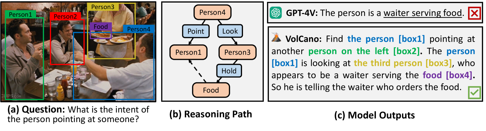
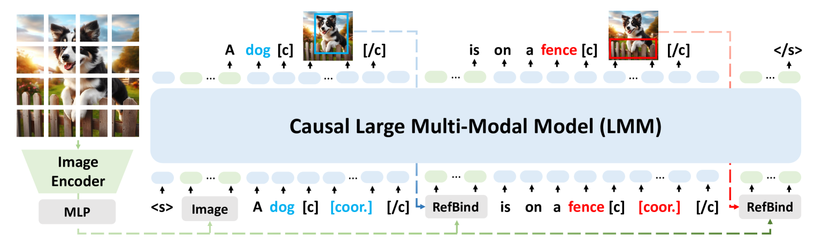
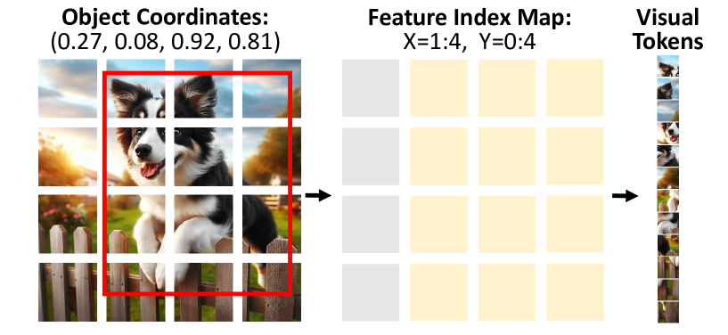
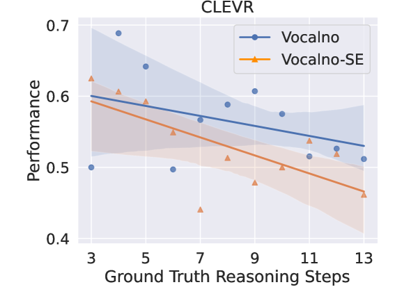
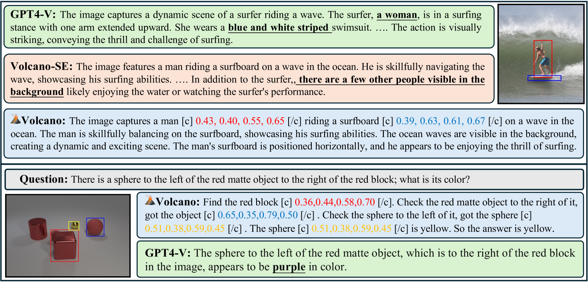
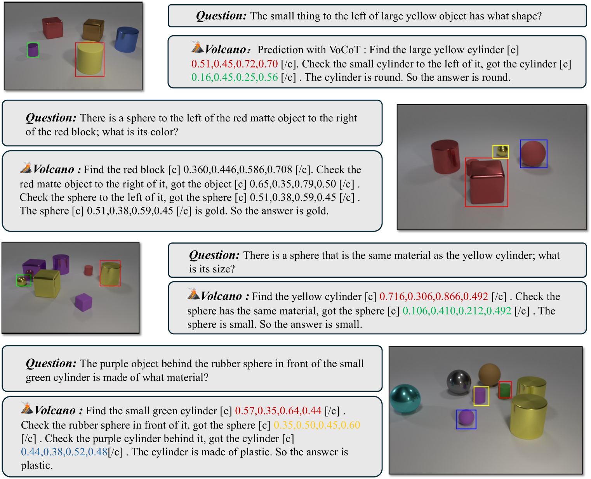
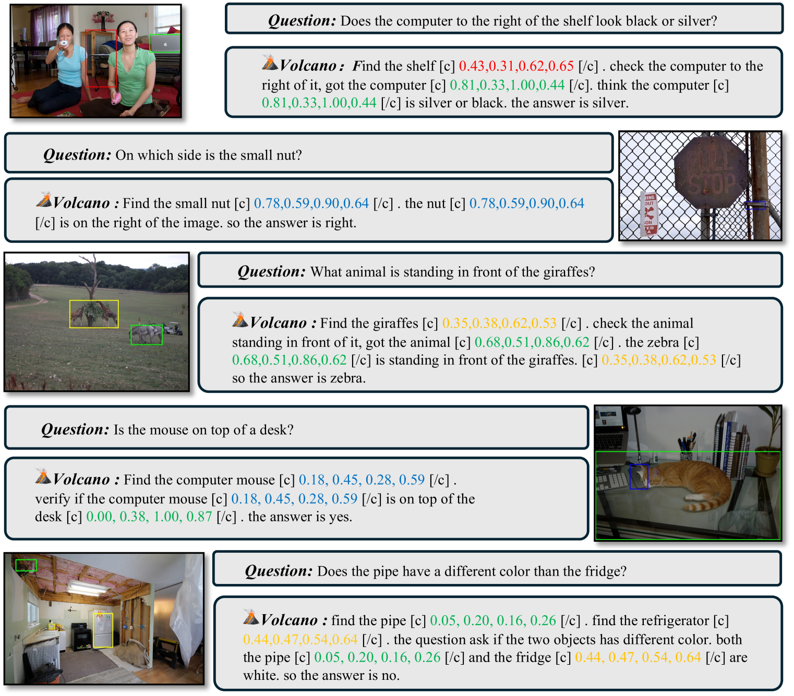
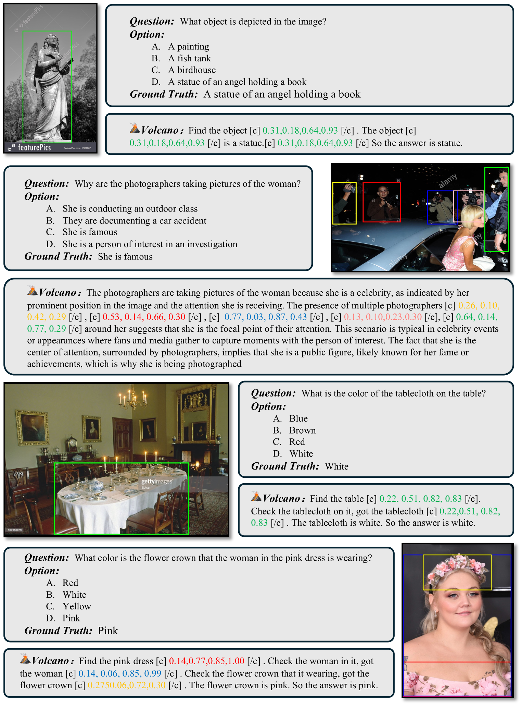
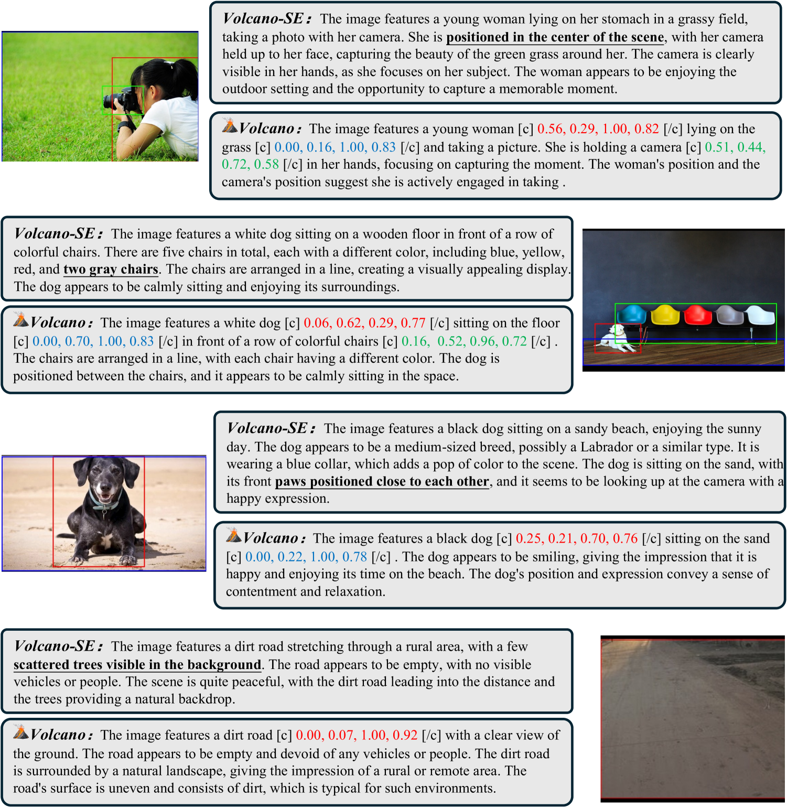

# VoCoT：激发大型多模态模型中的视觉引导多步推理潜能

发布时间：2024年05月27日

`LLM应用

理由：这篇论文介绍了一种名为VoCoT的新框架，专门设计用于改进大型多模态模型（LMMs）在处理复杂任务时的推理能力。VoCoT通过引入以对象为中心的推理路径和多模态交错校准的视觉基础表示，有效地解决了LMMs在长期生成中的模态差距问题。此外，论文还提到了构建指令数据集以帮助LMMs适应VoCoT推理，并开发了基于此框架的模型VolCano。这些内容主要关注于如何应用和改进现有的LLM技术，以提升其在特定任务上的性能，因此属于LLM应用类别。` `人工智能` `视觉推理`

> VoCoT: Unleashing Visually Grounded Multi-Step Reasoning in Large Multi-Modal Models

# 摘要

> 大型多模态模型（LMMs）虽在多任务中表现出色，但在处理复杂任务时，受限于单一推理步骤的范式。为此，我们提出了VoCoT，一种专为LMMs设计的多步骤视觉基础对象中心链式思维推理框架。VoCoT的两大特点是：围绕跨模态共享对象级信息的以对象为中心的推理路径，以及以多模态交错和校准方式呈现的对象概念的视觉基础表示，有效弥合了LMMs在长期生成中的模态差距。我们还构建了指令数据集，助力LMMs适应VoCoT推理。通过将VoCoT融入主流开源LMM架构，我们开发了VolCano。尽管参数仅7亿，输入分辨率有限，VolCano在多场景中表现卓越，超越了包括GPT-4V在内的顶尖模型，在复杂推理任务中尤为突出。我们的代码、数据和模型将在https://github.com/RupertLuo/VoCoT公开。

> While large multi-modal models (LMMs) have exhibited impressive capabilities across diverse tasks, their effectiveness in handling complex tasks has been limited by the prevailing single-step reasoning paradigm. To this end, this paper proposes VoCoT, a multi-step Visually grounded object-centric Chain-of-Thought reasoning framework tailored for inference with LMMs. VoCoT is characterized by two key features: (1) object-centric reasoning paths that revolve around cross-modal shared object-level information, and (2) visually grounded representation of object concepts in a multi-modal interleaved and aligned manner, which effectively bridges the modality gap within LMMs during long-term generation. Additionally, we construct an instruction dataset to facilitate LMMs in adapting to reasoning with VoCoT. By introducing VoCoT into the prevalent open-source LMM architecture, we introduce VolCano. With only 7B parameters and limited input resolution, VolCano demonstrates excellent performance across various scenarios, surpassing SOTA models, including GPT-4V, in tasks requiring complex reasoning. Our code, data and model will be available at https://github.com/RupertLuo/VoCoT.

[Arxiv](https://arxiv.org/abs/2405.16919)