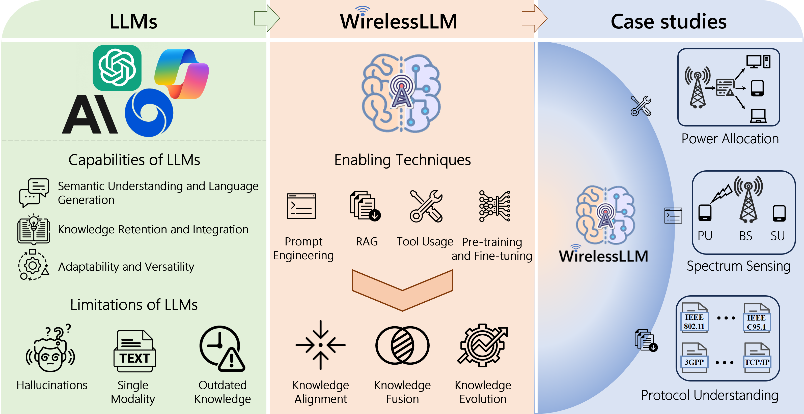
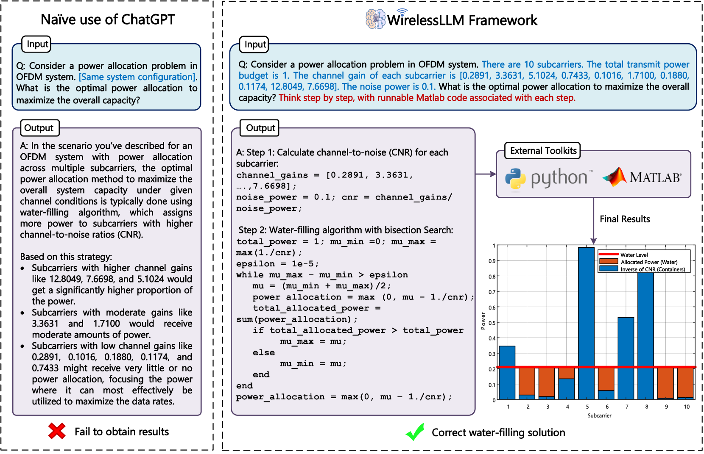
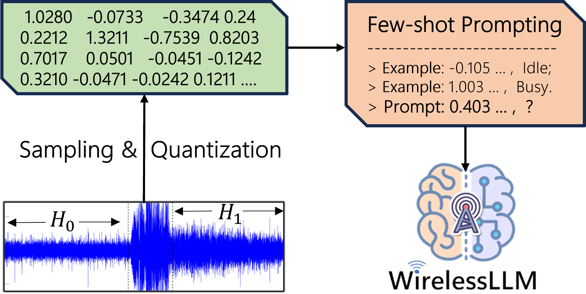
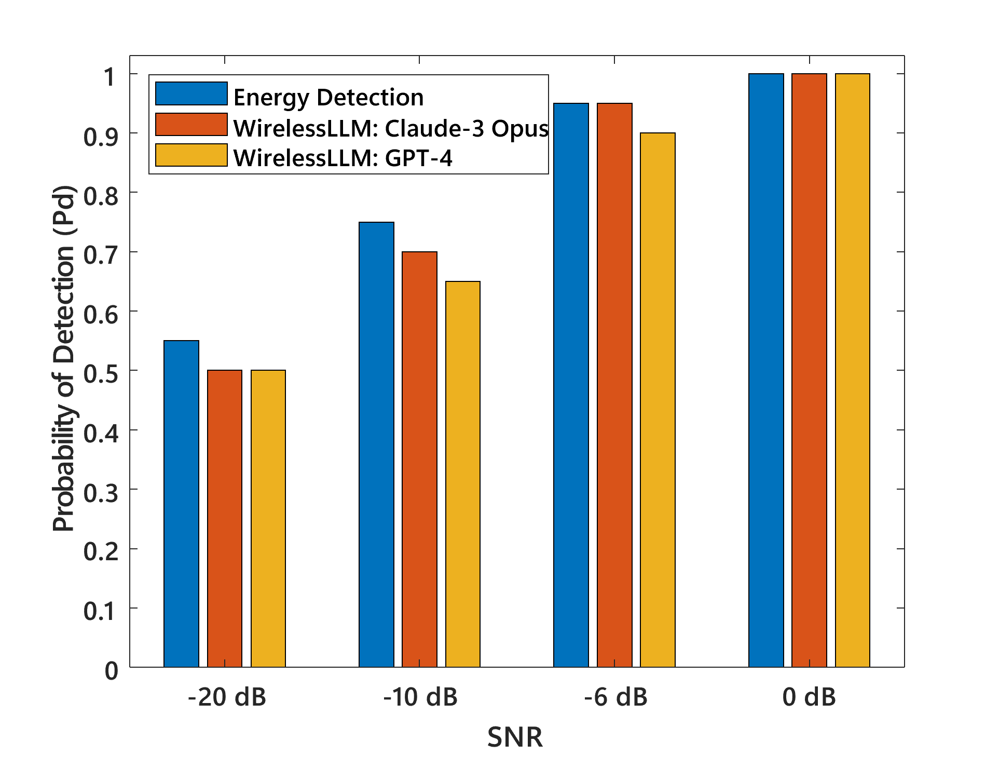

# WirelessLLM：助力大型语言模型实现无线智能

发布时间：2024年05月27日

`LLM应用

理由：这篇论文主要探讨了大型语言模型（LLMs）在无线通信领域的应用，特别是通过提出WirelessLLM框架来应对无线通信网络的特殊挑战。论文中提到的关键技术如提示工程、检索增强生成等，都是为了提升LLMs在无线通信领域的应用效果。因此，这篇论文更符合LLM应用的分类，因为它关注的是LLMs在特定领域（无线通信）的实际应用和效用。` `无线通信` `网络管理`

> WirelessLLM: Empowering Large Language Models Towards Wireless Intelligence

# 摘要

> 随着无线技术的飞速进步，以及网络基础设施的复杂性不断增加，通信网络的设计、配置和管理亟需一场范式革命。大型语言模型（LLMs）的最新突破激发了人们对其在无线通信领域革新潜力的关注。然而，目前关于LLMs在无线系统中的研究大多局限于电信语言理解的直接应用。为此，本文提出了WirelessLLM框架，旨在通过知识对齐、融合与演化三大原则，全面提升LLMs以应对无线通信网络的特殊挑战。我们深入探讨了构建WirelessLLM的关键技术，如提示工程、检索增强生成等，并通过三个案例研究验证了其在解决无线网络问题上的实际效用。最后，本文总结了当前面临的挑战，并展望了未来研究的方向。

> The rapid evolution of wireless technologies and the growing complexity of network infrastructures necessitate a paradigm shift in how communication networks are designed, configured, and managed. Recent advancements in Large Language Models (LLMs) have sparked interest in their potential to revolutionize wireless communication systems. However, existing studies on LLMs for wireless systems are limited to a direct application for telecom language understanding. To empower LLMs with knowledge and expertise in the wireless domain, this paper proposes WirelessLLM, a comprehensive framework for adapting and enhancing LLMs to address the unique challenges and requirements of wireless communication networks. We first identify three foundational principles that underpin WirelessLLM: knowledge alignment, knowledge fusion, and knowledge evolution. Then, we investigate the enabling technologies to build WirelessLLM, including prompt engineering, retrieval augmented generation, tool usage, multi-modal pre-training, and domain-specific fine-tuning. Moreover, we present three case studies to demonstrate the practical applicability and benefits of WirelessLLM for solving typical problems in wireless networks. Finally, we conclude this paper by highlighting key challenges and outlining potential avenues for future research.

[Arxiv](https://arxiv.org/abs/2405.17053)