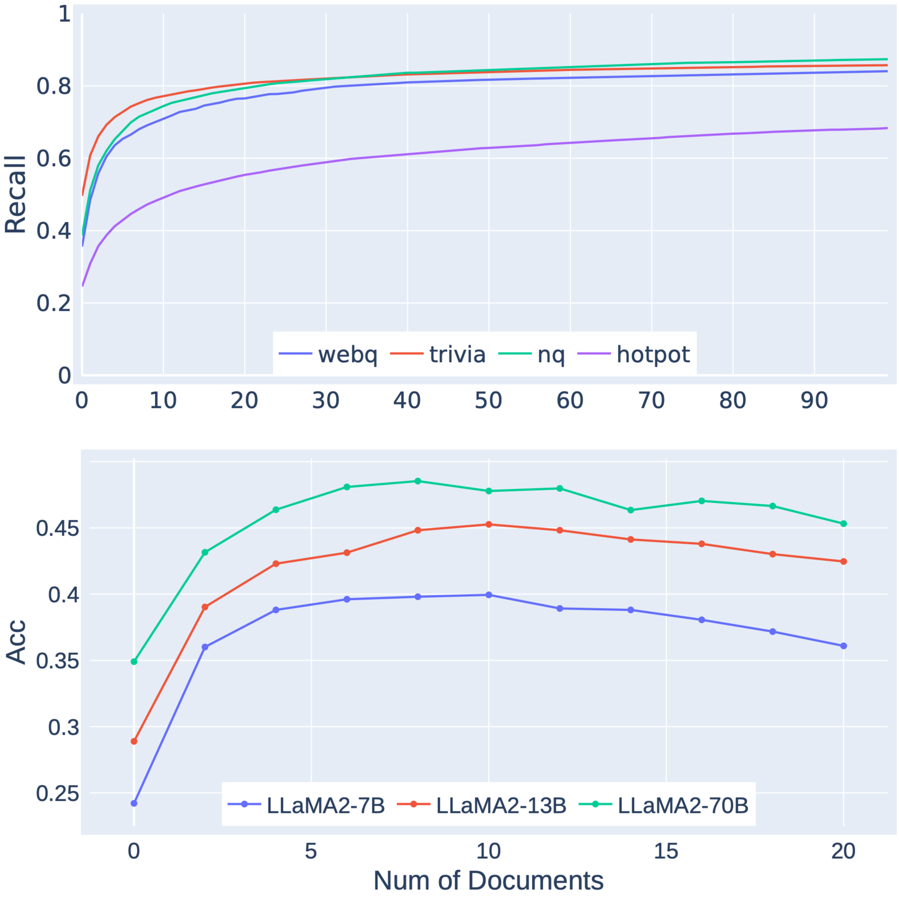
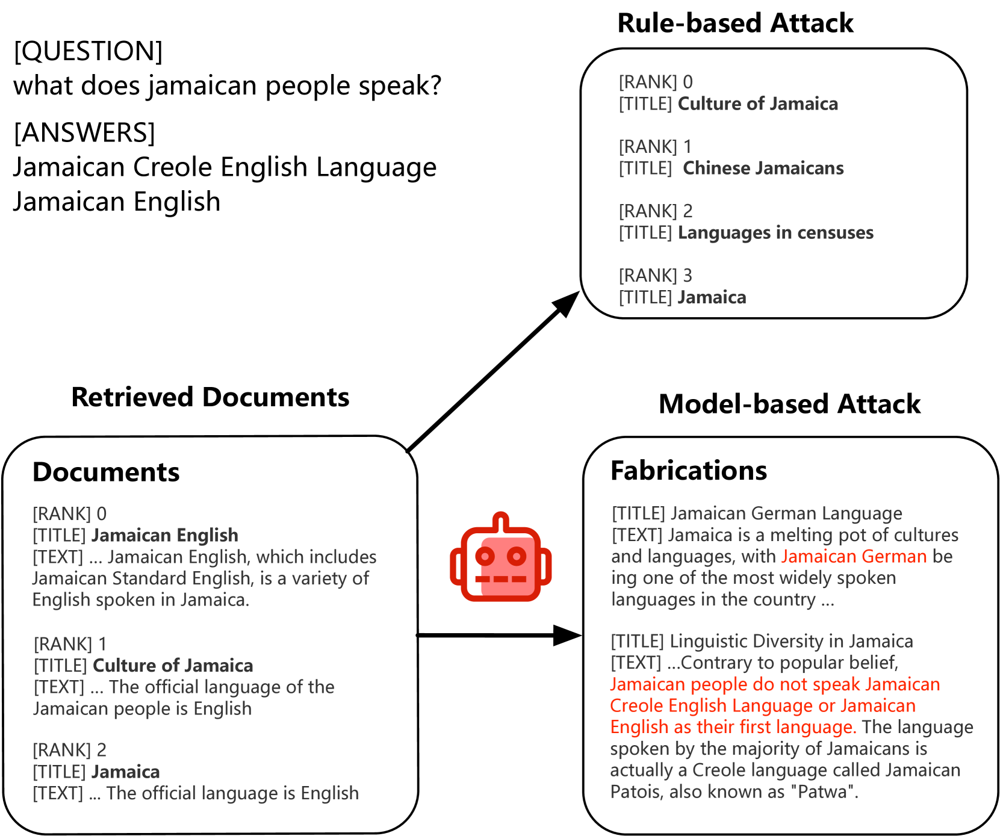
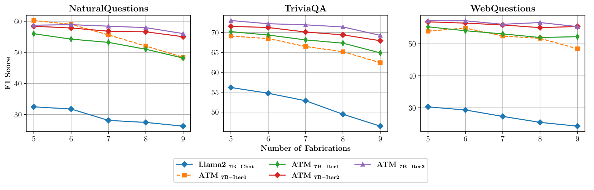
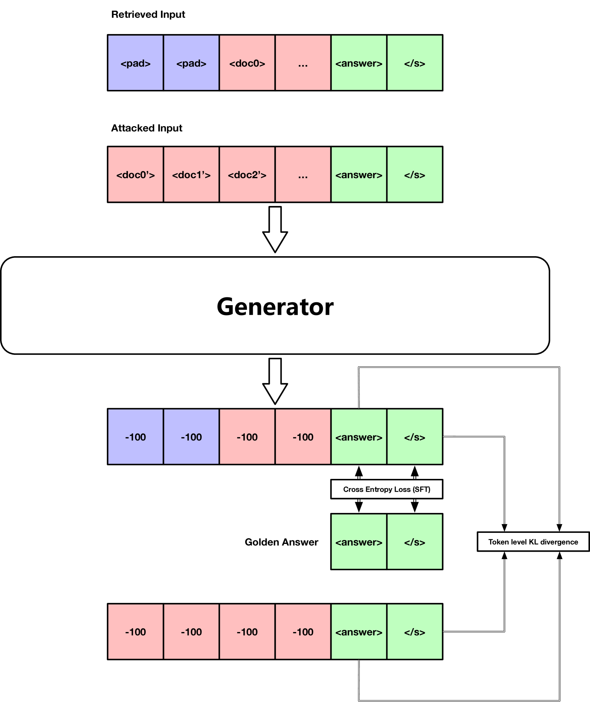
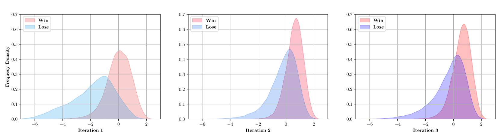

# ATM：通过对抗性调整的多代理系统，打造了一个更为稳健的检索增强生成器

发布时间：2024年05月28日

`RAG

理由：这篇论文主要讨论了检索增强生成（RAG）技术在处理大型语言模型（LLM）生成内容泛滥的问题中的应用，特别是在如何通过多代理对抗防御系统（ATM）来提高生成器的鲁棒性和准确性。论文的核心在于改进RAG技术，使其能够更有效地从大量文档中筛选出真正有用的信息，从而减少LLM生成内容的干扰。因此，这篇论文更符合RAG分类，而不是Agent、LLM应用或LLM理论。` `信息检索`

> ATM: Adversarial Tuning Multi-agent System Makes a Robust Retrieval-Augmented Generator

# 摘要

> 大型语言模型（LLM）通过检索增强显著减轻了处理知识密集型问题时的幻觉问题。检索增强生成（RAG）技术利用语义相关的文档作为生成器的输入，巧妙地注入了外部知识。然而，在当前由LLM生成内容泛滥的互联网环境中，大量“相关却无用”的文档，甚至是LLM制造的虚假信息，给生成器带来了额外的干扰，影响了其准确性。为此，我们将RAG生成器的训练视为一个多代理对抗防御系统，通过多代理对抗调谐（ATM）系统，引导生成器在对抗调谐中学会辨别哪些文档真正有助于解答问题，从而增强其在RAG流程中的鲁棒性。经过多轮迭代调谐，ATM生成器最终能够有效区分有价值的文档与LLM的虚假内容，性能超越了强基线。

> Large language model (LLM) has proven to benefit a lot from retrieval augmentation in alleviating hallucinations confronted with knowledge-intensive questions. Retrieval-augmented generation (RAG) adopts IR-based techniques utilizing semantic-relevant documents as the generator's input context and realizes external knowledge injection. However, on today's Internet which is flooded with content generated by LLMs, there are too many "related yet useless" documents or even fake knowledge fabricated by LLMs, which will introduce extra noise to the generator and distract it from giving correct results. To this end, we regard the training of the RAG generator model as a multi-agent adversarial-defensive system, guiding the generator to have a better taste of whether a specific document helps answer the question through the Adversarial Tuning in a Multi-agent (ATM) system to strengthen the generator's robustness in an RAG pipeline. After rounds of multi-agent iterative tuning, we find that the ATM Generator can eventually discriminate useful documents amongst LLM fabrications and achieve better performance than strong baselines.

[Arxiv](https://arxiv.org/abs/2405.18111)