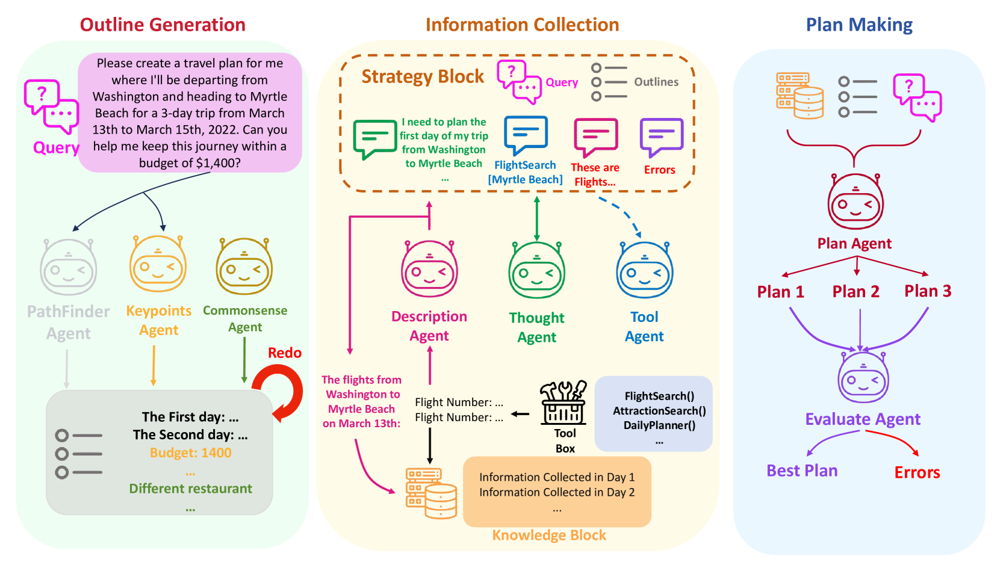
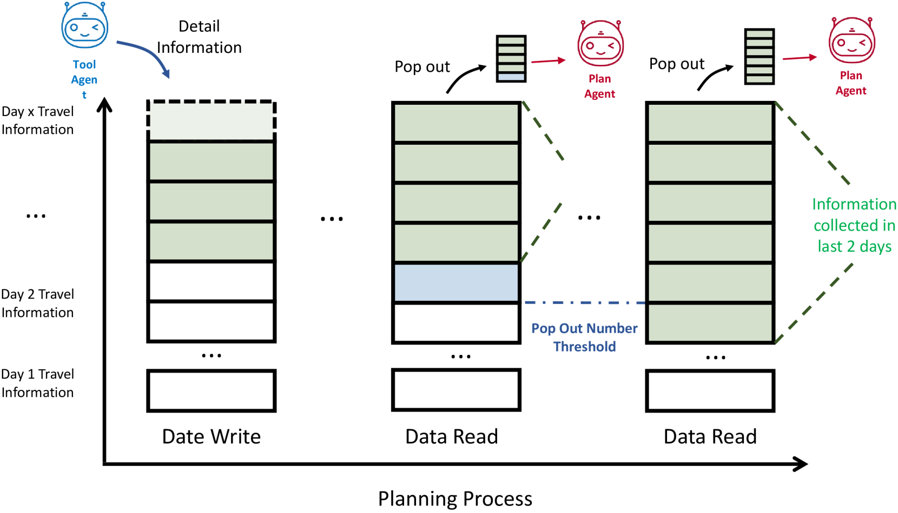
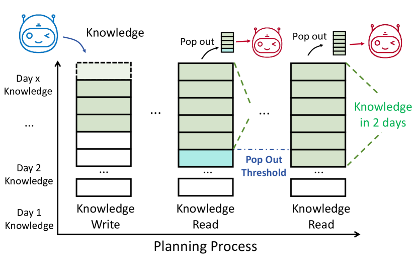
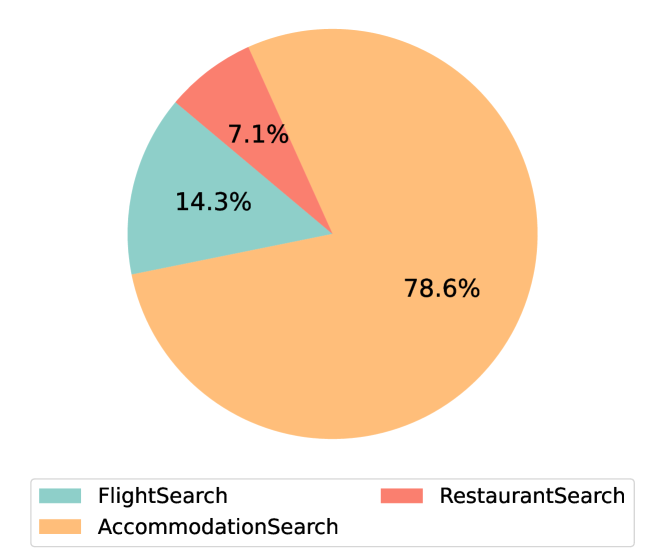
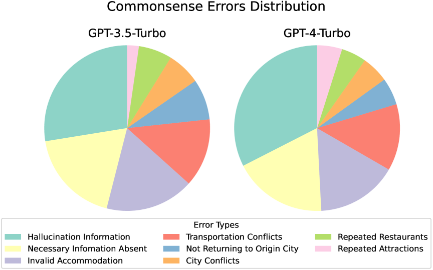
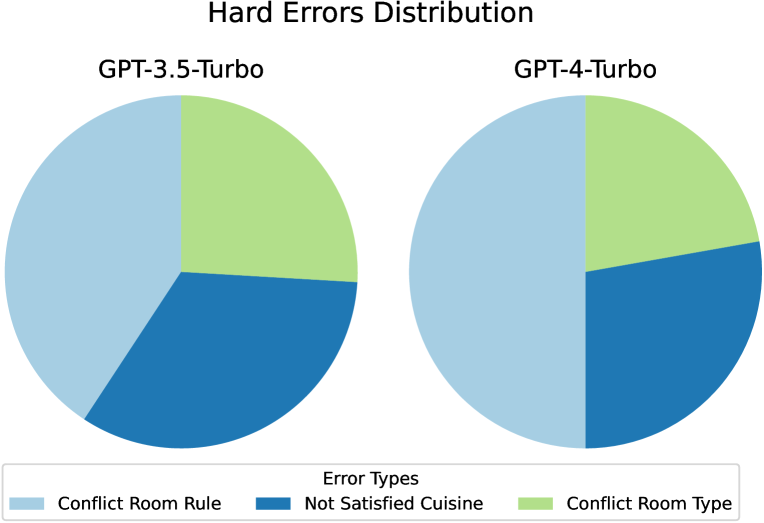
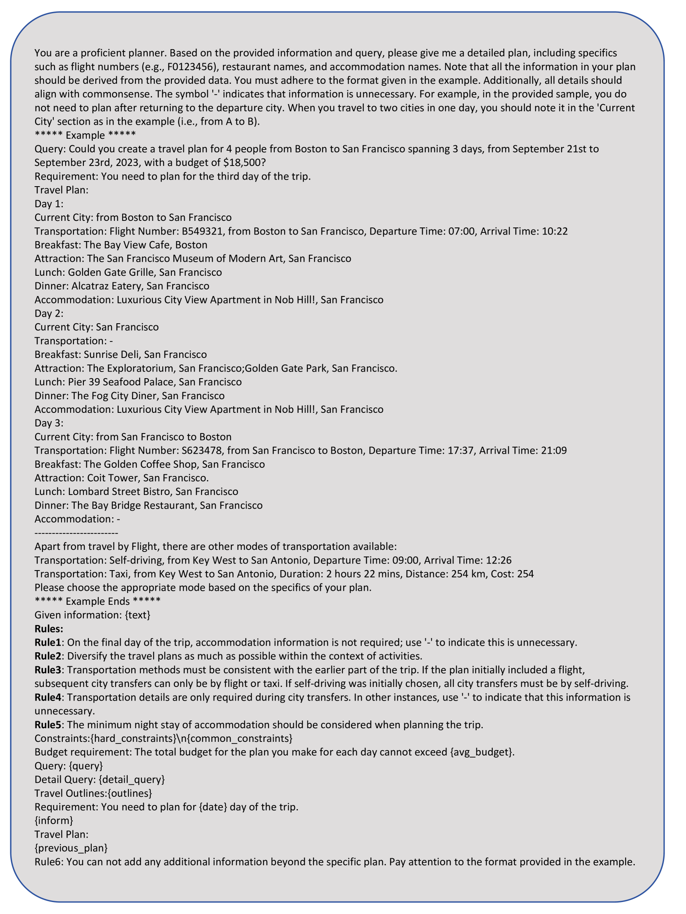

# 大型语言模型在多阶段规划任务中的人类式推理框架

发布时间：2024年05月28日

`Agent

这篇论文主要探讨了如何提升大型语言模型（LLM）代理在处理复杂任务，特别是旅行规划任务时的能力。论文提出了一种新的规划框架，该框架模拟人类解决问题的步骤，并通过整合策略块和知识块来增强LLM代理的信息收集和详细规划能力。实验结果显示，这种框架显著提高了LLM代理在旅行规划任务上的效率和效果。因此，这篇论文更符合Agent分类，因为它专注于改进和应用LLM作为代理来处理特定任务。` `旅行规划` `人工智能`

> A Human-Like Reasoning Framework for Multi-Phases Planning Task with Large Language Models

# 摘要

> 近期研究显示，大型语言模型（LLM）代理在处理简单任务如写作和编程时表现出色，但面对需要全面规划的任务时仍显吃力。本研究聚焦于旅行规划这一多阶段挑战，涉及多个相互关联的阶段，包括概述、信息收集和详细规划，这些阶段通常伴随着管理多种约束和不确定性的需求。现有推理方法对此复杂任务处理不力。为此，我们开发了一种类似人类的规划框架，旨在引导LLM代理模拟人类解决多阶段问题时的步骤。我们采用多种策略，使LLM代理能够为每个旅行查询生成连贯的概述，模仿人类的规划模式，并整合了策略块和知识块：前者助力信息收集，后者提供详细规划所需的关键信息。实验结果表明，我们的框架显著提升了LLM代理的规划能力，使其在旅行规划任务上展现出更高的效率和效果。与GPT-4-Turbo结合使用时，我们的框架相比基准框架实现了10倍的性能提升。

> Recent studies have highlighted their proficiency in some simple tasks like writing and coding through various reasoning strategies. However, LLM agents still struggle with tasks that require comprehensive planning, a process that challenges current models and remains a critical research issue. In this study, we concentrate on travel planning, a Multi-Phases planning problem, that involves multiple interconnected stages, such as outlining, information gathering, and planning, often characterized by the need to manage various constraints and uncertainties. Existing reasoning approaches have struggled to effectively address this complex task. Our research aims to address this challenge by developing a human-like planning framework for LLM agents, i.e., guiding the LLM agent to simulate various steps that humans take when solving Multi-Phases problems. Specifically, we implement several strategies to enable LLM agents to generate a coherent outline for each travel query, mirroring human planning patterns. Additionally, we integrate Strategy Block and Knowledge Block into our framework: Strategy Block facilitates information collection, while Knowledge Block provides essential information for detailed planning. Through our extensive experiments, we demonstrate that our framework significantly improves the planning capabilities of LLM agents, enabling them to tackle the travel planning task with improved efficiency and effectiveness. Our experimental results showcase the exceptional performance of the proposed framework; when combined with GPT-4-Turbo, it attains $10\times$ the performance gains in comparison to the baseline framework deployed on GPT-4-Turbo.

[Arxiv](https://arxiv.org/abs/2405.18208)