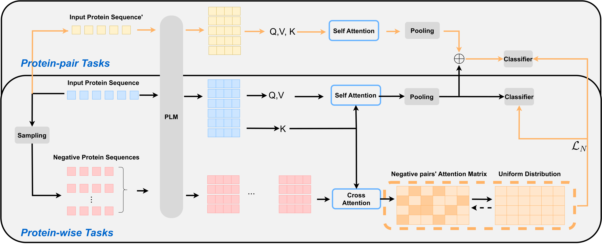
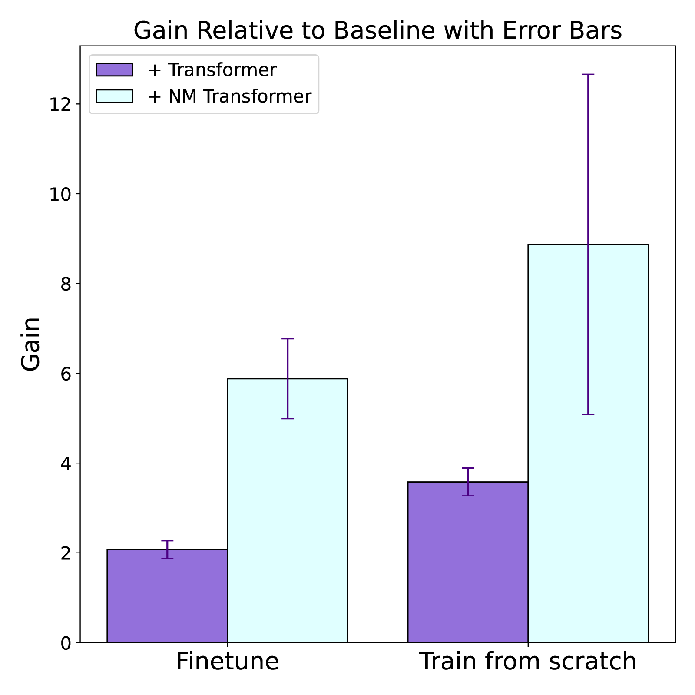
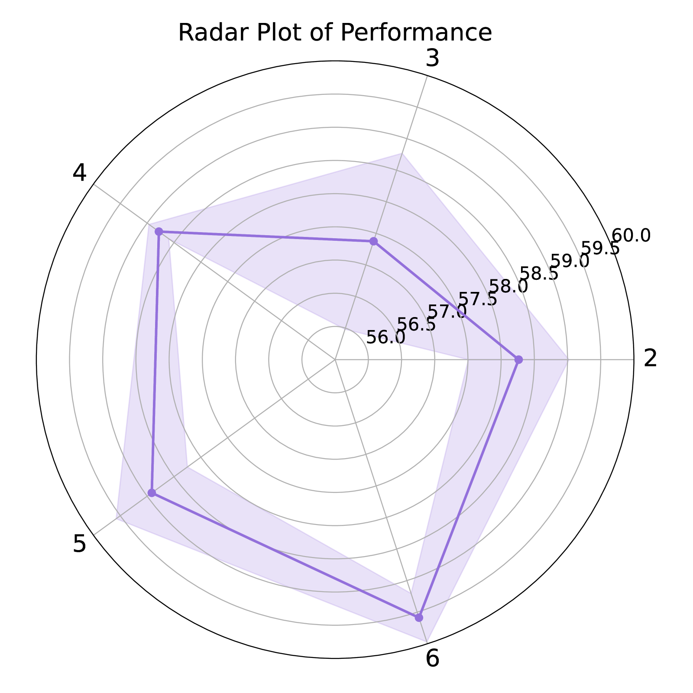
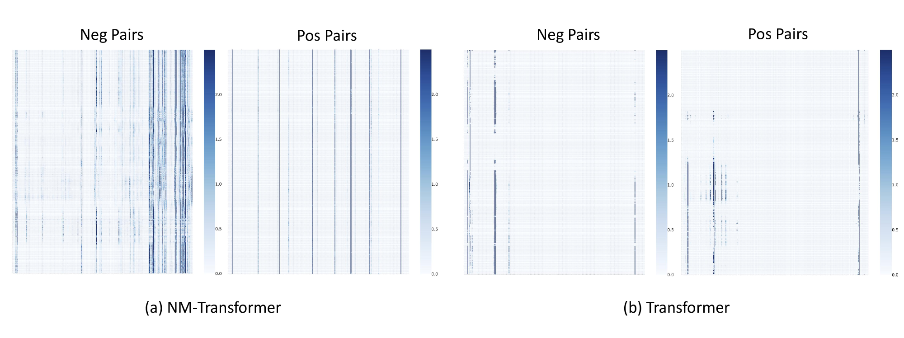

# 利用负样本挖掘优化蛋白质语言模型性能

发布时间：2024年05月28日

`LLM应用

这篇论文摘要描述了一种创新方法，旨在提升大型语言模型（LLM）在蛋白质表示学习领域的性能。这种方法通过训练网络从不同类别蛋白质对构成的负样本中提炼深刻见解，有效减少了模型对共进化知识的过度依赖，并增强了基于变压器模型的训练效果。此外，该方法还精准捕捉了蛋白质的生物学特性，与传统生物机制如蛋白质相互作用相吻合。实验结果显示，在多个任务上，这种方法超越了现有的大型蛋白质模型，为蛋白质研究和计算生物学领域带来了新的发展机遇。因此，这篇论文属于LLM应用类别，因为它专注于将LLM技术应用于特定的科学问题——蛋白质表示学习。` `蛋白质研究` `计算生物学`

> Boosting Protein Language Models with Negative Sample Mining

# 摘要

> 我们提出了一种创新方法，旨在提升大型语言模型在蛋白质表示学习领域的性能。关键在于，我们通过训练网络从不同类别蛋白质对构成的负样本中提炼深刻见解，有效减少了模型对共进化知识的过度依赖。这一策略不仅增强了基于变压器模型的训练效果，还精准捕捉了蛋白质的生物学特性，与传统生物机制如蛋白质相互作用相吻合。实验结果显示，在多个任务上，我们的方法超越了现有的大型蛋白质模型，为蛋白质研究和计算生物学领域带来了新的发展机遇。

> We introduce a pioneering methodology for boosting large language models in the domain of protein representation learning. Our primary contribution lies in the refinement process for correlating the over-reliance on co-evolution knowledge, in a way that networks are trained to distill invaluable insights from negative samples, constituted by protein pairs sourced from disparate categories. By capitalizing on this novel approach, our technique steers the training of transformer-based models within the attention score space. This advanced strategy not only amplifies performance but also reflects the nuanced biological behaviors exhibited by proteins, offering aligned evidence with traditional biological mechanisms such as protein-protein interaction. We experimentally observed improved performance on various tasks over datasets, on top of several well-established large protein models. This innovative paradigm opens up promising horizons for further progress in the realms of protein research and computational biology.

[Arxiv](https://arxiv.org/abs/2405.17902)