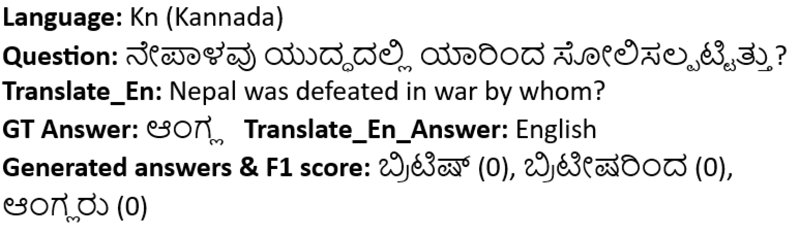
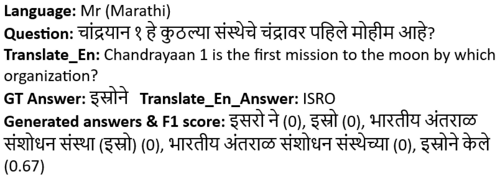
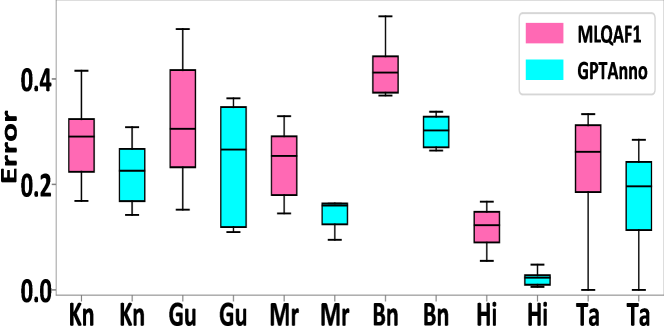
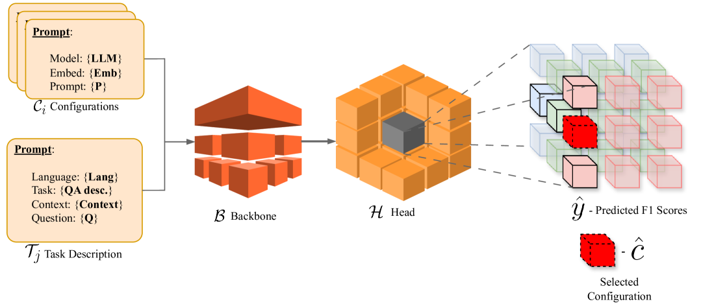

# 跨越鸿沟：采用动态学习策略提升大型语言模型在多语言环境下的表现

发布时间：2024年05月28日

`RAG

理由：这篇论文主要关注的是如何提升大型语言模型（LLMs）在多语言环境中的性能，特别是通过结合检索增强生成（RAG）与多语言嵌入来优化多语言任务表现。RAG是一种结合了检索和生成的方法，用于增强语言模型的性能，尤其是在处理多语言任务时。论文中提到的创新技术，如优化提示设计、动态学习方法等，都是围绕RAG框架进行的，因此将其归类为RAG。` `多语言处理` `问答系统`

> Bridging the Gap: Dynamic Learning Strategies for Improving Multilingual Performance in LLMs

# 摘要

> 大型语言模型（LLMs）正引领全球多个领域的变革，但面对非拉丁文字和低资源语言时，其包容性与效能仍显不足。本文直面挑战，旨在不依赖广泛训练或微调的情况下，提升LLMs的多语言性能。通过系统性地利用流行的问答（QA）数据集对多种语言进行评估与研究，我们开发出创新技术，释放LLMs在多语言环境中的潜能。我们的策略包含三大关键举措，显著增强了多语言能力：首先，我们精心设计了针对多语言LLMs的优化提示，激发其潜在能力，大幅提升跨语言性能；其次，我们创新性地结合了LLM的检索增强生成（RAG）与多语言嵌入，进一步优化了多语言任务表现；最后，我们提出了一种动态学习方法，根据实时查询动态选择最优的提示策略、LLM模型及嵌入模型，确保LLMs在不同语言中发挥最大效能，超越传统静态与随机策略。此外，我们的方法灵活适应离线与在线环境，并能轻松应对新语言与数据集，极大地推动了多语言理解和生成在多样语言中的进步。

> Large language models (LLMs) are at the forefront of transforming numerous domains globally. However, their inclusivity and effectiveness remain limited for non-Latin scripts and low-resource languages. This paper tackles the imperative challenge of enhancing the multilingual performance of LLMs without extensive training or fine-tuning. Through systematic investigation and evaluation of diverse languages using popular question-answering (QA) datasets, we present novel techniques that unlock the true potential of LLMs in a polyglot landscape. Our approach encompasses three key strategies that yield significant improvements in multilingual proficiency. First, by meticulously optimizing prompts tailored for polyglot LLMs, we unlock their latent capabilities, resulting in substantial performance boosts across languages. Second, we introduce a new hybrid approach that synergizes LLM Retrieval Augmented Generation (RAG) with multilingual embeddings and achieves improved multilingual task performance. Finally, we introduce a novel learning approach that dynamically selects the optimal prompt strategy, LLM model, and embedding model per query at run-time. This dynamic adaptation maximizes the efficacy of LLMs across languages, outperforming best static and random strategies. Additionally, our approach adapts configurations in both offline and online settings, and can seamlessly adapt to new languages and datasets, leading to substantial advancements in multilingual understanding and generation across diverse languages.

[Arxiv](https://arxiv.org/abs/2405.18359)