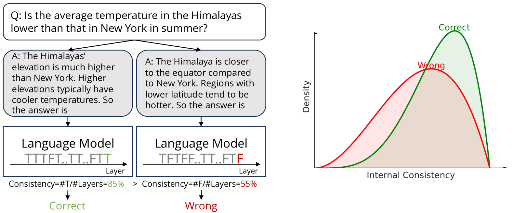
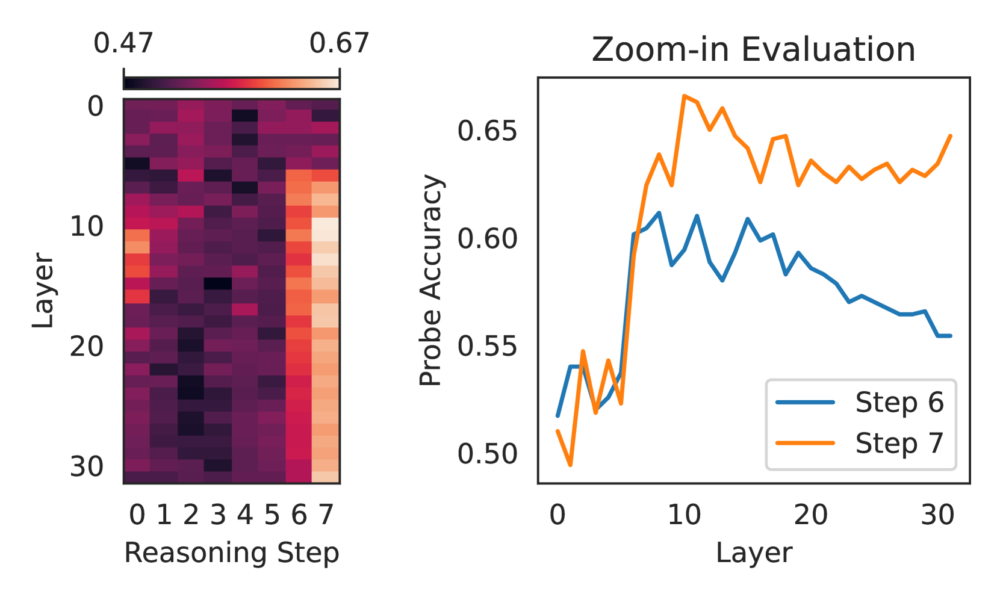
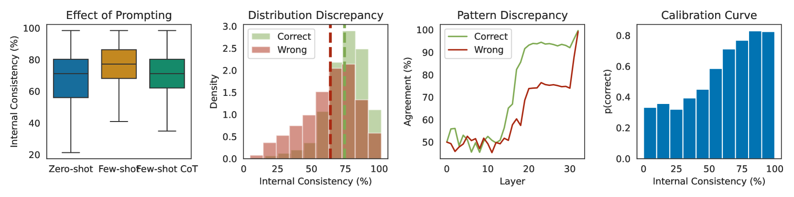
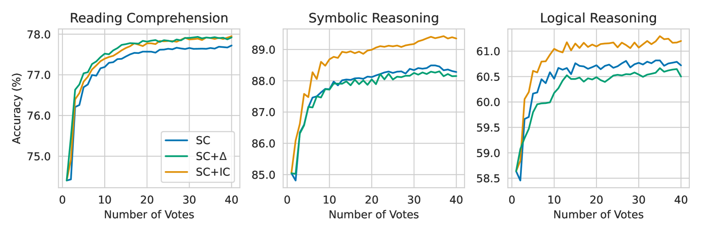
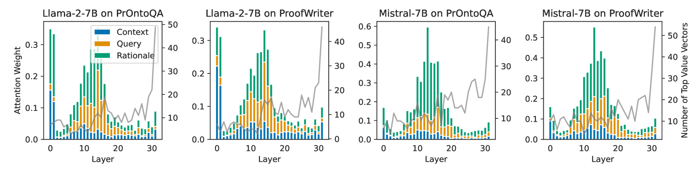
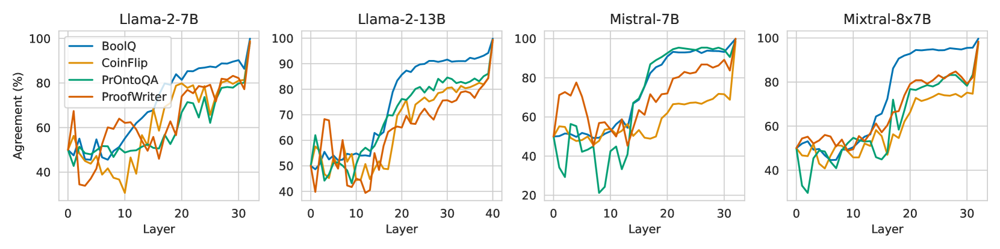
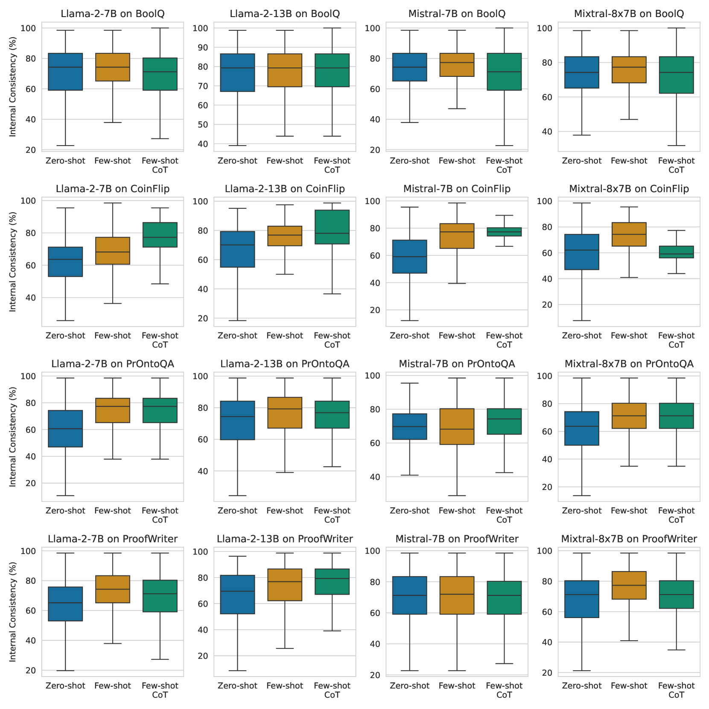
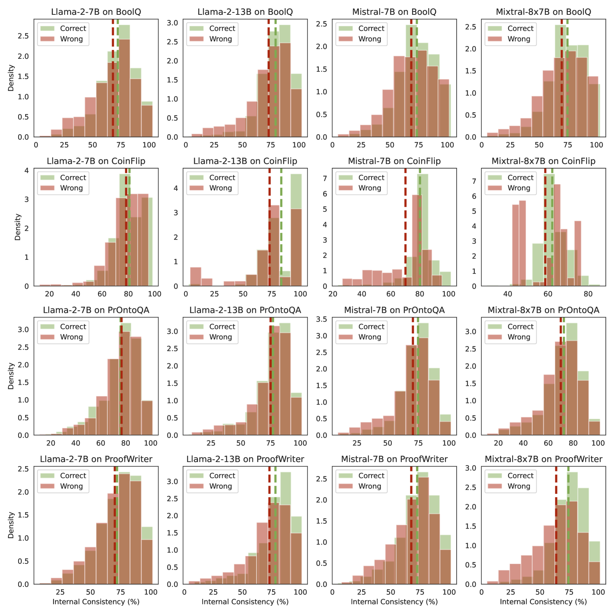
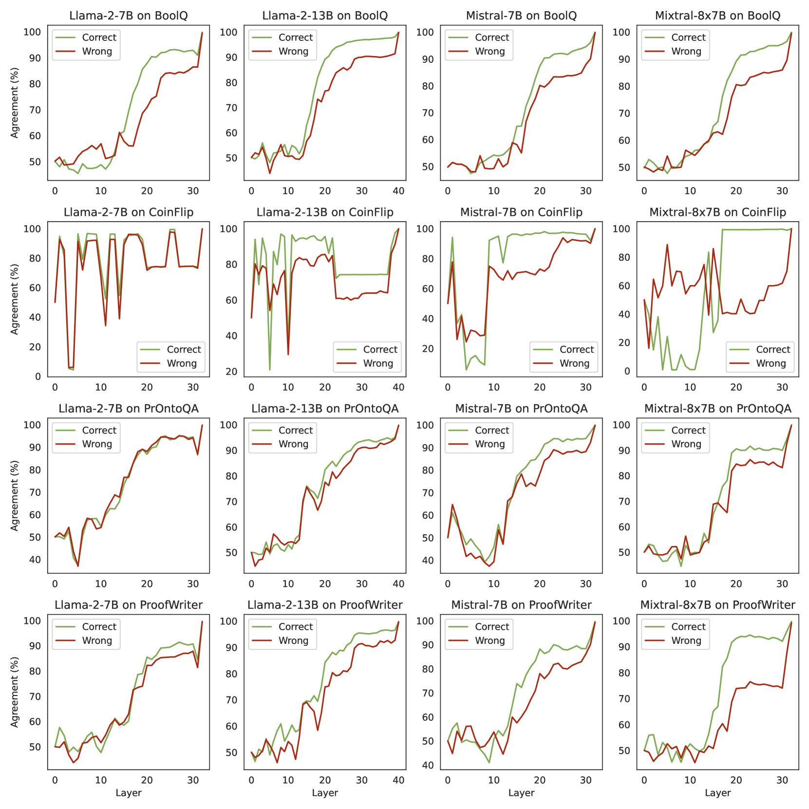
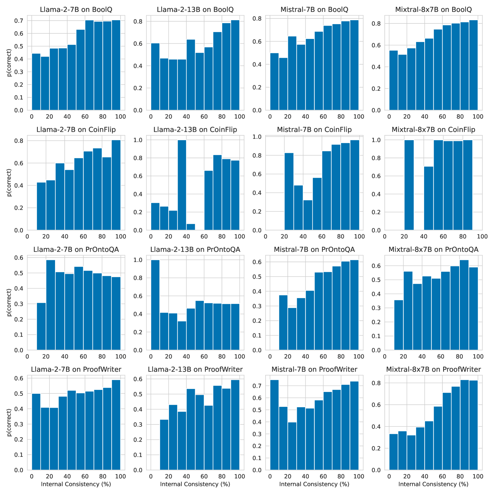

# 利用内部一致性优化语言模型的推理能力

发布时间：2024年05月28日

`LLM理论

理由：这篇论文主要关注大型语言模型（LLMs）在推理任务中的表现，特别是通过思维链（CoT）提示技术来分析和改进模型的推理能力。论文提出了一个新的指标——内部一致性，用于衡量模型的自信度，并通过实证研究验证了其有效性。此外，论文还提出了一种新方法来校准CoT推理，以提升推理性能。这些研究内容涉及LLMs的理论分析和改进，因此属于LLM理论分类。` `人工智能`

> Calibrating Reasoning in Language Models with Internal Consistency

# 摘要

> 大型语言模型（LLMs）在推理任务中表现出色，得益于思维链（CoT）提示技术，它能激发语言化的推理。但LLMs生成的文本常含错误和矛盾，引发对其推理能力的质疑。本研究通过内部表示分析CoT推理，发现尽管生成的理由提升了准确性，但模型内部表示在不同层级间出现不一致，可能影响推理可靠性。为此，我们提出内部一致性作为衡量模型自信度的新指标，并通过实证研究证实其在区分正确与错误推理路径上的有效性。基于此，我们提出一种新方法，通过增强高内部一致性推理路径的权重来校准CoT推理，显著提升推理性能。深入分析揭示了不同层级中注意力和前馈模块的特定模式，为理解内部不一致性提供了线索。综上，我们的研究展示了利用内部表示进行LLMs自我评估的潜力。

> Large language models (LLMs) have demonstrated impressive capabilities in various reasoning tasks, aided by techniques like chain-of-thought (CoT) prompting that elicits verbalized reasoning. However, LLMs often generate text with obvious mistakes and contradictions, raising doubts about their ability to robustly process and utilize generated rationales. In this work, we investigate CoT reasoning in LLMs through the lens of internal representations, focusing on how these representations are influenced by generated rationales. Our preliminary analysis reveals that while generated rationales improve answer accuracy, inconsistencies emerge between the model's internal representations in middle layers and those in final layers, potentially undermining the reliability of their reasoning processes. To address this, we propose internal consistency as a measure of the model's confidence by examining the agreement of latent predictions decoded from intermediate layers. Extensive empirical studies across different models and datasets demonstrate that internal consistency effectively distinguishes between correct and incorrect reasoning paths. Motivated by this, we propose a new approach to calibrate CoT reasoning by up-weighting reasoning paths with high internal consistency, resulting in a significant boost in reasoning performance. Further analysis uncovers distinct patterns in attention and feed-forward modules across layers, providing insights into the emergence of internal inconsistency. In summary, our results demonstrate the potential of using internal representations for self-evaluation of LLMs.

[Arxiv](https://arxiv.org/abs/2405.18711)