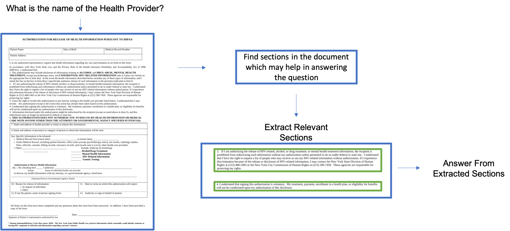

# GPT能否革新医学认知？探究其在生物医学机器阅读理解领域的评估表现

发布时间：2024年05月28日

`RAG

理由：这篇论文主要探讨了大型语言模型（LLMs）在闭卷生物医学机器阅读理解（MRC）任务中的应用，并提出了隐式检索增强生成（RAG）策略。这种策略是为了克服LLMs在检索上的局限性，并减少对向量数据库的依赖。因此，这篇论文的内容与RAG（检索增强生成）技术紧密相关，而不是Agent、LLM应用或LLM理论。` `生物医学` `机器阅读理解`

> Can GPT Redefine Medical Understanding? Evaluating GPT on Biomedical Machine Reading Comprehension

# 摘要

> 大型语言模型（LLMs）在多领域任务中表现出色，但在闭卷生物医学机器阅读理解（MRC）方面，其潜力尚未被充分挖掘。本研究中，我们针对GPT在四个闭卷生物医学MRC基准上进行了深入评估，并探索了多种提示技术，包括我们独创的新方法。为了克服LLMs在检索上的局限，我们提出了隐式检索增强生成（RAG）策略，有效减少了传统RAG中对向量数据库的依赖。此外，我们还对生成的自然语言进行了质量评估。结果表明，我们的创新提示技术在四个数据集中两个达到最佳，其余两个位列第二。实验还揭示，即使在零-shot条件下，GPT等现代LLMs也能超越传统监督模型，在两个基准上刷新了性能记录。

> Large language models (LLMs) have shown remarkable performance on many tasks in different domains. However, their performance in closed-book biomedical machine reading comprehension (MRC) has not been evaluated in depth. In this work, we evaluate GPT on four closed-book biomedical MRC benchmarks. We experiment with different conventional prompting techniques as well as introduce our own novel prompting method. To solve some of the retrieval problems inherent to LLMs, we propose a prompting strategy named Implicit Retrieval Augmented Generation (RAG) that alleviates the need for using vector databases to retrieve important chunks in traditional RAG setups. Moreover, we report qualitative assessments on the natural language generation outputs from our approach. The results show that our new prompting technique is able to get the best performance in two out of four datasets and ranks second in rest of them. Experiments show that modern-day LLMs like GPT even in a zero-shot setting can outperform supervised models, leading to new state-of-the-art (SoTA) results on two of the benchmarks.

[Arxiv](https://arxiv.org/abs/2405.18682)