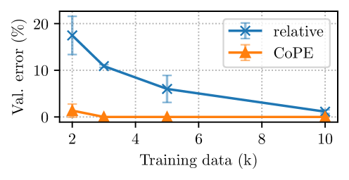
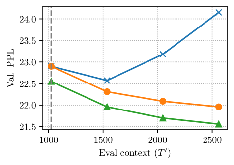
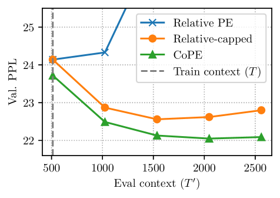
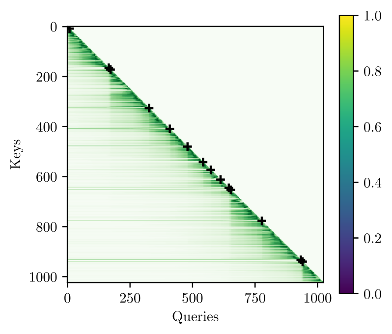
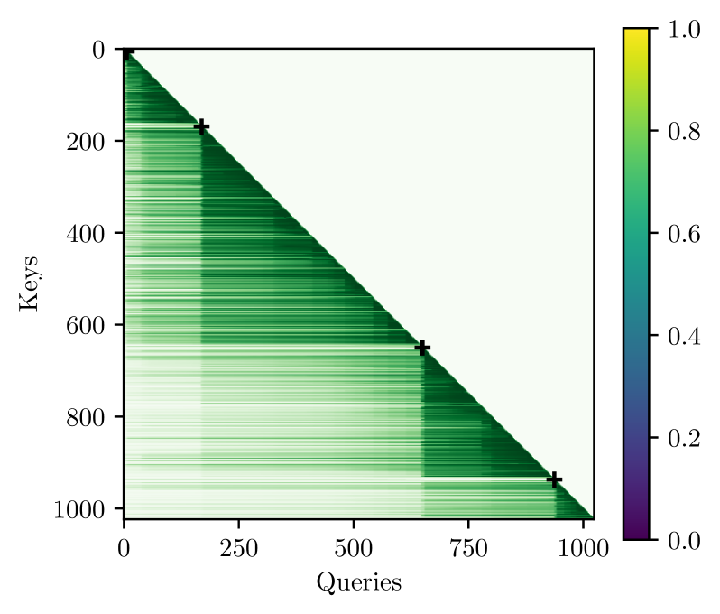
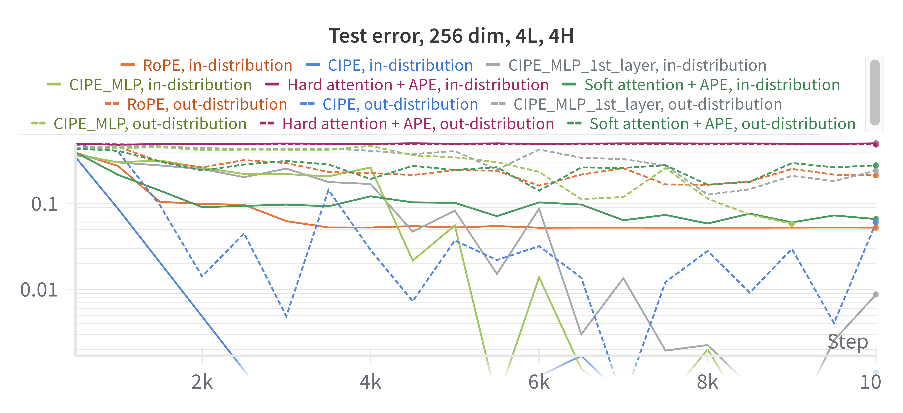
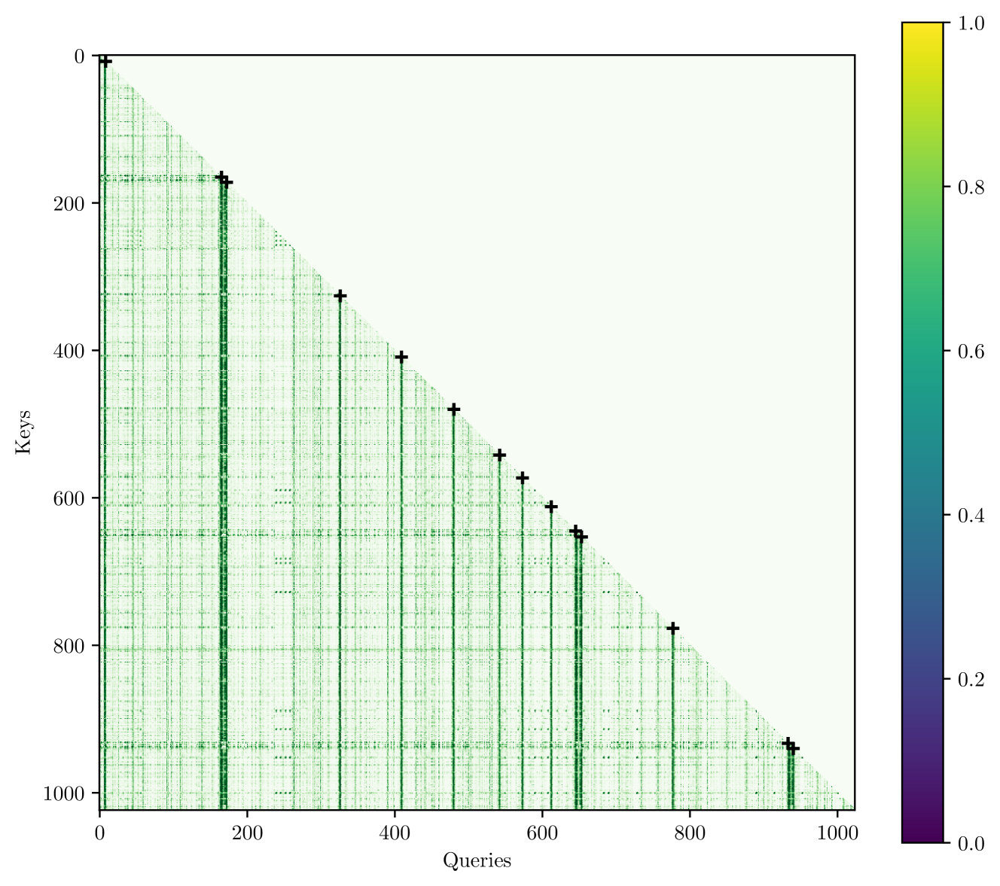
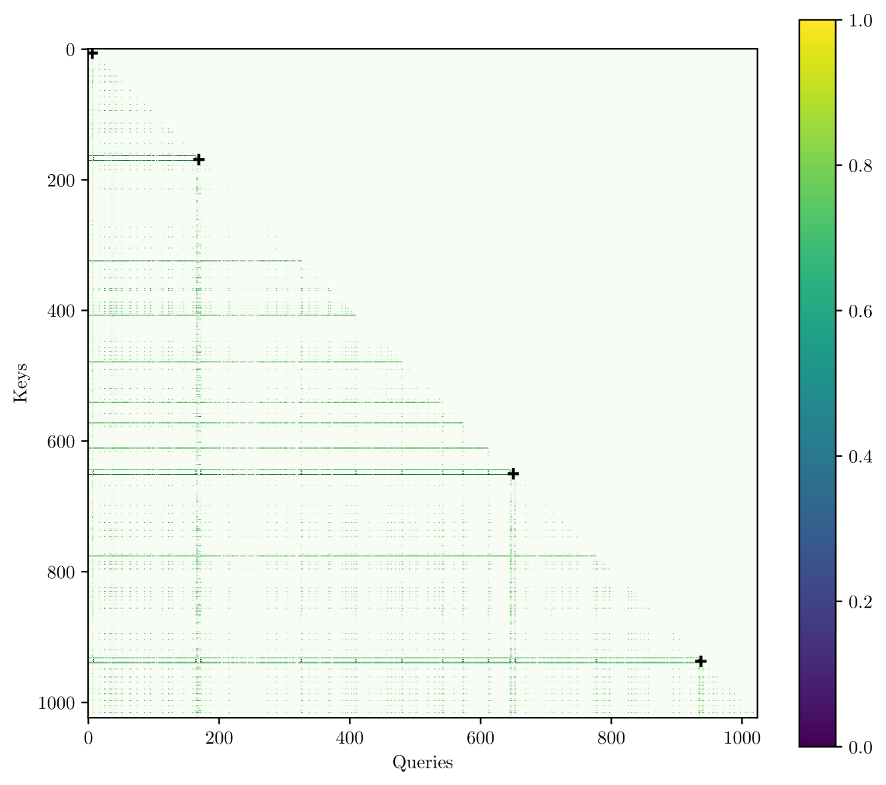

# 上下文位置编码：掌握关键信息的重要性

发布时间：2024年05月28日

`LLM理论

这篇论文主要探讨了大型语言模型（LLM）中的位置编码问题，并提出了一种新的上下文位置编码（CoPE）方法。这种新方法旨在改进模型对文本中特定位置的关注能力，特别是在句子级别的抽象处理上。论文通过实验验证了CoPE在提高模型性能方面的有效性，尤其是在语言建模和编码任务中降低了困惑度。因此，这篇论文的内容更偏向于LLM的理论研究，即如何改进和优化LLM的内部机制，而不是具体的应用、Agent设计或RAG（检索增强生成）技术。` `机器学习`

> Contextual Position Encoding: Learning to Count What's Important

# 摘要

> 注意力机制虽使大型语言模型中的标记能相互交互，却缺乏位置感。位置编码（PE）的引入虽能按位置关注特定标记，如第i个，但现有方法依赖标记计数，难以抽象至句子级别。本文提出的上下文位置编码（CoPE）通过模型选定的标记增量位置，实现了更灵活的位置寻址，如关注特定第i个单词、名词或句子。实验证明，CoPE在解决选择性复制、计数及Flip-Flop任务上超越了传统位置嵌入，并在语言建模和编码任务中降低了困惑度。

> The attention mechanism is a critical component of Large Language Models (LLMs) that allows tokens in a sequence to interact with each other, but is order-invariant. Incorporating position encoding (PE) makes it possible to address by position, such as attending to the i-th token. However, current PE methods use token counts to derive position, and thus cannot generalize to higher levels of abstraction, such as attending to the i-th sentence. In this paper, we propose a new position encoding method, Contextual Position Encoding (CoPE), that allows positions to be conditioned on context by incrementing position only on certain tokens determined by the model. This allows more general position addressing such as attending to the $i$-th particular word, noun, or sentence. We show that CoPE can solve the selective copy, counting and Flip-Flop tasks where popular position embeddings fail, and improves perplexity on language modeling and coding tasks.

[Arxiv](https://arxiv.org/abs/2405.18719)