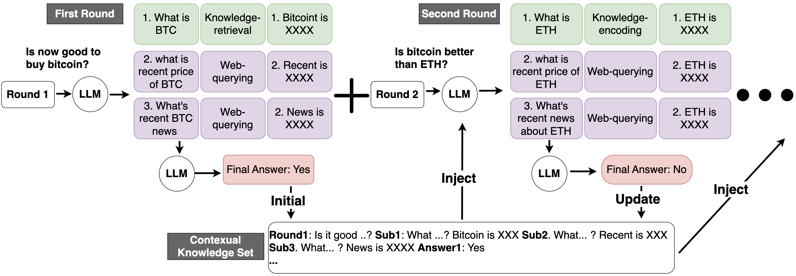

# Conv-CoA：借助对话链式行动优化大型语言模型中的开放领域问答性能

发布时间：2024年05月28日

`Agent

这篇论文介绍了一种名为对话行动链（Conv-CoA）的新框架，专门设计用于开放域对话问答（OCQA）。该框架通过动态的推理-检索机制，识别问题意图并分解成推理步骤，通过提示、预设行动、更新上下文知识集（CKS）以及基于Hopfield的新型检索器来逐步解答问题。此外，还引入了对话多参考忠诚度分数（Conv-MRFS）来验证并解决对话中的知识与答案冲突。这些特性表明该框架是一个智能Agent，能够处理复杂的对话任务，并优化了对话场景中的推理和信息检索能力。因此，将其分类为Agent。` `对话系统` `信息检索`

> Conv-CoA: Improving Open-domain Question Answering in Large Language Models via Conversational Chain-of-Action

# 摘要

> 我们开发了一种名为对话行动链（Conv-CoA）的新框架，专为开放域对话问答（OCQA）设计。该框架针对三大挑战进行了优化：(i) 避免与实时或领域事实不符的幻觉现象，(ii) 提升对话场景中的推理能力，(iii) 改善对话信息检索的性能。我们的核心创新在于一种动态的推理-检索机制，它能够识别问题意图，并将其分解成一系列推理步骤，通过精心设计的提示、预设行动、更新上下文知识集（CKS）以及基于Hopfield的新型检索器来逐步解答。在方法论上，我们引入了高效的Hopfield检索器，以提高对话信息检索的效率和准确性。同时，我们还设计了一个对话多参考忠诚度分数（Conv-MRFS），用于验证并解决对话中知识与答案之间的冲突。通过与23种顶尖方法在五个研究方向和两个公共基准上的比较，我们的Conv-CoA在准确性和效率方面均显示出优越性。

> We present a Conversational Chain-of-Action (Conv-CoA) framework for Open-domain Conversational Question Answering (OCQA). Compared with literature, Conv-CoA addresses three major challenges: (i) unfaithful hallucination that is inconsistent with real-time or domain facts, (ii) weak reasoning performance in conversational scenarios, and (iii) unsatisfying performance in conversational information retrieval. Our key contribution is a dynamic reasoning-retrieval mechanism that extracts the intent of the question and decomposes it into a reasoning chain to be solved via systematic prompting, pre-designed actions, updating the Contextual Knowledge Set (CKS), and a novel Hopfield-based retriever. Methodologically, we propose a resource-efficiency Hopfield retriever to enhance the efficiency and accuracy of conversational information retrieval within our actions. Additionally, we propose a conversational-multi-reference faith score (Conv-MRFS) to verify and resolve conflicts between retrieved knowledge and answers in conversations. Empirically, we conduct comparisons between our framework and 23 state-of-the-art methods across five different research directions and two public benchmarks. These comparisons demonstrate that our Conv-CoA outperforms other methods in both the accuracy and efficiency dimensions.

[Arxiv](https://arxiv.org/abs/2405.17822)