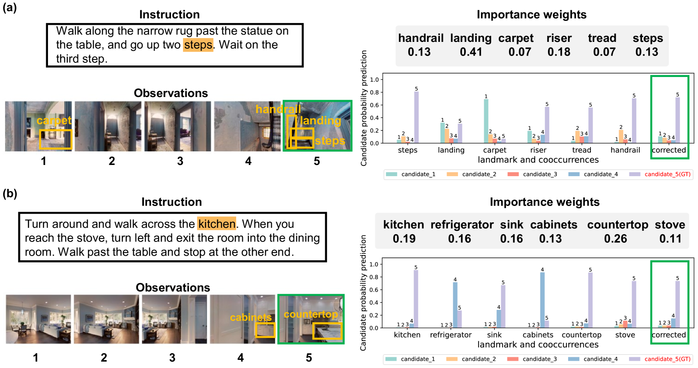

# 利用大型模型探索视觉-语言导航中的可纠正地标

发布时间：2024年05月28日

`Agent

这篇论文主要探讨了在视觉-语言导航（VLN）任务中，如何通过大型模型实现精确的模态对齐，特别是在未探索场景中。研究提出了一种新的方法CONSOLE，它利用ChatGPT和CLIP模型来实现可纠正的地标发现，并通过设计可学习的共现评分模块和观察增强策略来提高导航的准确性。这种方法涉及到了代理（Agent）的设计和优化，因此应归类为Agent。` `机器人导航`

> Correctable Landmark Discovery via Large Models for Vision-Language Navigation

# 摘要

> 视觉-语言导航（VLN）中，代理需遵循语言指令抵达目标位置。关键在于将指令中的隐含地标与视觉观察精准对齐。然而，以往的VLN代理在未探索场景中难以实现精确模态对齐，因其依赖有限导航数据且缺乏开放世界对齐知识。本研究提出了一种新范式——CONSOLE，即通过大型模型实现可纠正地标发现。我们将VLN视为开放世界的顺序地标发现问题，并基于ChatGPT和CLIP两大模型，创新性地引入了可纠正地标发现机制。ChatGPT提供开放世界地标共现的丰富常识，而CLIP则据此进行地标发现。为减少因视觉约束不足导致的先验噪声，我们设计了可学习的共现评分模块，根据实际观察调整共现重要性，确保地标发现的准确性。此外，我们还开发了观察增强策略，将我们的框架与不同VLN代理优雅结合，利用校正后的地标特征提升观察特征，辅助动作决策。在多个VLN基准测试中，CONSOLE的表现显著超越了其他强基线，尤其在未见场景的R2R和R4R上刷新了记录。代码已公开于https://github.com/expectorlin/CONSOLE。

> Vision-Language Navigation (VLN) requires the agent to follow language instructions to reach a target position. A key factor for successful navigation is to align the landmarks implied in the instruction with diverse visual observations. However, previous VLN agents fail to perform accurate modality alignment especially in unexplored scenes, since they learn from limited navigation data and lack sufficient open-world alignment knowledge. In this work, we propose a new VLN paradigm, called COrrectable LaNdmark DiScOvery via Large ModEls (CONSOLE). In CONSOLE, we cast VLN as an open-world sequential landmark discovery problem, by introducing a novel correctable landmark discovery scheme based on two large models ChatGPT and CLIP. Specifically, we use ChatGPT to provide rich open-world landmark cooccurrence commonsense, and conduct CLIP-driven landmark discovery based on these commonsense priors. To mitigate the noise in the priors due to the lack of visual constraints, we introduce a learnable cooccurrence scoring module, which corrects the importance of each cooccurrence according to actual observations for accurate landmark discovery. We further design an observation enhancement strategy for an elegant combination of our framework with different VLN agents, where we utilize the corrected landmark features to obtain enhanced observation features for action decision. Extensive experimental results on multiple popular VLN benchmarks (R2R, REVERIE, R4R, RxR) show the significant superiority of CONSOLE over strong baselines. Especially, our CONSOLE establishes the new state-of-the-art results on R2R and R4R in unseen scenarios. Code is available at https://github.com/expectorlin/CONSOLE.

[Arxiv](https://arxiv.org/abs/2405.18721)