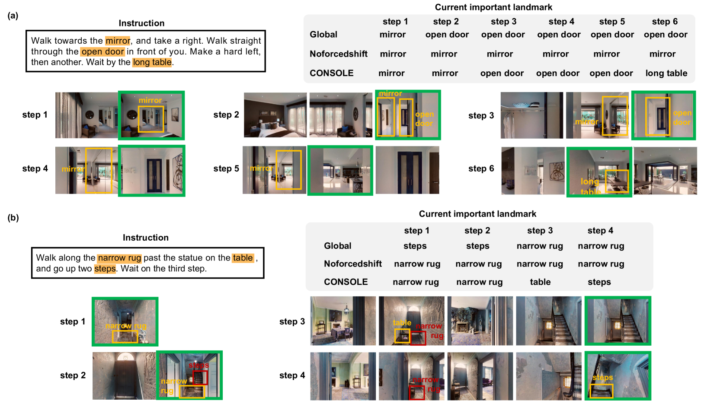

# 利用大型模型探索视觉-语言导航中的可纠正地标

发布时间：2024年05月28日

`Agent

理由：这篇论文主要讨论了在视觉-语言导航（VLN）任务中，如何通过创新的系统CONSOLE来提高代理在遵循语言指令导航至目标点的能力。CONSOLE系统利用了ChatGPT和CLIP模型来增强地标发现和导航的准确性，这在本质上是一个Agent的应用，因为它涉及到了一个智能代理在特定任务（导航）中的行为和决策过程。此外，论文中提到的系统设计和实验结果都强调了代理在开放世界环境中的性能提升，这进一步支持了其分类为Agent。` `机器人导航`

> Correctable Landmark Discovery via Large Models for Vision-Language Navigation

# 摘要

> 视觉-语言导航（VLN）中，代理需遵循语言指令抵达目标点。关键在于将指令中的隐含地标与视觉观察精准对齐。以往的VLN系统因依赖有限数据且缺乏开放世界知识，在未知环境中对齐表现不佳。为此，我们创新性地提出了CONSOLE——一种基于ChatGPT和CLIP两大模型的可纠正地标发现新范式。CONSOLE将VLN视为开放世界的顺序地标发现挑战，利用ChatGPT丰富地标共现常识，并通过CLIP进行地标发现。针对先验知识中的视觉约束不足，我们开发了可学习的共现评分机制，根据实际观察调整共现权重，确保地标发现的准确性。此外，我们还设计了观察增强策略，将CONSOLE与各类VLN系统无缝集成，通过校正后的地标特征提升观察质量，辅助决策。在R2R、REVERIE、R4R、RxR等VLN基准上的实验表明，CONSOLE显著超越现有技术，尤其在未知场景中刷新了R2R和R4R的记录。项目代码已公开于https://github.com/expectorlin/CONSOLE。

> Vision-Language Navigation (VLN) requires the agent to follow language instructions to reach a target position. A key factor for successful navigation is to align the landmarks implied in the instruction with diverse visual observations. However, previous VLN agents fail to perform accurate modality alignment especially in unexplored scenes, since they learn from limited navigation data and lack sufficient open-world alignment knowledge. In this work, we propose a new VLN paradigm, called COrrectable LaNdmark DiScOvery via Large ModEls (CONSOLE). In CONSOLE, we cast VLN as an open-world sequential landmark discovery problem, by introducing a novel correctable landmark discovery scheme based on two large models ChatGPT and CLIP. Specifically, we use ChatGPT to provide rich open-world landmark cooccurrence commonsense, and conduct CLIP-driven landmark discovery based on these commonsense priors. To mitigate the noise in the priors due to the lack of visual constraints, we introduce a learnable cooccurrence scoring module, which corrects the importance of each cooccurrence according to actual observations for accurate landmark discovery. We further design an observation enhancement strategy for an elegant combination of our framework with different VLN agents, where we utilize the corrected landmark features to obtain enhanced observation features for action decision. Extensive experimental results on multiple popular VLN benchmarks (R2R, REVERIE, R4R, RxR) show the significant superiority of CONSOLE over strong baselines. Especially, our CONSOLE establishes the new state-of-the-art results on R2R and R4R in unseen scenarios. Code is available at https://github.com/expectorlin/CONSOLE.

[Arxiv](https://arxiv.org/abs/2405.18721)