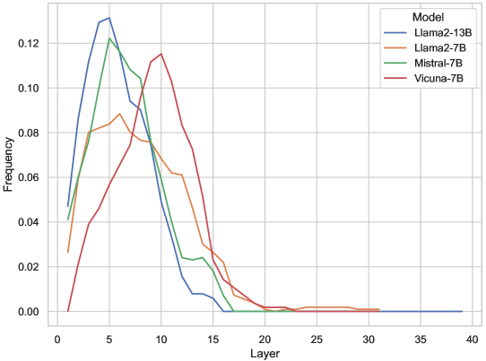

# 利用层级特定编辑技术，为大型语言模型筑起抵御越狱攻击的防线

发布时间：2024年05月28日

`LLM应用

理由：这篇论文主要关注大型语言模型（LLMs）在面对对抗性提示时的安全问题，并提出了一种新的防御策略——“层特定编辑”（LED）。该研究通过分析LLMs的内部机制，特别是早期层中的“安全层”，来增强模型对越狱攻击的防御能力。这种研究直接应用于提升LLMs在实际应用中的安全性，因此属于LLM应用类别。虽然研究涉及模型的内部机制，但其重点在于应用层面的防御策略，而非理论探讨。` `人工智能安全`

> Defending Large Language Models Against Jailbreak Attacks via Layer-specific Editing

# 摘要

> 大型语言模型（LLMs）在众多实际应用中日益普及，尽管其性能卓越，但最新研究显示，这些模型即便经过人类反馈强化学习或监督微调，仍易受精心构造的对抗性提示影响。目前防御策略多侧重于有害提示的检测或降低有害反应风险，而基于LLMs内部机制的越狱攻击防御研究尚显不足。本研究深入分析了LLMs对有害提示的响应机制，并创新性地提出了“层特定编辑”（LED）防御策略，旨在提升LLMs对越狱攻击的抵御能力。研究发现，LLMs早期层中存在若干关键“安全层”，通过重新调整这些层与目标层解码的安全响应，能显著增强模型对越狱攻击的防御。在包括Llama2、Mistral在内的多种LLMs上进行的广泛实验验证了LED的有效性，该方法不仅有效抵御越狱攻击，且不影响对良性提示的处理性能。相关代码已公开于\url{https://github.com/ledllm/ledllm}。

> Large language models (LLMs) are increasingly being adopted in a wide range of real-world applications. Despite their impressive performance, recent studies have shown that LLMs are vulnerable to deliberately crafted adversarial prompts even when aligned via Reinforcement Learning from Human Feedback or supervised fine-tuning. While existing defense methods focus on either detecting harmful prompts or reducing the likelihood of harmful responses through various means, defending LLMs against jailbreak attacks based on the inner mechanisms of LLMs remains largely unexplored. In this work, we investigate how LLMs response to harmful prompts and propose a novel defense method termed \textbf{L}ayer-specific \textbf{Ed}iting (LED) to enhance the resilience of LLMs against jailbreak attacks. Through LED, we reveal that several critical \textit{safety layers} exist among the early layers of LLMs. We then show that realigning these safety layers (and some selected additional layers) with the decoded safe response from selected target layers can significantly improve the alignment of LLMs against jailbreak attacks. Extensive experiments across various LLMs (e.g., Llama2, Mistral) show the effectiveness of LED, which effectively defends against jailbreak attacks while maintaining performance on benign prompts. Our code is available at \url{https://github.com/ledllm/ledllm}.

[Arxiv](https://arxiv.org/abs/2405.18166)