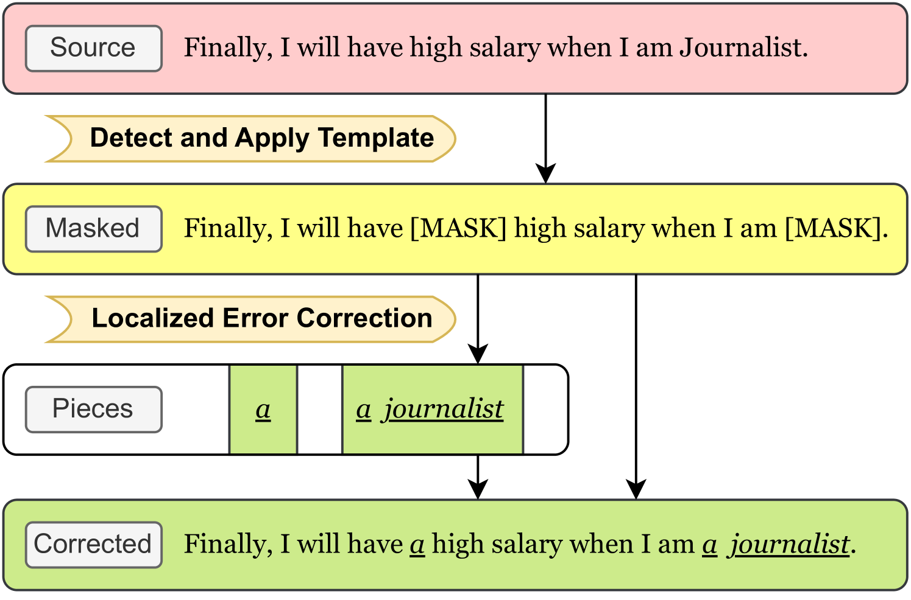
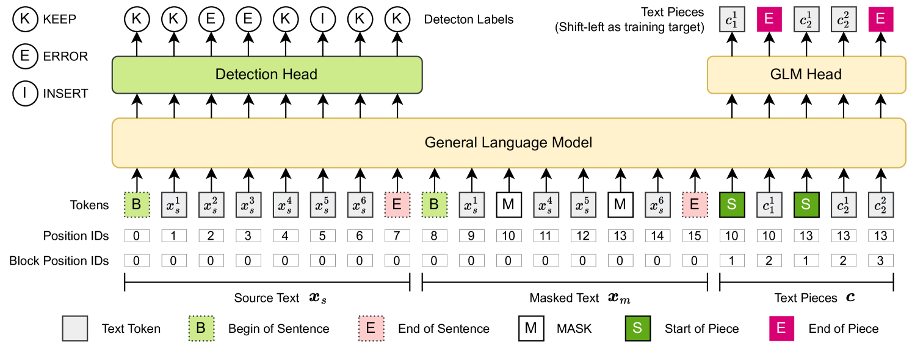
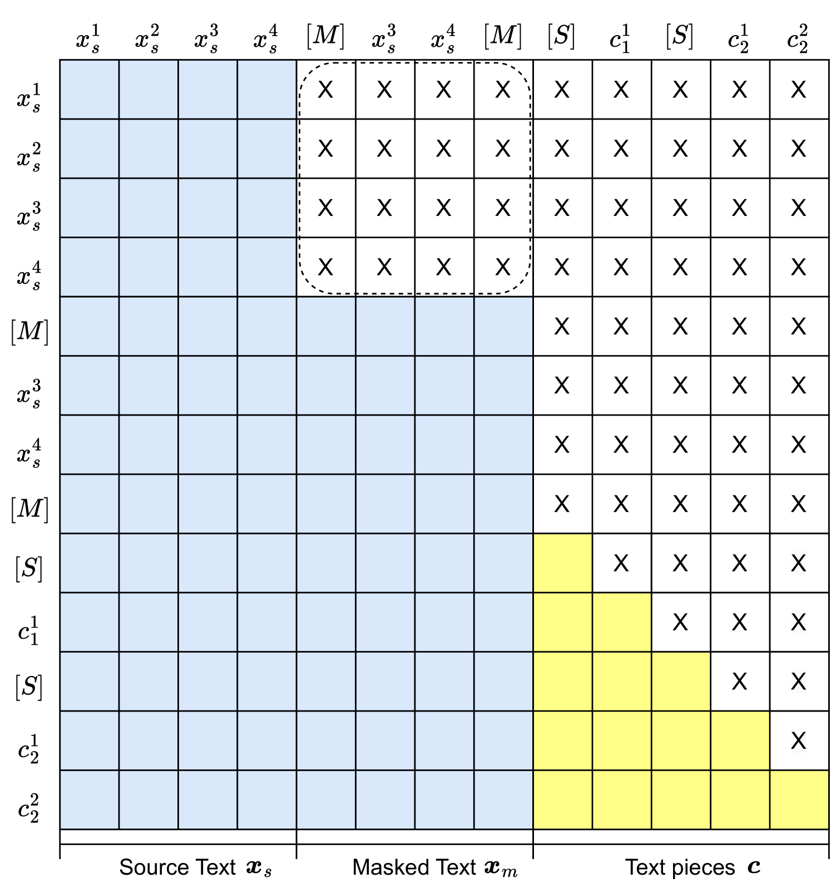
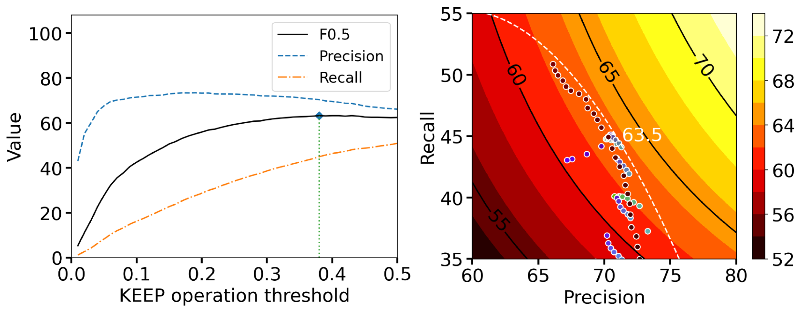
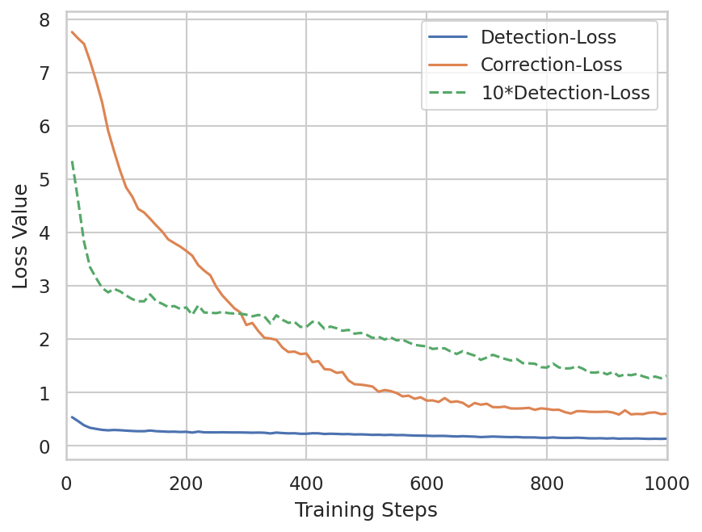

# 基于通用语言模型的语法错误修正：检测与修正结构

发布时间：2024年05月28日

`LLM应用

这篇论文介绍了一个名为DeCoGLM的模型，该模型基于通用语言模型（GLM），专门设计用于语法错误修正（GEC）任务。DeCoGLM模型通过整合检测和修正两个环节，实现了在单一模型内的多任务学习。这种集成方法通过特定的技术（如容错模板和自回归掩码填充技术）来精准定位并修正文本中的语法错误。论文在英语和中文GEC数据集上展示了DeCoGLM的性能，并与顶尖模型进行了比较，显示出其卓越的性能。因此，这篇论文属于大型语言模型（LLM）的应用范畴，因为它展示了LLM在特定任务（即语法错误修正）中的实际应用和效果。`

> Detection-Correction Structure via General Language Model for Grammatical Error Correction

# 摘要

> 语法错误修正（GEC）任务旨在通过最小化编辑来修正文本，其核心包括检测和修正两个环节。以往研究多侧重于直接修正，未曾尝试将检测与修正整合于单一模型。大型语言模型（LLMs）对这一检测-修正范式的探索尚显不足。本文推出的DeCoGLM模型，基于通用语言模型（GLM），巧妙融合了检测与修正功能。检测阶段采用容错模板，修正阶段则运用自回归掩码填充技术，精准定位并修正错误。通过精心设计输入令牌和调整注意力掩码，DeCoGLM实现了模型内的多任务学习。在英语和中文GEC数据集上，DeCoGLM与顶尖模型比肩，展现出卓越性能。实验结果证实，LLMs中的检测-修正结构极具潜力，为GEC领域开辟了新的研究方向。

> Grammatical error correction (GEC) is a task dedicated to rectifying texts with minimal edits, which can be decoupled into two components: detection and correction. However, previous works have predominantly focused on direct correction, with no prior efforts to integrate both into a single model. Moreover, the exploration of the detection-correction paradigm by large language models (LLMs) remains underdeveloped. This paper introduces an integrated detection-correction structure, named DeCoGLM, based on the General Language Model (GLM). The detection phase employs a fault-tolerant detection template, while the correction phase leverages autoregressive mask infilling for localized error correction. Through the strategic organization of input tokens and modification of attention masks, we facilitate multi-task learning within a single model. Our model demonstrates competitive performance against the state-of-the-art models on English and Chinese GEC datasets. Further experiments present the effectiveness of the detection-correction structure in LLMs, suggesting a promising direction for GEC.

[Arxiv](https://arxiv.org/abs/2405.17804)