# 别忘了连线！利用图结构重新排序提升 RAG 性能

发布时间：2024年05月28日

`RAG

理由：这篇论文主要探讨了Retrieval Augmented Generation (RAG) 的改进方法，特别是通过引入基于图神经网络的重新排序机制（G-RAG）来提高RAG的性能。论文的核心贡献在于提出了一种新的技术来优化RAG中的文档检索和上下文排序，这是对RAG框架的直接改进和应用，因此归类为RAG。` `问答系统`

> Don't Forget to Connect! Improving RAG with Graph-based Reranking

# 摘要

> Retrieval Augmented Generation (RAG) 通过结合现有文档的上下文，显著提升了大型语言模型 (LLM) 的响应质量。然而，当文档仅提供部分信息或与问题上下文的关联不明显时，RAG 的表现如何？我们又该如何理解文档间的关联？本研究旨在解答这些关于 RAG 生成的关键问题。我们提出了 G-RAG，一种基于图神经网络 (GNNs) 的重新排序机制，它位于 RAG 的检索器和阅读器之间，能够结合文档间的联系和语义信息（通过抽象意义表示图），为 RAG 提供更精准的上下文排序。G-RAG 不仅在性能上超越了现有技术，而且计算成本更低。我们还评估了 PaLM 2 作为重新排序器的性能，发现其表现远不如 G-RAG，这进一步凸显了在大型语言模型中，重新排序对于 RAG 的重要性。

> Retrieval Augmented Generation (RAG) has greatly improved the performance of Large Language Model (LLM) responses by grounding generation with context from existing documents. These systems work well when documents are clearly relevant to a question context. But what about when a document has partial information, or less obvious connections to the context? And how should we reason about connections between documents? In this work, we seek to answer these two core questions about RAG generation. We introduce G-RAG, a reranker based on graph neural networks (GNNs) between the retriever and reader in RAG. Our method combines both connections between documents and semantic information (via Abstract Meaning Representation graphs) to provide a context-informed ranker for RAG. G-RAG outperforms state-of-the-art approaches while having smaller computational footprint. Additionally, we assess the performance of PaLM 2 as a reranker and find it to significantly underperform G-RAG. This result emphasizes the importance of reranking for RAG even when using Large Language Models.

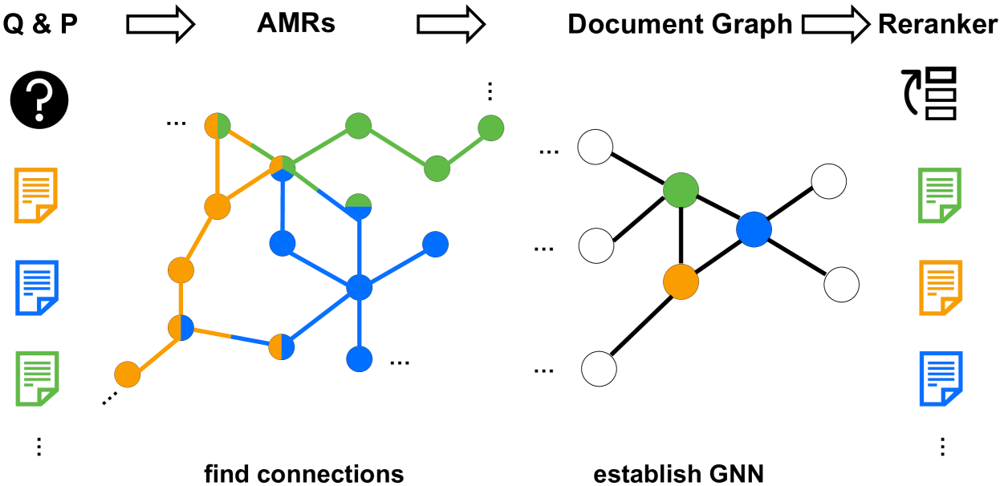

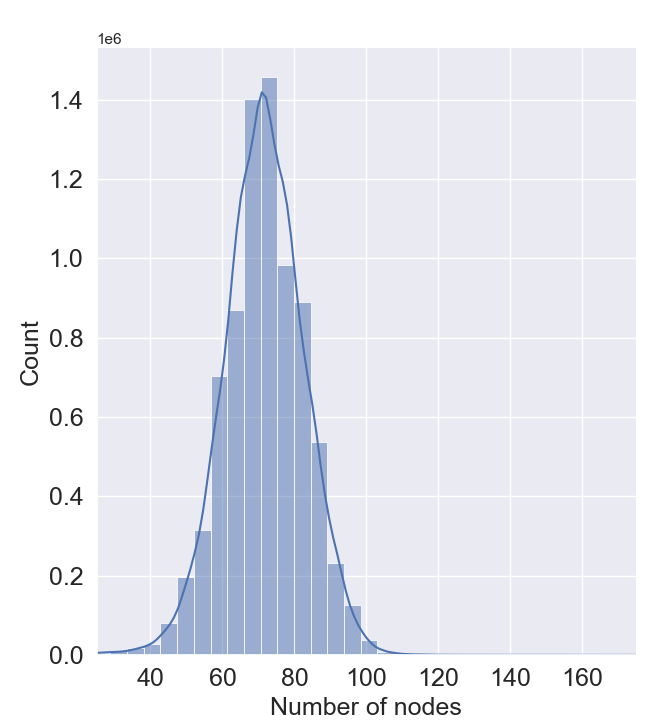

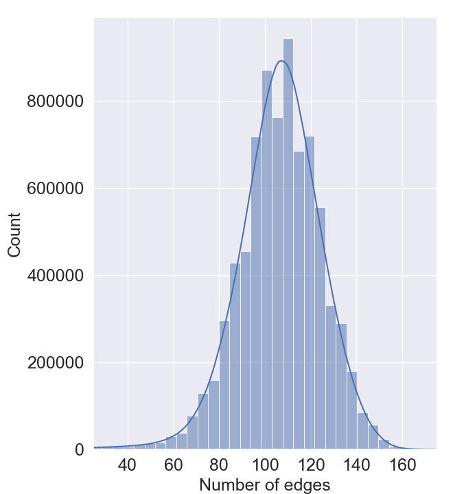

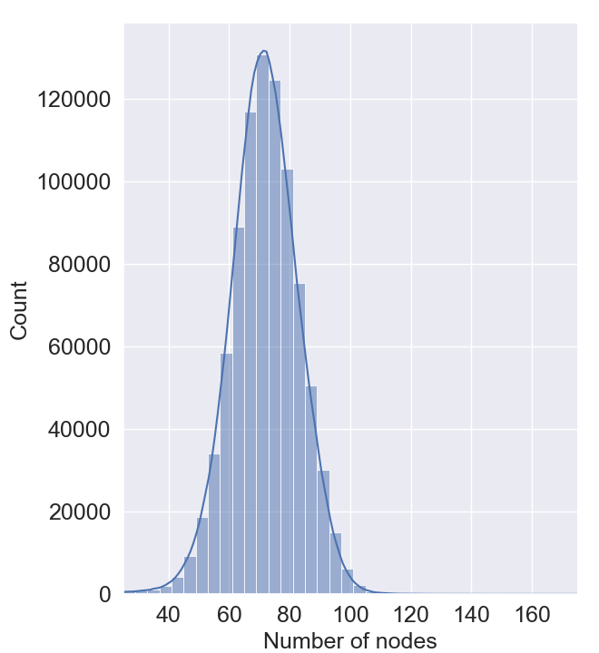

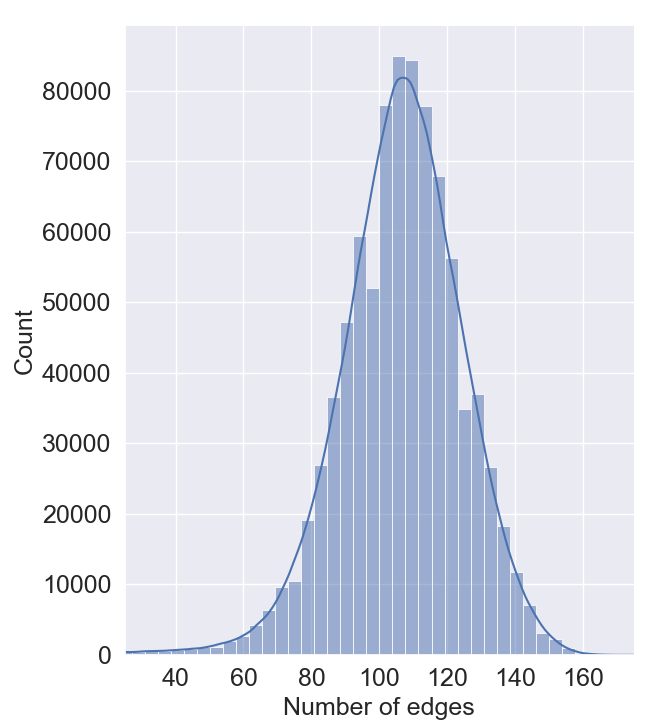

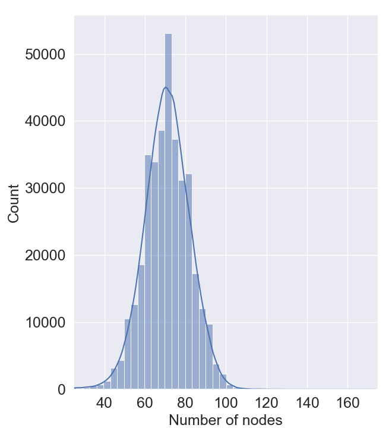

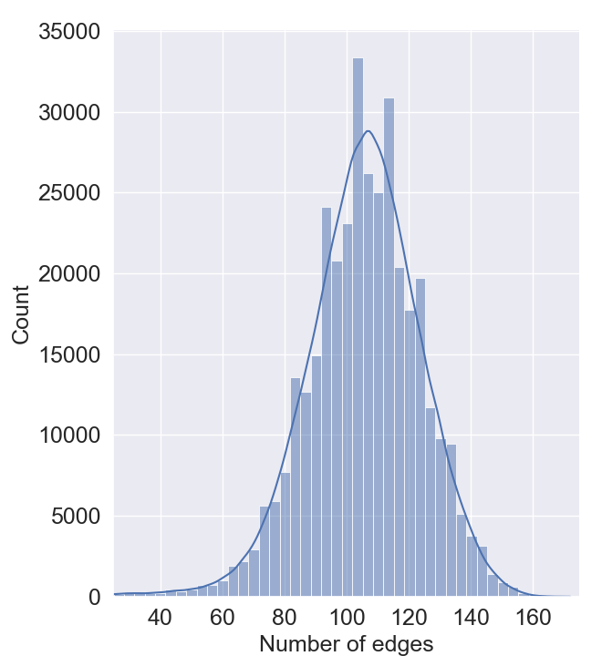

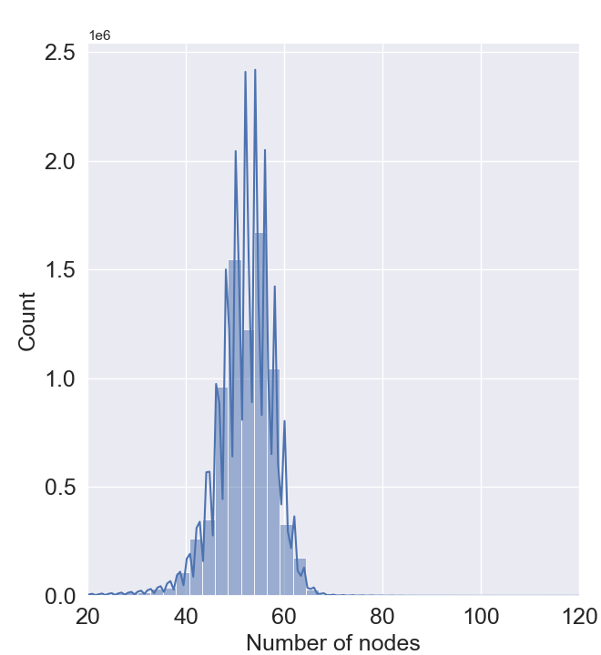

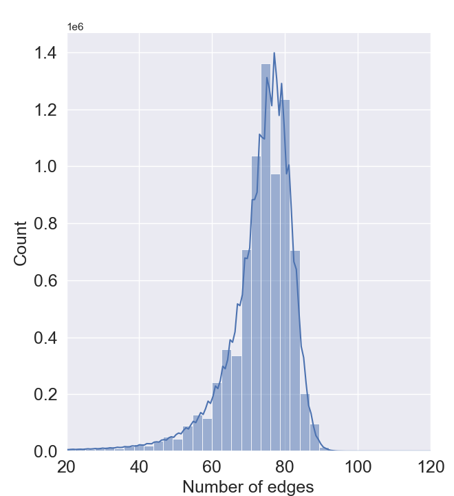

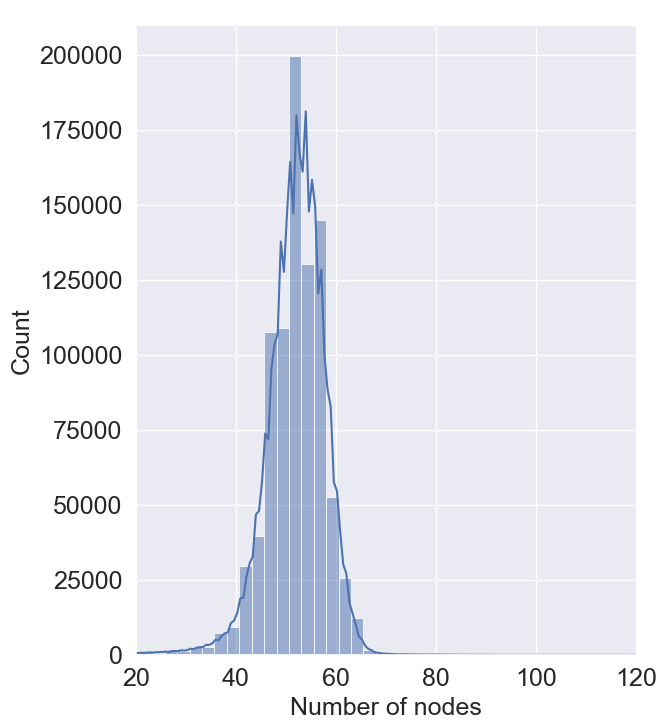

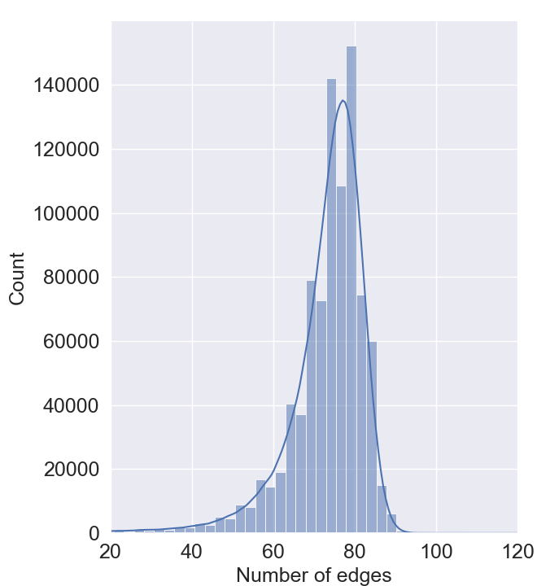

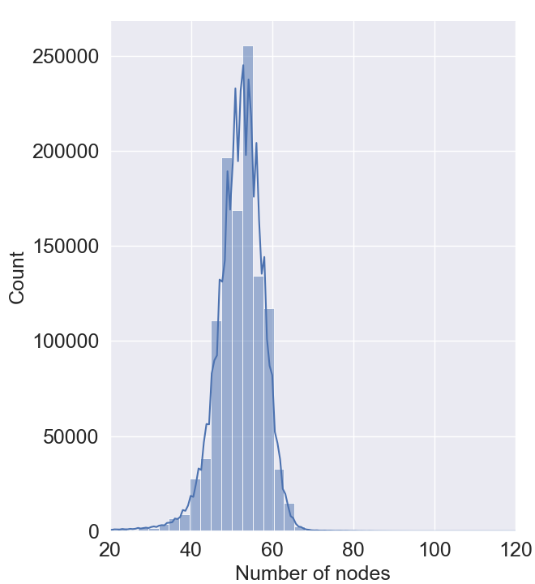

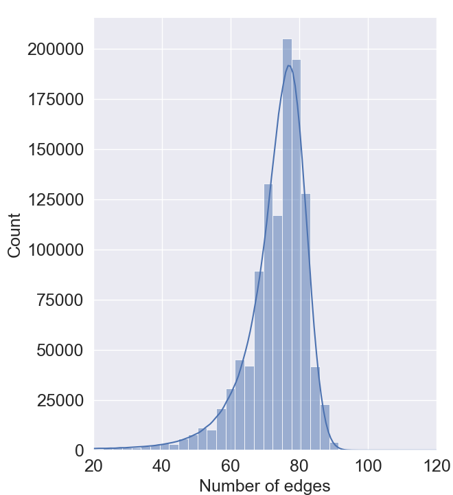

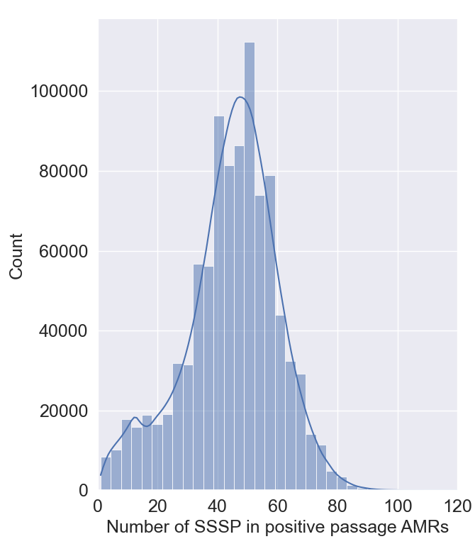

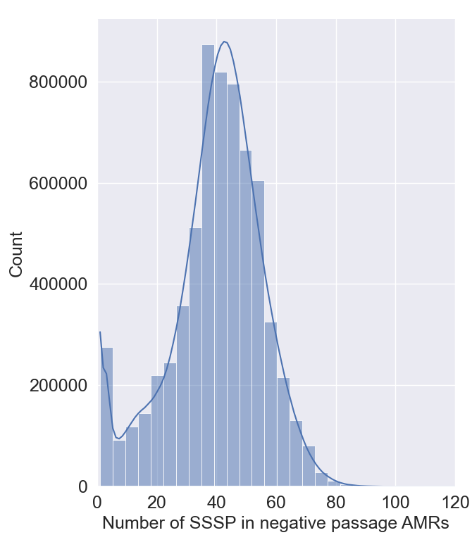

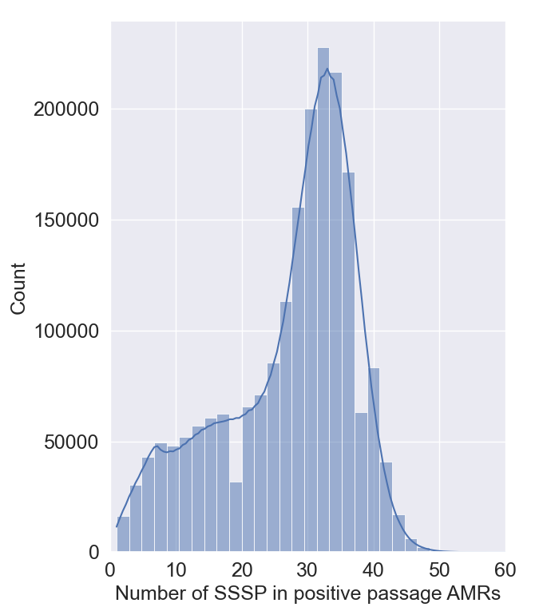

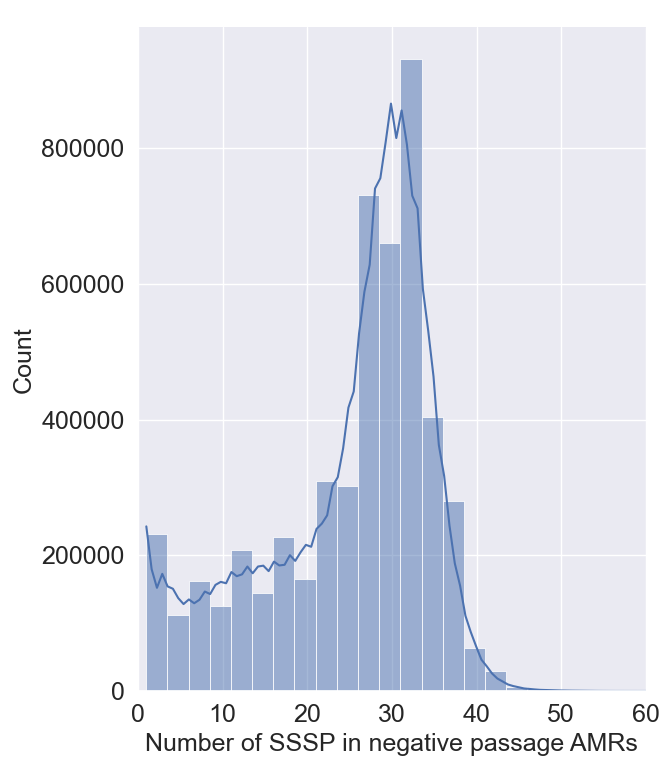

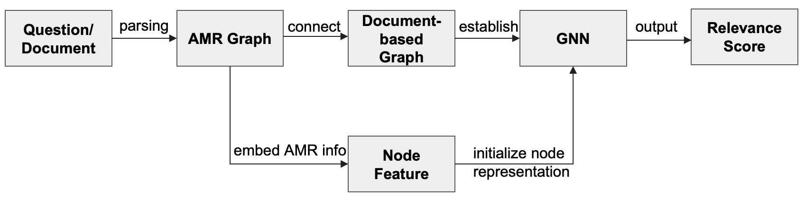

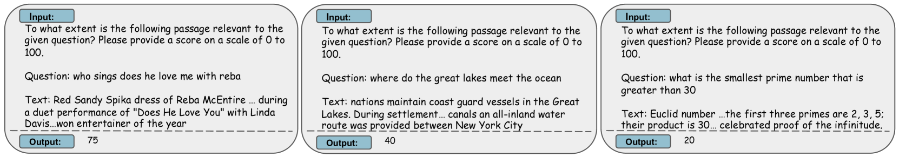

[Arxiv](https://arxiv.org/abs/2405.18414)