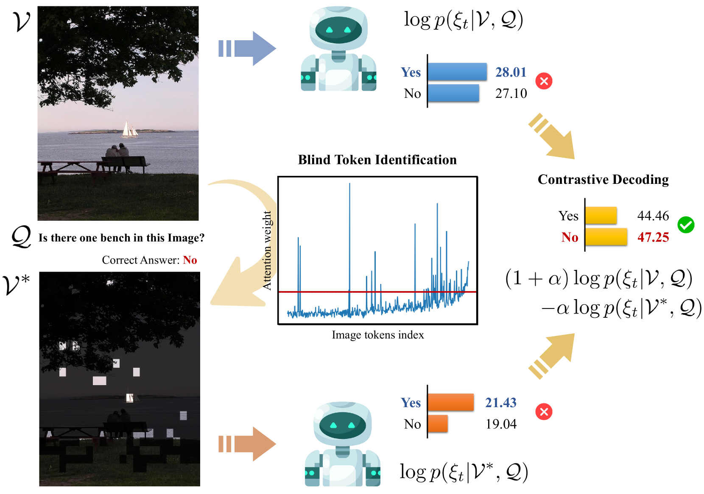
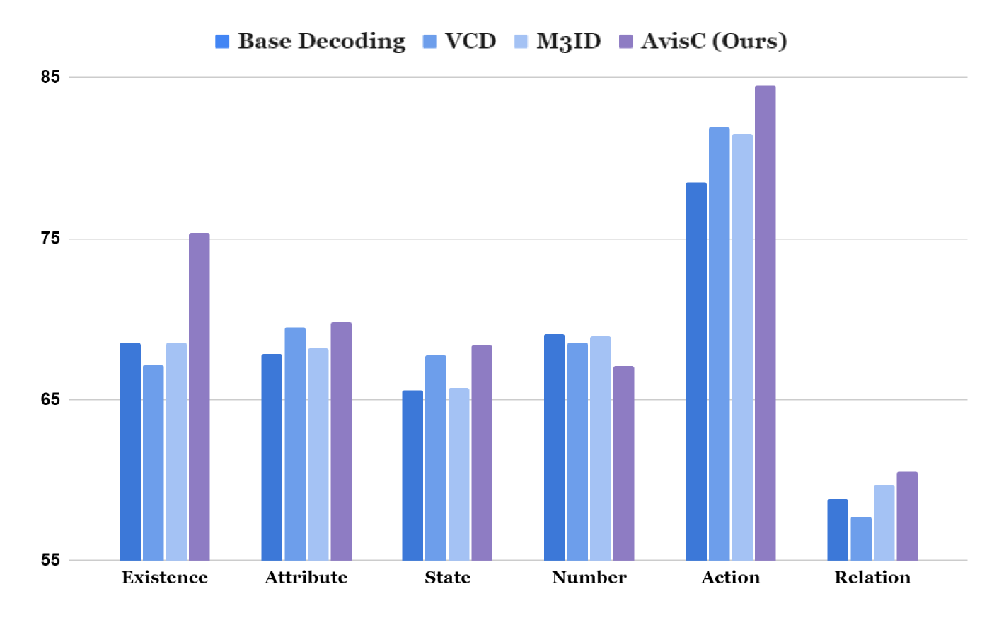

# 勿因树木而失森林：大型视觉语言模型的注意力视觉校准

发布时间：2024年05月28日

`LLM应用

理由：这篇论文关注的是大型视觉语言模型（LVLMs）在处理视觉对象任务时的性能问题，并提出了一种新的技术（注意力视觉校准，AVC）来改善这一问题。虽然涉及到了模型的内部机制（注意力分布），但主要焦点是应用层面的改进，即如何通过技术手段减少模型在特定任务上的幻觉现象。因此，这篇论文更适合归类为LLM应用，因为它主要探讨了如何应用技术来优化大型模型的性能，而不是深入探讨模型的理论基础或Agent的行为。` `计算机视觉`

> Don't Miss the Forest for the Trees: Attentional Vision Calibration for Large Vision Language Models

# 摘要

> 本研究揭示了大型视觉语言模型（LVLMs）中的一个现象：过度关注少数图像令牌（盲令牌）导致在精细理解视觉对象的任务中产生幻觉。我们发现，那些被忽视的令牌往往蕴含着识别对象细节的关键信息。为此，我们提出了一种名为注意力视觉校准（AVC）的新技术。AVC在解码过程中通过分析注意力分布来识别盲令牌，并调整预测下一个令牌的对数，以减少对盲令牌的依赖，实现对所有令牌的均衡考量。在POPE、MME和AMBER等基准测试中，AVC显著优于现有技术，有效减少了LVLMs中的对象幻觉现象。

> This study addresses the issue observed in Large Vision Language Models (LVLMs), where excessive attention on a few image tokens, referred to as blind tokens, leads to hallucinatory responses in tasks requiring fine-grained understanding of visual objects. We found that tokens receiving lower attention weights often hold essential information for identifying nuanced object details -- ranging from merely recognizing object existence to identifying their attributes (color, position, etc.) and understanding their relationships. To counteract the over-emphasis on blind tokens and to accurately respond to user queries, we introduce a technique called Attentional Vision Calibration (AVC). During the decoding phase, AVC identifies blind tokens by analyzing the image-related attention distribution. It then dynamically adjusts the logits for the next token prediction by contrasting the logits conditioned on the original visual tokens with those conditioned on the blind tokens. This effectively lowers the dependency on blind tokens and promotes a more balanced consideration of all tokens. We validate AVC on benchmarks such as POPE, MME, and AMBER, where it consistently outperforms existing decoding techniques in mitigating object hallucinations in LVLMs.

[Arxiv](https://arxiv.org/abs/2405.17820)