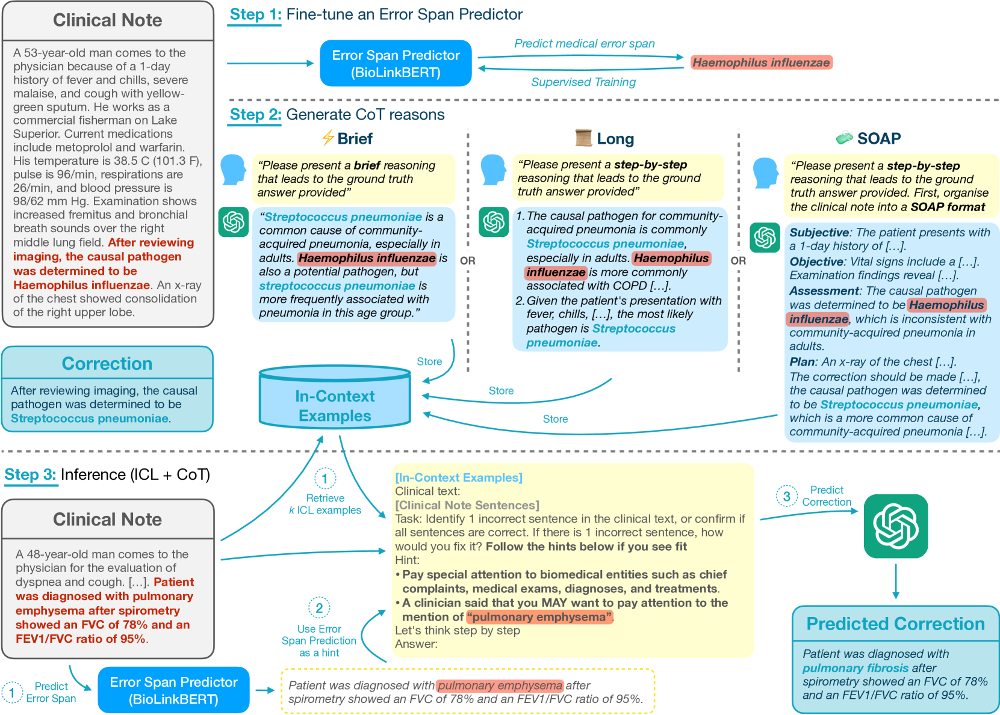
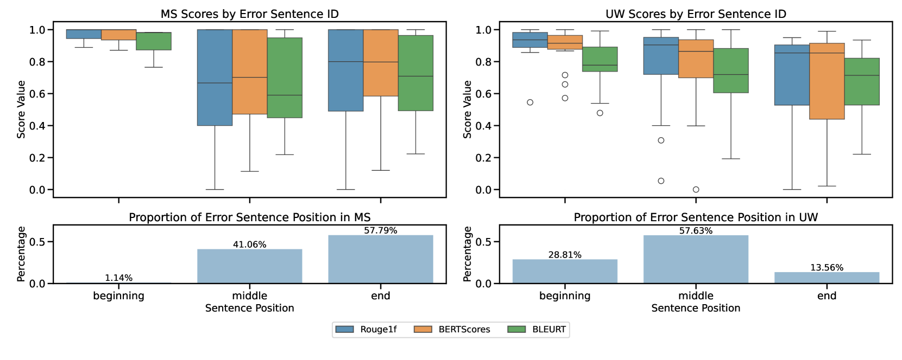

# 2024年MEDIQA-CORR大会上，爱丁堡临床NLP团队展示了如何巧妙地利用提示来引导大型语言模型，以提升其在医疗领域的应用效果。

发布时间：2024年05月28日

`LLM应用

这篇论文摘要描述了使用大型语言模型（如GPT-3.5和GPT-4）来识别和修正临床笔记中的医疗错误的研究。研究中采用了多种提示策略，并结合微调模型来提高纠错准确性。这表明研究关注的是LLM在特定应用场景（即医疗错误修正）中的实际应用和性能优化，因此属于LLM应用分类。` `临床应用`

> Edinburgh Clinical NLP at MEDIQA-CORR 2024: Guiding Large Language Models with Hints

# 摘要

> MEDIQA-CORR 2024 共享任务旨在检验大型语言模型（如 GPT-3.5 和 GPT-4）在临床笔记中识别和修正医疗错误的能力。本研究通过多种提示策略评估这些模型的能力，并提出结合微调模型的错误范围预测，以提升纠正的准确性。我们发现，通过在提示中加入提示或设计为多项选择题，LLM 的纠错能力显著增强。我们的最佳方案（结合 8-shot、CoT 和提示）在排行榜上位列第六。此外，我们的深入分析揭示了错误句子位置、提示角色及选项位置对 LLM 准确性的影响，引发了对 LLM 在实际临床应用中准备程度的深入探讨。

> The MEDIQA-CORR 2024 shared task aims to assess the ability of Large Language Models (LLMs) to identify and correct medical errors in clinical notes. In this study, we evaluate the capability of general LLMs, specifically GPT-3.5 and GPT-4, to identify and correct medical errors with multiple prompting strategies. Recognising the limitation of LLMs in generating accurate corrections only via prompting strategies, we propose incorporating error-span predictions from a smaller, fine-tuned model in two ways: 1) by presenting it as a hint in the prompt and 2) by framing it as multiple-choice questions from which the LLM can choose the best correction. We found that our proposed prompting strategies significantly improve the LLM's ability to generate corrections. Our best-performing solution with 8-shot + CoT + hints ranked sixth in the shared task leaderboard. Additionally, our comprehensive analyses show the impact of the location of the error sentence, the prompted role, and the position of the multiple-choice option on the accuracy of the LLM. This prompts further questions about the readiness of LLM to be implemented in real-world clinical settings.

[Arxiv](https://arxiv.org/abs/2405.18028)