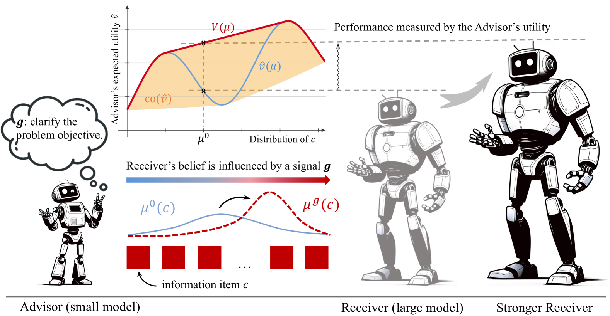
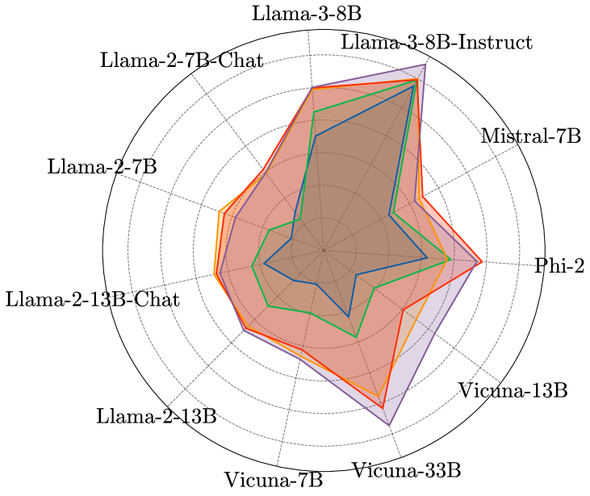
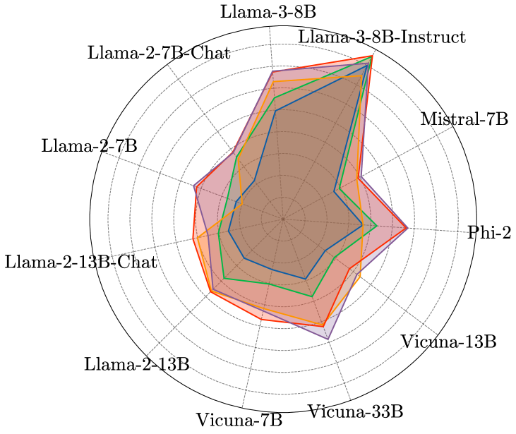
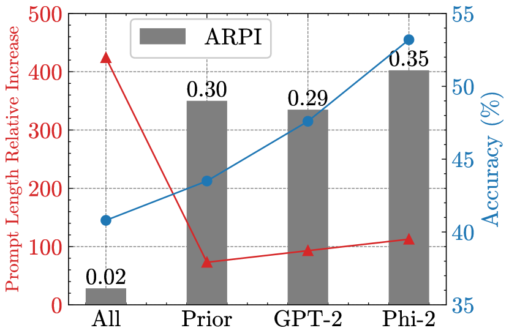

# 利用贝叶斯说服策略，实现模型间的高效对齐，不受特定模型限制。

发布时间：2024年05月28日

`Agent

理由：这篇论文主要探讨了如何通过一个小型模型来优化大型黑盒模型的对齐过程，以确保大型语言模型与人类意图的一致性。这种方法涉及使用一个轻量级的、模型无关的贝叶斯说服框架来优化小型模型的信号策略，从而引导大型模型产生更优的响应。这种通过代理（小型模型）来影响和优化主系统（大型模型）的行为，符合Agent的定义，即一个能够感知环境并采取行动以达到目标的系统。因此，这篇论文应归类于Agent。` `人工智能` `模型对齐`

> Efficient Model-agnostic Alignment via Bayesian Persuasion

# 摘要

> 随着大型语言模型技术的进步，对齐技术已成为确保模型与人类意图一致的关键。目前，主流方法如监督微调（SFT）和人类反馈强化学习（RLHF）虽有效，但资源消耗巨大。本文提出了一种创新方法：利用小型模型优化大型黑盒模型的对齐过程，采用轻量级且模型无关的贝叶斯说服框架。我们通过优化小型模型的信号策略，使其在说服过程中引导大型模型产生更优响应。实证显示，通过此框架训练，小型模型能显著提升大型模型在多任务上的表现，如数学推理能力提升16.1%，代码生成提升13.7%。我们期望这一研究能为对齐技术的未来发展提供新的视角。

> With recent advancements in large language models (LLMs), alignment has emerged as an effective technique for keeping LLMs consensus with human intent. Current methods primarily involve direct training through Supervised Fine-tuning (SFT) or Reinforcement Learning from Human Feedback (RLHF), both of which require substantial computational resources and extensive ground truth data. This paper explores an efficient method for aligning black-box large models using smaller models, introducing a model-agnostic and lightweight Bayesian Persuasion Alignment framework. We formalize this problem as an optimization of the signaling strategy from the small model's perspective. In the persuasion process, the small model (Advisor) observes the information item (i.e., state) and persuades large models (Receiver) to elicit improved responses. The Receiver then generates a response based on the input, the signal from the Advisor, and its updated belief about the information item. Through training using our framework, we demonstrate that the Advisor can significantly enhance the performance of various Receivers across a range of tasks. We theoretically analyze our persuasion framework and provide an upper bound on the Advisor's regret, confirming its effectiveness in learning the optimal signaling strategy. Our Empirical results demonstrates that GPT-2 can significantly improve the performance of various models, achieving an average enhancement of 16.1% in mathematical reasoning ability and 13.7% in code generation. We hope our work can provide an initial step toward rethinking the alignment framework from the Bayesian Persuasion perspective.

[Arxiv](https://arxiv.org/abs/2405.18718)