# 基于偏好的强化学习：通过对齐经验估计实现高效学习

发布时间：2024年05月28日

`Agent

理由：这篇论文主要讨论了基于偏好的强化学习（PbRL）方法，并提出了一种名为SEER的新方法，该方法通过结合标签平滑与策略正则化来提高学习效率和性能。这种研究直接关联到训练和优化代理（Agent）的行为和决策过程，特别是在无需精心设计奖励的情况下。因此，它属于Agent分类，因为它专注于改进和优化代理的学习和行为策略。` `人工智能`

> Efficient Preference-based Reinforcement Learning via Aligned Experience Estimation

# 摘要

> 基于偏好的强化学习（PbRL）在无需精心设计奖励的情况下训练代理表现出色，但其依赖大量人类反馈的弱点不容忽视。这种依赖源自学习循环，该循环需要大量样本以精确学习奖励和策略。为此，我们开发了SEER，一种结合标签平滑与策略正则化的高效PbRL方法。通过平滑人类偏好标签，SEER减少了奖励模型的过拟合，并利用回放缓存中的优质状态-动作对来引导一个保守的Q值估计，以抑制高估偏差，进而优化策略学习。实验证明，无论是在线还是离线，SEER在多种复杂任务中均显著提升了反馈效率，超越了现有技术。进一步的消融研究揭示，SEER在Q函数精度上超越了以往的方法。

> Preference-based reinforcement learning (PbRL) has shown impressive capabilities in training agents without reward engineering. However, a notable limitation of PbRL is its dependency on substantial human feedback. This dependency stems from the learning loop, which entails accurate reward learning compounded with value/policy learning, necessitating a considerable number of samples. To boost the learning loop, we propose SEER, an efficient PbRL method that integrates label smoothing and policy regularization techniques. Label smoothing reduces overfitting of the reward model by smoothing human preference labels. Additionally, we bootstrap a conservative estimate $\widehat{Q}$ using well-supported state-action pairs from the current replay memory to mitigate overestimation bias and utilize it for policy learning regularization. Our experimental results across a variety of complex tasks, both in online and offline settings, demonstrate that our approach improves feedback efficiency, outperforming state-of-the-art methods by a large margin. Ablation studies further reveal that SEER achieves a more accurate Q-function compared to prior work.

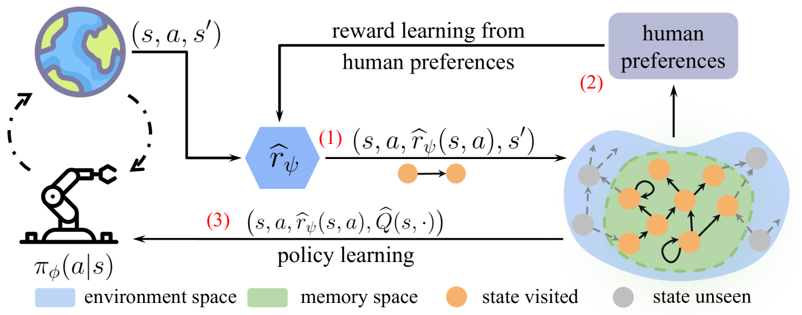

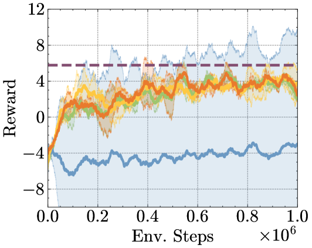

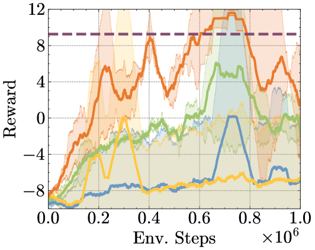

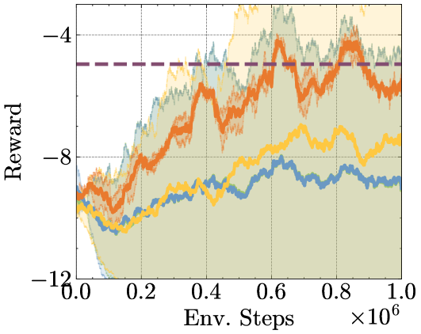

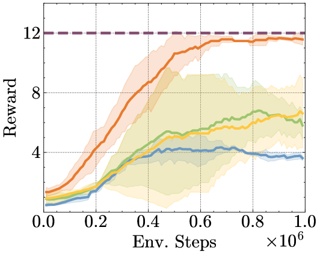

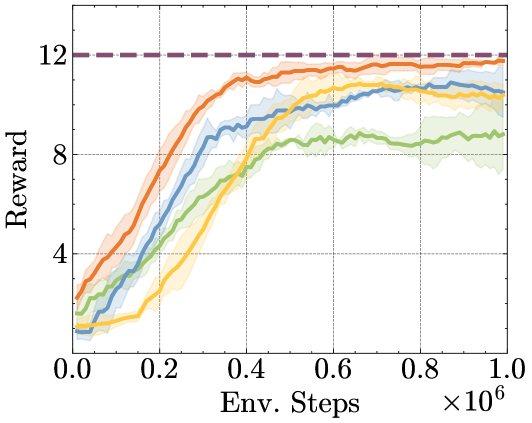

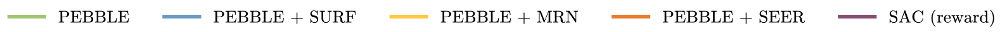

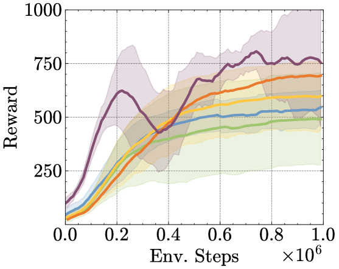

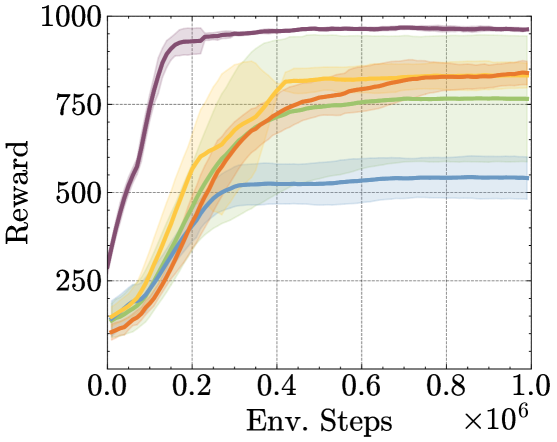

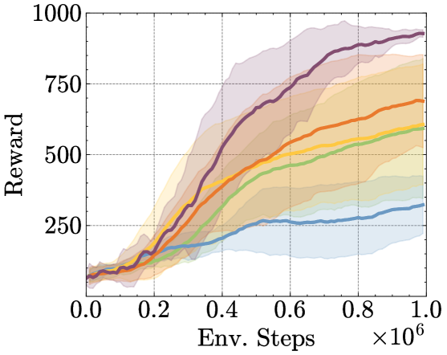

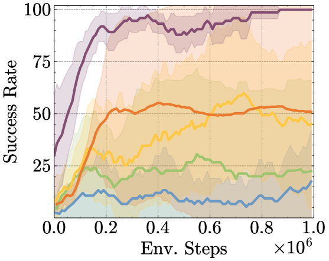

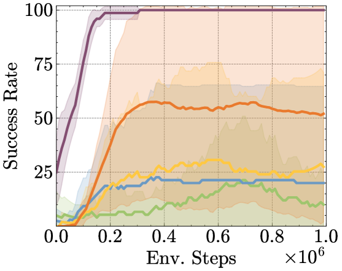

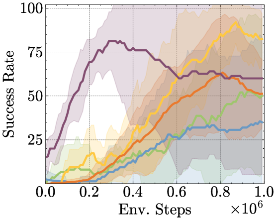

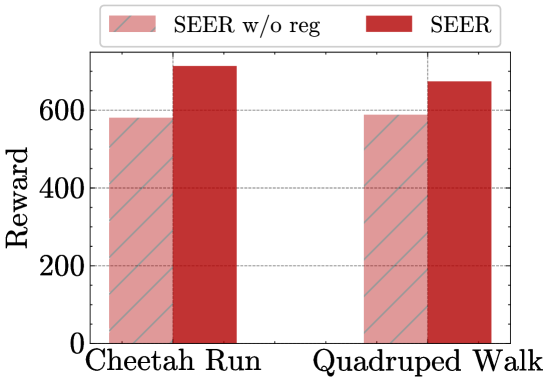

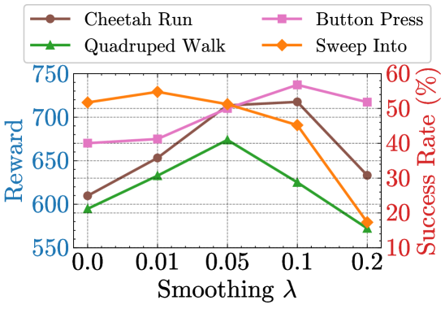

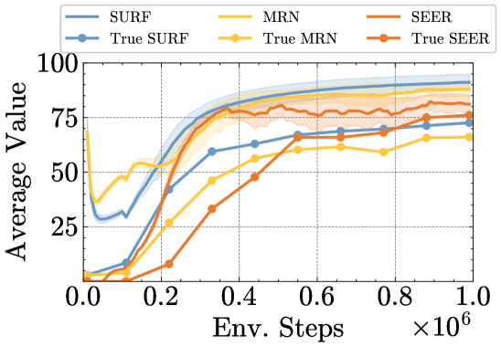

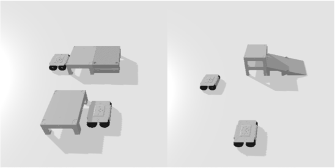

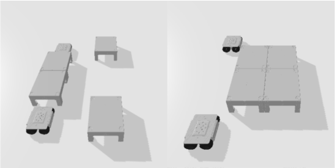

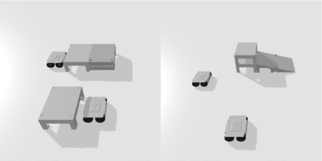

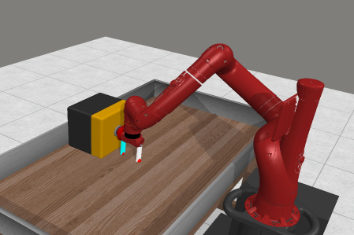

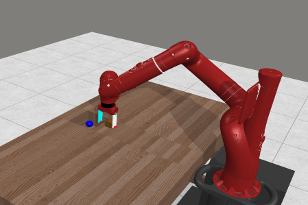

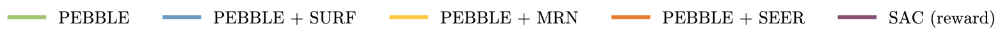

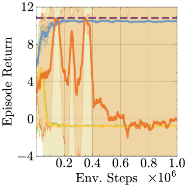

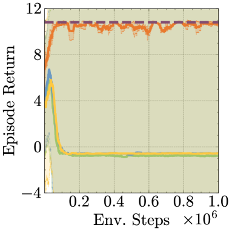

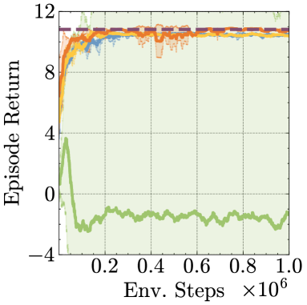

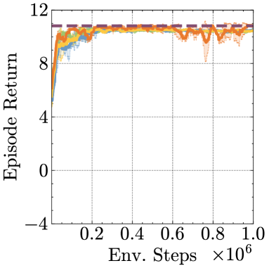

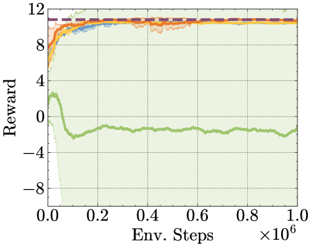

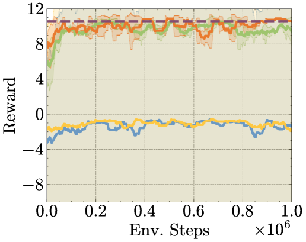

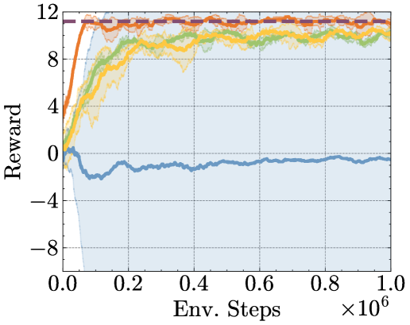

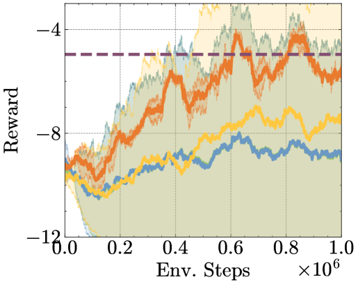

[Arxiv](https://arxiv.org/abs/2405.18688)