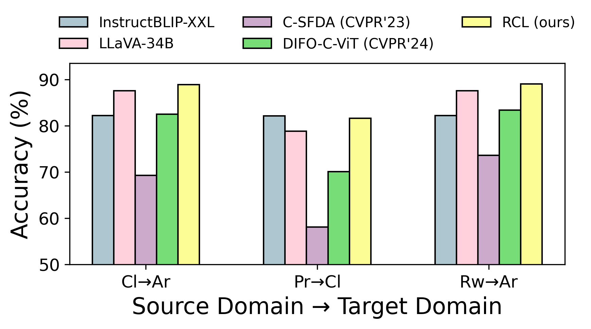
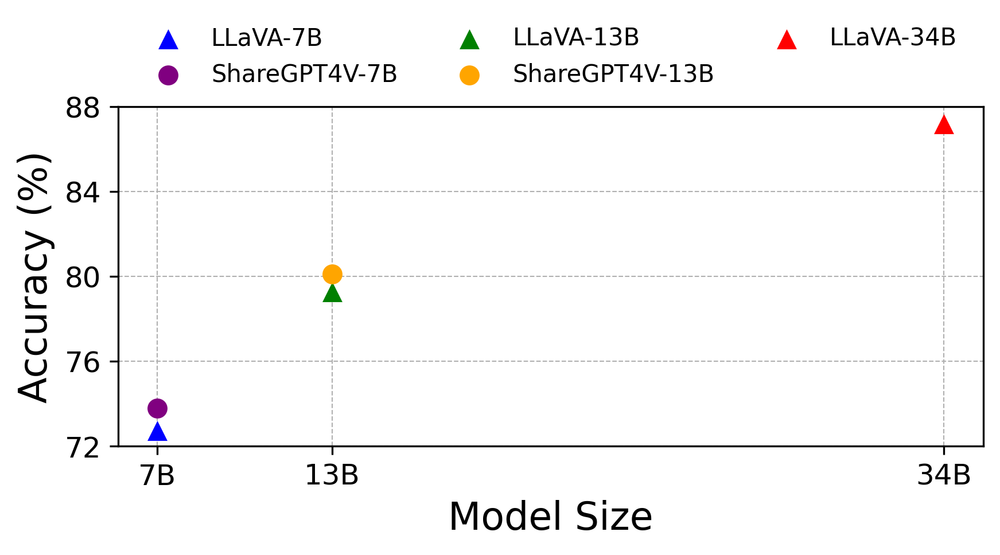
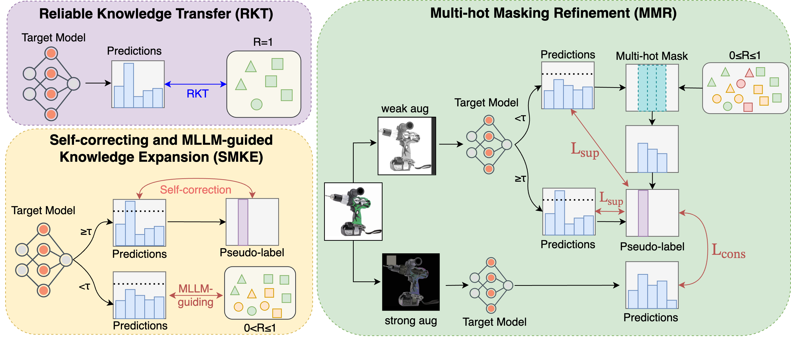
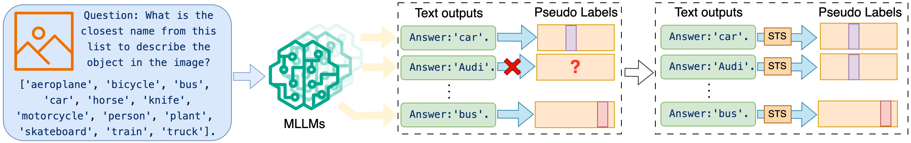
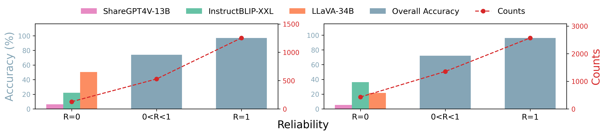
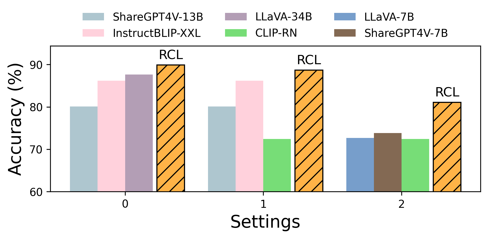
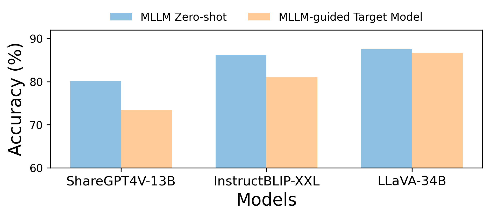
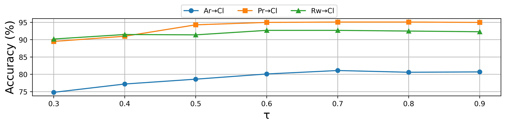
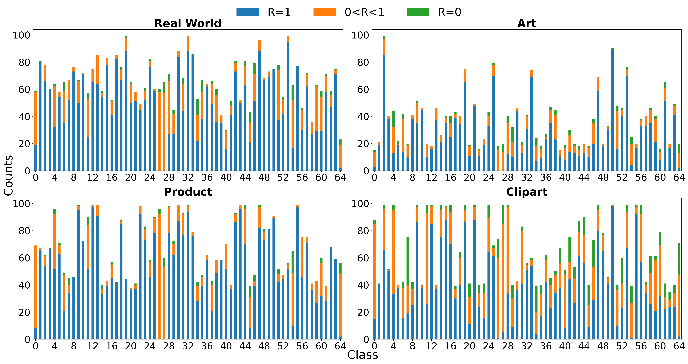

# 借助多语言大型语言模型驱动的课程学习，提升源无关域适应能力

发布时间：2024年05月28日

`Agent

理由：这篇论文主要讨论了在源自由域适应（SFDA）场景下，如何利用多模态大型语言模型（MLLMs）来提升模型的适应性和鲁棒性。论文提出了一种基于可靠性的课程学习（RCL）框架，该框架通过伪标记技术整合多个MLLMs，以在SFDA中挖掘知识。这种方法涉及到模型的自我校正和知识扩展，以及多热点掩码细化技术，这些都是Agent相关的行为，因为它们涉及到模型的自主学习和适应环境的能力。因此，这篇论文更适合归类为Agent。` `机器学习` `数据迁移`

> Empowering Source-Free Domain Adaptation with MLLM-driven Curriculum Learning

# 摘要

> 源自由域适应（SFDA）旨在仅凭未标记的目标数据，将预训练的源模型迁移至目标域。当前方法在充分利用预训练知识和挖掘目标域数据方面遭遇挑战。多模态大型语言模型（MLLMs）虽在处理视觉与文本信息上表现卓越，但在SFDA应用中，如指令遵循失败、高计算需求及适应前性能评估难题等问题仍待解决。为此，我们创新性地提出了基于可靠性的课程学习（RCL）框架，通过伪标记技术，整合多个MLLMs以在SFDA中挖掘知识。该框架融合了可靠知识转移、自我校正及MLLM引导的知识扩展，以及多热点掩码细化技术，逐步深入挖掘目标域的未标记数据。RCL在多个SFDA基准上取得了顶尖成绩，例如在DomainNet上性能提升了$\textbf{+9.4\%}$，展现了其在无需源数据访问的情况下，提升模型适应性与鲁棒性的强大效能。代码已公开：https://github.com/Dong-Jie-Chen/RCL。

> Source-Free Domain Adaptation (SFDA) aims to adapt a pre-trained source model to a target domain using only unlabeled target data. Current SFDA methods face challenges in effectively leveraging pre-trained knowledge and exploiting target domain data. Multimodal Large Language Models (MLLMs) offer remarkable capabilities in understanding visual and textual information, but their applicability to SFDA poses challenges such as instruction-following failures, intensive computational demands, and difficulties in performance measurement prior to adaptation. To alleviate these issues, we propose Reliability-based Curriculum Learning (RCL), a novel framework that integrates multiple MLLMs for knowledge exploitation via pseudo-labeling in SFDA. Our framework incorporates proposed Reliable Knowledge Transfer, Self-correcting and MLLM-guided Knowledge Expansion, and Multi-hot Masking Refinement to progressively exploit unlabeled data in the target domain. RCL achieves state-of-the-art (SOTA) performance on multiple SFDA benchmarks, e.g., $\textbf{+9.4%}$ on DomainNet, demonstrating its effectiveness in enhancing adaptability and robustness without requiring access to source data. Code: https://github.com/Dong-Jie-Chen/RCL.

[Arxiv](https://arxiv.org/abs/2405.18376)