# 利用LLM代理赋能生成设计工具，探索新型设备构建——以流体计算接口为例

发布时间：2024年05月28日

`Agent

这篇论文主要探讨了将大型语言模型（LLM）代理融入物理设备设计工具的可能性，以增强生成设计工具（GDT）的功能。它涉及了LLM在设计工具中的应用，特别是在人机交互和设备设计领域。虽然这涉及到LLM的应用，但更侧重于通过LLM代理来增强设计工具的能力，因此更适合归类为Agent。` `人机交互` `设计工具`

> Enabling Generative Design Tools with LLM Agents for Building Novel Devices: A Case Study on Fluidic Computation Interfaces

# 摘要

> 在人机交互领域，交互设备的创新发展备受瞩目。随着新型硬件和先进制造技术的兴起，对能够简化尖端设备原型制作过程的专门设计工具的需求日益增长。虽然这些工具通过参数化设计和模拟简化了流程，但它们的学习曲线往往较陡峭，且在激发创意构思方面表现不佳。本研究以流体计算接口为例，探索了将大型语言模型（LLM）代理融入物理设备设计工具的可能性。增强后的生成设计工具（GDT）能洞察新设备的能力与局限，提出富有洞察力的应用场景，并推荐技术与情境相宜的设计方案。此外，它还为传统设计工具部分生成必要的设计参数，以便可视化结果并准备制造支持文件。本文不仅阐述了GDT的框架、实施和性能，还对其未来发展及面临的挑战进行了深思。

> In the field of Human-Computer Interaction (HCI), the development of interactive devices represents a significant area of focus. The advent of novel hardware and advanced fabrication techniques has underscored the demand for specialized design tools that democratize the prototyping process for such cutting-edge devices. While these tools simplify the process through parametric design and simulation, they typically require a certain learning curve and often fall short in facilitating creative ideation. In this study, we employ fluidic computation interface as a case study to investigate the potential of augmenting design tools of physical devices with Large Language Model (LLM) agents. Enhanced by LLM agents, the Generative Design Tool (GDT) can comprehend the capabilities and limitations of newly developed devices; it can propose varied, insightful, and practical application scenarios, and recommend device designs that are technically and contextually appropriate. Furthermore, it generates the necessary design parameters for the traditional part of the design tool to visualize results and produce support files for fabrication. This paper outlines the GDT's framework, implementation, and performance, while also contemplating its prospects and the obstacles encountered.

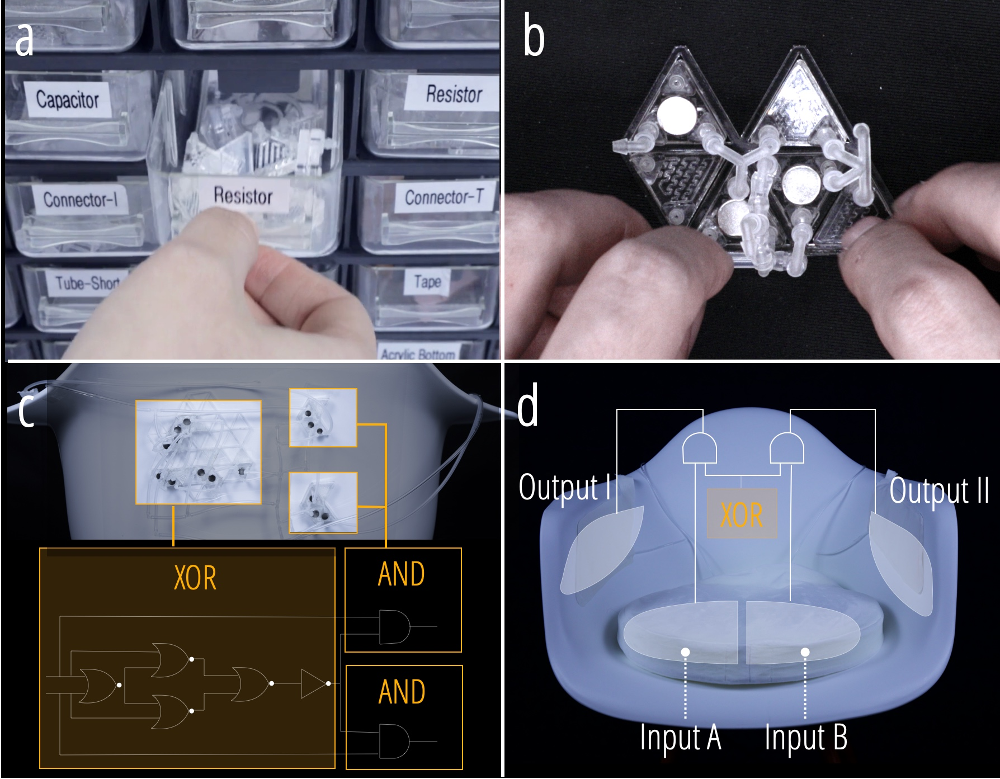

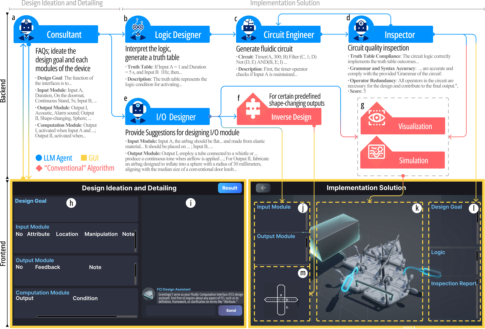

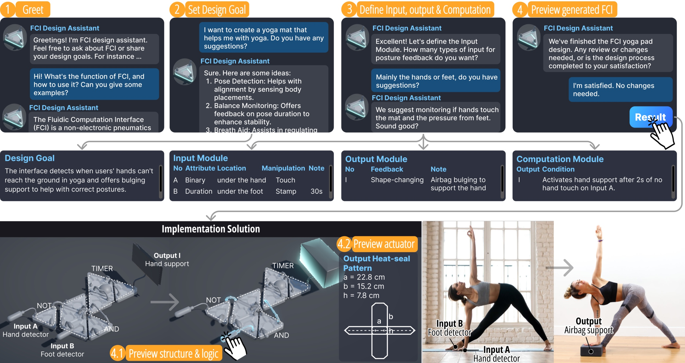

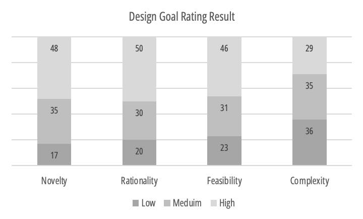

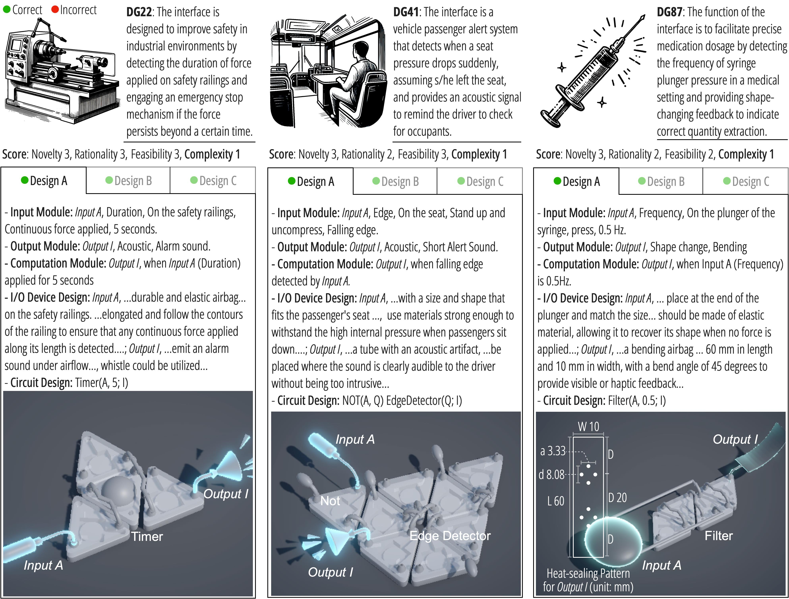

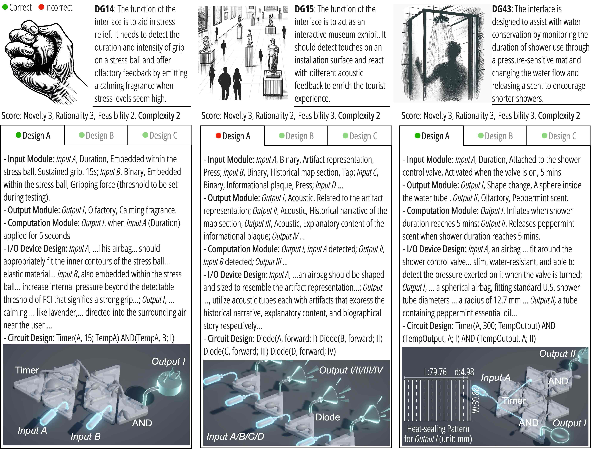

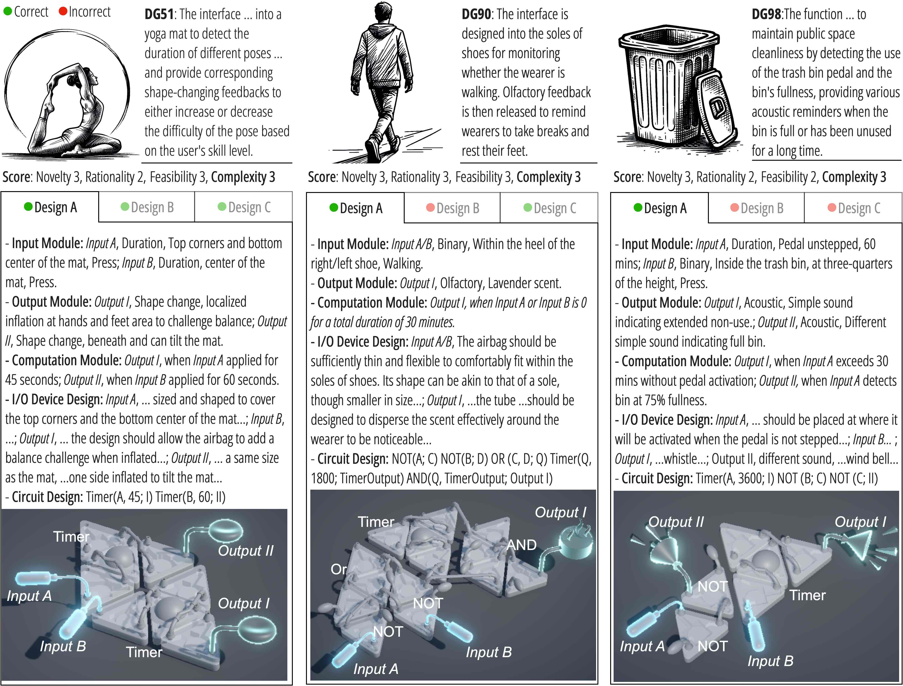

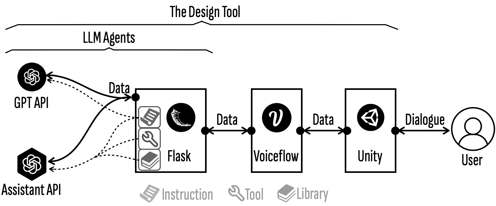

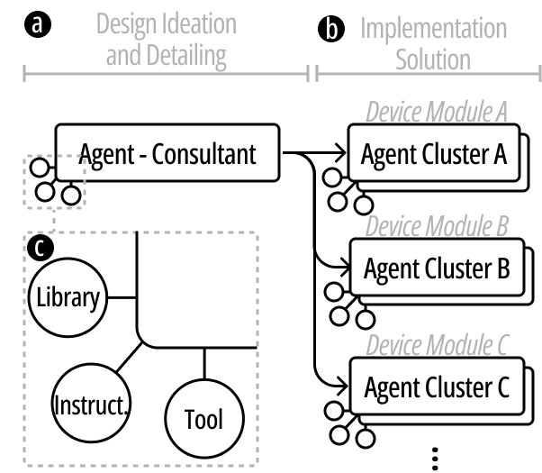

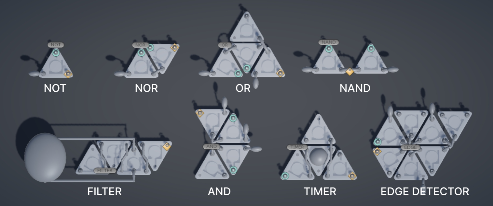

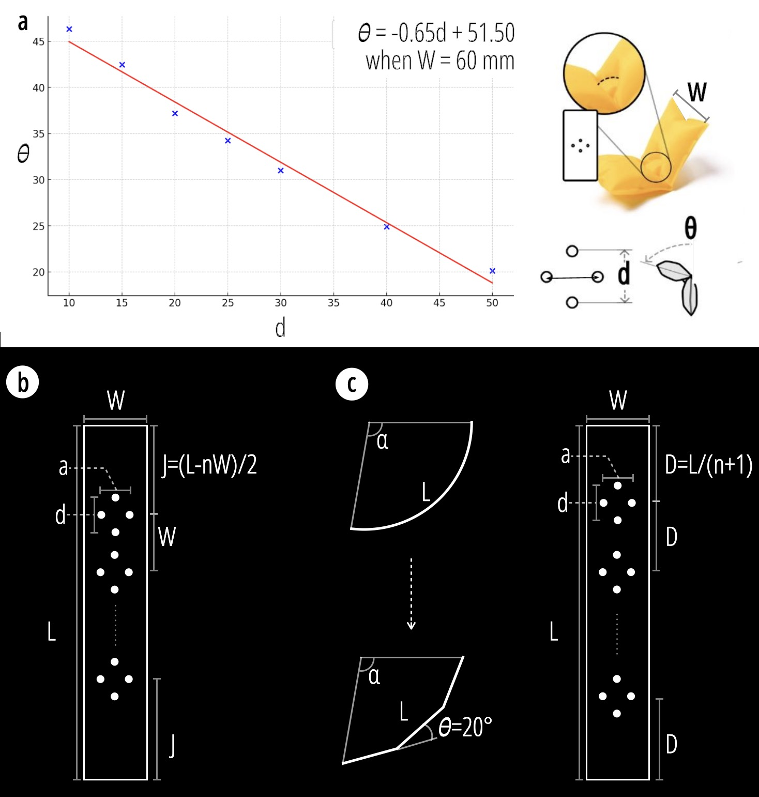

[Arxiv](https://arxiv.org/abs/2405.17837)