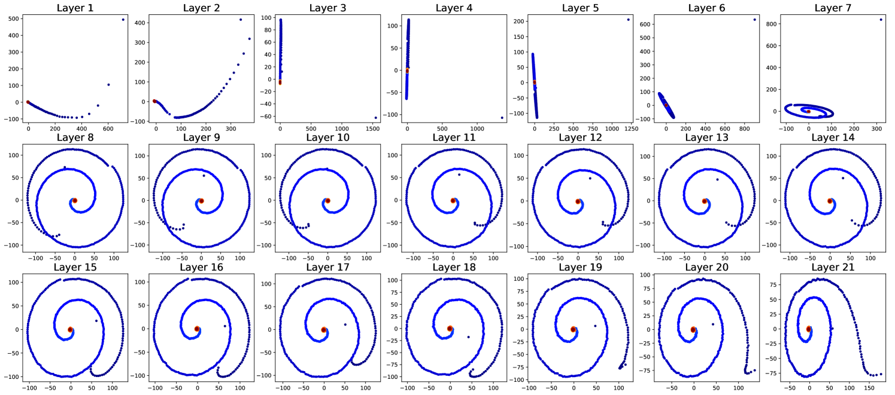

# 探究大型语言模型上下文窗口：分解位置向量之法

发布时间：2024年05月28日

`LLM理论

这篇论文主要探讨了大型语言模型（LLMs）中上下文窗口的限制及其对模型性能的影响，并深入分析了位置信息在模型中的作用。通过采用特定的技术来分解和分析位置向量，论文揭示了LLMs在处理超出上下文窗口的文本时的运作机制，并提出了两种扩展上下文窗口的策略。这些研究内容属于对LLMs内部工作原理的理论探讨，因此归类为LLM理论。` `机器学习`

> Exploring Context Window of Large Language Models via Decomposed Positional Vectors

# 摘要

> 基于Transformer的大型语言模型（LLMs）受限于其上下文窗口，一旦处理超出此范围的文本，性能便会大幅下滑。尽管已有众多研究尝试扩展这一窗口并推动LLMs的长度外推，但这些方法背后的深层原理仍未被充分揭示。本研究深入探讨了LLMs中上下文窗口内外的位置信息，旨在揭示其运作机制。我们采用了一种基于均值的分解技术，将位置向量从LLMs的隐藏状态中剥离出来，并探究了它们的生成过程及其对注意力的影响。当文本长度超出上下文窗口时，我们分别在直接外推和窗口扩展两种情境下，分析了位置向量的变化。基于这些发现，我们提出了两种无需额外训练的上下文窗口扩展策略：位置向量替换和注意力窗口扩展。实验证明，这些策略能有效延长上下文窗口，提升模型性能。

> Transformer-based large language models (LLMs) typically have a limited context window, resulting in significant performance degradation when processing text beyond the length of the context window. Extensive studies have been proposed to extend the context window and achieve length extrapolation of LLMs, but there is still a lack of in-depth interpretation of these approaches. In this study, we explore the positional information within and beyond the context window for deciphering the underlying mechanism of LLMs. By using a mean-based decomposition method, we disentangle positional vectors from hidden states of LLMs and analyze their formation and effect on attention. Furthermore, when texts exceed the context window, we analyze the change of positional vectors in two settings, i.e., direct extrapolation and context window extension. Based on our findings, we design two training-free context window extension methods, positional vector replacement and attention window extension. Experimental results show that our methods can effectively extend the context window length.

[Arxiv](https://arxiv.org/abs/2405.18009)