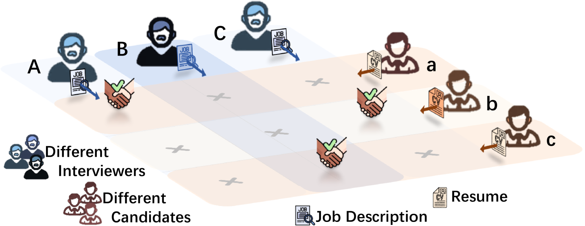
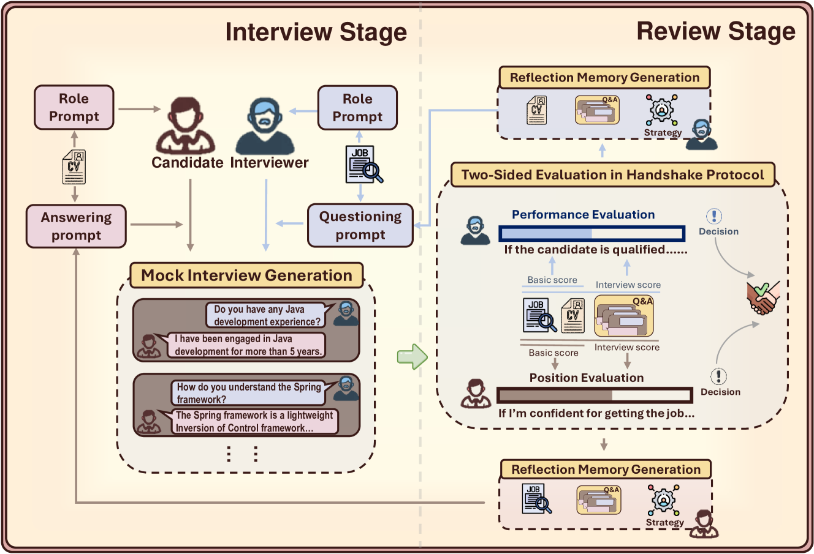
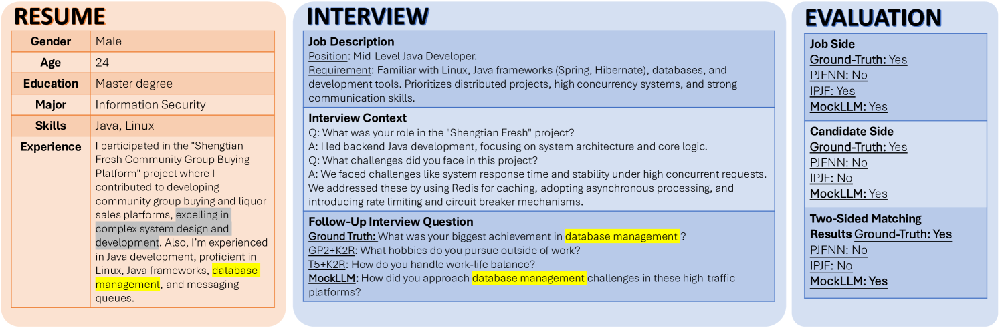
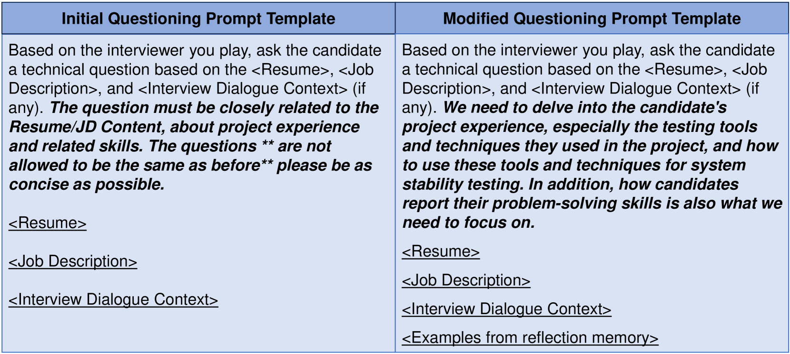
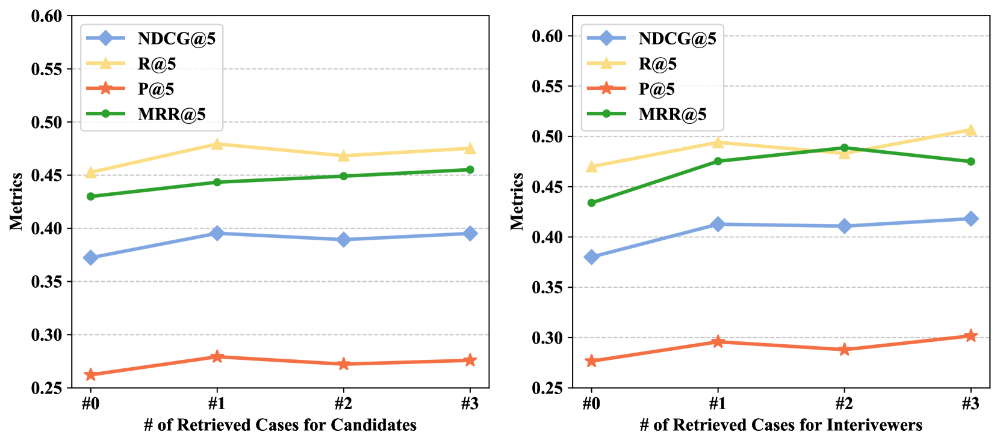

# 助力大型语言模型实现在线求职与招聘的多角色多行为协同

发布时间：2024年05月28日

`Agent

这篇论文主要介绍了一种基于大型语言模型（LLMs）的模拟面试流程，其中LLM扮演面试官与候选人进行对话，以提升人岗匹配效率。这种方法涉及创建一个Agent（代理），即LLM，来模拟面试官的角色，并通过其与候选人的交互来评估和匹配候选人与职位。因此，这篇论文更符合Agent分类，因为它描述了一个智能代理如何被用于特定的应用场景，即在线招聘服务中的模拟面试。` `在线招聘` `人力资源`

> Facilitating Multi-Role and Multi-Behavior Collaboration of Large Language Models for Online Job Seeking and Recruiting

# 摘要

> 在线招聘服务的兴起彻底改变了求职和招聘的传统方式，推动了高质量工业应用的发展，以提升人岗匹配效率。现有方法多依赖于简历和职位描述的潜在语义建模及其匹配函数的学习。受到大型语言模型（LLMs）在角色扮演方面的强大能力启发，我们提出了一种模拟面试流程，其中LLM扮演面试官与候选人进行对话。这种模拟面试不仅为候选人评估提供了新的视角，也丰富了传统仅依赖简历和职位描述的人岗匹配方法。然而，在线招聘中如何精准刻画这两个角色仍是一大挑战，包括如何提出有效的面试问题、如何给出恰当的答案以及如何评估双方的匹配度。为此，我们开发了MockLLM框架，它将人岗匹配过程细分为模拟面试生成和双方评估两个模块，并通过面试官与候选人之间的协作行为来共同提升匹配效果。我们设计了一个多角色、多行为的角色扮演框架，使单个LLM能够为双方执行多种功能。此外，我们还引入了反射记忆生成和动态提示修改技术，以不断优化双方的行为，增强模拟面试的质量。实验结果显示，MockLLM在人岗匹配上表现卓越，模拟面试质量高，预示着其在未来在线招聘中的广泛应用前景。

> The emergence of online recruitment services has revolutionized the traditional landscape of job seeking and recruitment, necessitating the development of high-quality industrial applications to improve person-job fitting. Existing methods generally rely on modeling the latent semantics of resumes and job descriptions and learning a matching function between them. Inspired by the powerful role-playing capabilities of Large Language Models (LLMs), we propose to introduce a mock interview process between LLM-played interviewers and candidates. The mock interview conversations can provide additional evidence for candidate evaluation, thereby augmenting traditional person-job fitting based solely on resumes and job descriptions. However, characterizing these two roles in online recruitment still presents several challenges, such as developing the skills to raise interview questions, formulating appropriate answers, and evaluating two-sided fitness. To this end, we propose MockLLM, a novel applicable framework that divides the person-job matching process into two modules: mock interview generation and two-sided evaluation in handshake protocol, jointly enhancing their performance through collaborative behaviors between interviewers and candidates. We design a role-playing framework as a multi-role and multi-behavior paradigm to enable a single LLM agent to effectively behave with multiple functions for both parties. Moreover, we propose reflection memory generation and dynamic prompt modification techniques to refine the behaviors of both sides, enabling continuous optimization of the augmented additional evidence. Extensive experimental results show that MockLLM can achieve the best performance on person-job matching accompanied by high mock interview quality, envisioning its emerging application in real online recruitment in the future.

[Arxiv](https://arxiv.org/abs/2405.18113)