# FinerCut：精细剪枝大型语言模型的可解释层，实现更细粒度的优化。

发布时间：2024年05月28日

`LLM理论

理由：这篇论文主要探讨了大型语言模型（LLM）的架构优化问题，特别是通过细粒度层剪枝技术（FinerCut）来减少过度参数化的变压器网络的参数数量，以减少计算资源需求和环境影响。这种技术涉及到对模型内部结构的深入理解和调整，属于对LLM理论层面的研究和改进。因此，将其归类为LLM理论。` `人工智能` `模型优化`

> FinerCut: Finer-grained Interpretable Layer Pruning for Large Language Models

# 摘要

> 过度参数化的变压器网络是大型语言模型的尖端架构，但其庞大的参数数量不仅需要大量计算资源，还引发了环境担忧。为此，我们推出了FinerCut，一种创新的细粒度层剪枝技术，它将变压器块内的自注意力和前馈网络层作为独立剪枝对象，与以往的块级剪枝不同。FinerCut精准地移除那些对模型输出影响最小的层，开创了一种精简、透明且通用的剪枝方法。在9项基准测试中，我们的方法在减少25%层后仍保持Llama3-8B的90%性能，减少30%层后保持Llama3-70B的95%性能，无需任何微调或后续重建。特别引人注目的是，FinerCut显示，在移除34个自注意力层后，Llama3-70B的性能几乎不受影响，且无需额外微调。此外，FinerCut还提供了一个工具，用于分析被剪除层的类型和位置，揭示了有趣的剪枝模式，如更倾向于剪除深层解码器中的自注意力层。我们期待这些发现能启发未来高效LLM架构的创新设计。

> Overparametrized transformer networks are the state-of-the-art architecture for Large Language Models (LLMs). However, such models contain billions of parameters making large compute a necessity, while raising environmental concerns. To address these issues, we propose FinerCut, a new form of fine-grained layer pruning, which in contrast to prior work at the transformer block level, considers all self-attention and feed-forward network (FFN) layers within blocks as individual pruning candidates. FinerCut prunes layers whose removal causes minimal alternation to the model's output -- contributing to a new, lean, interpretable, and task-agnostic pruning method. Tested across 9 benchmarks, our approach retains 90% performance of Llama3-8B with 25% layers removed, and 95% performance of Llama3-70B with 30% layers removed, all without fine-tuning or post-pruning reconstruction. Strikingly, we observe intriguing results with FinerCut: 42% (34 out of 80) of the self-attention layers in Llama3-70B can be removed while preserving 99% of its performance -- without additional fine-tuning after removal. Moreover, FinerCut provides a tool to inspect the types and locations of pruned layers, allowing to observe interesting pruning behaviors. For instance, we observe a preference for pruning self-attention layers, often at deeper consecutive decoder layers. We hope our insights inspire future efficient LLM architecture designs.

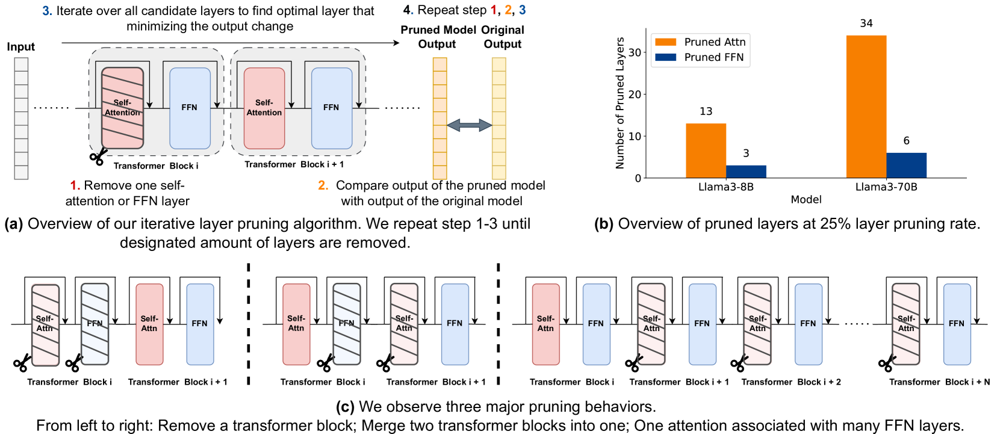

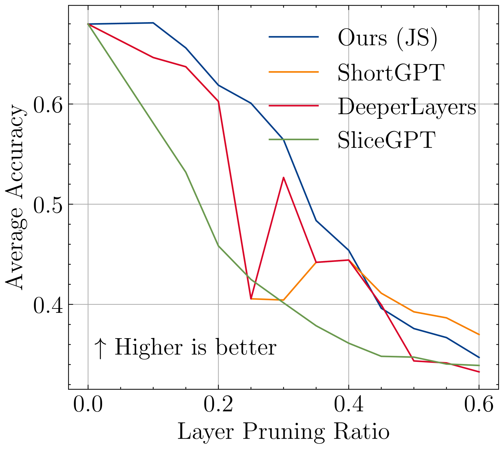

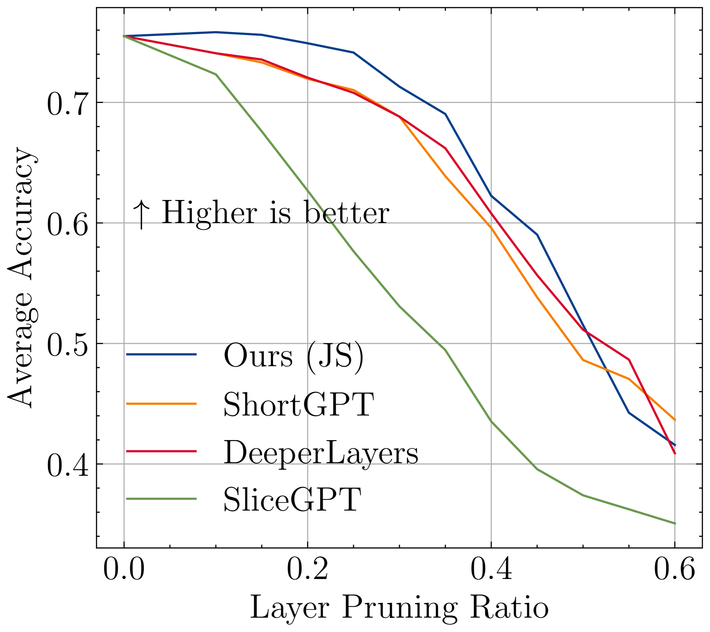

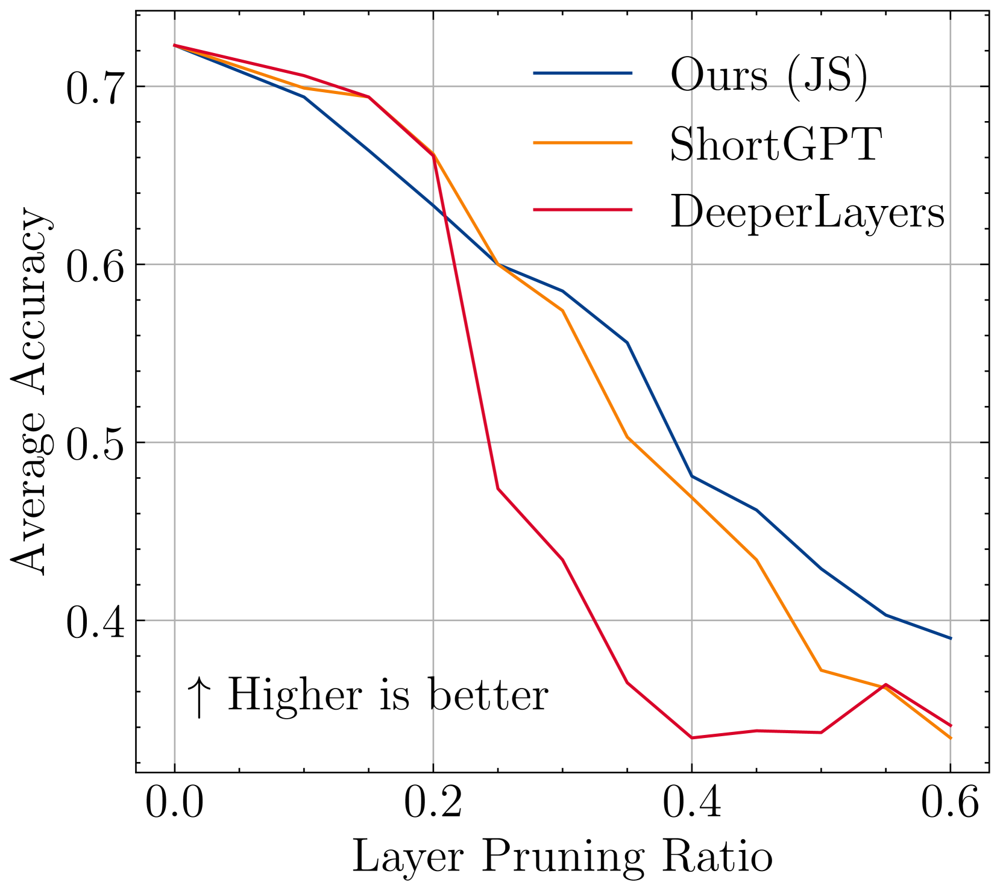

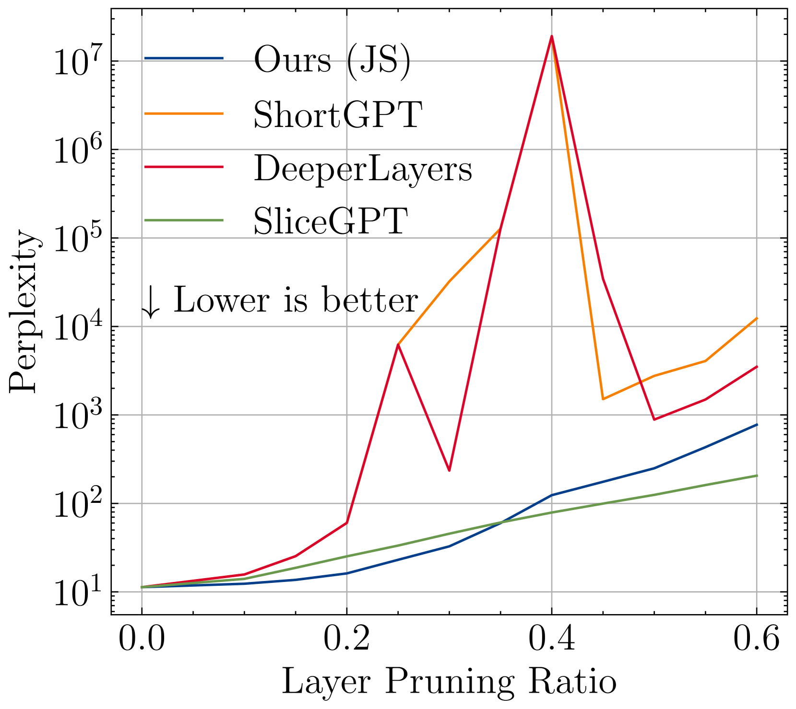

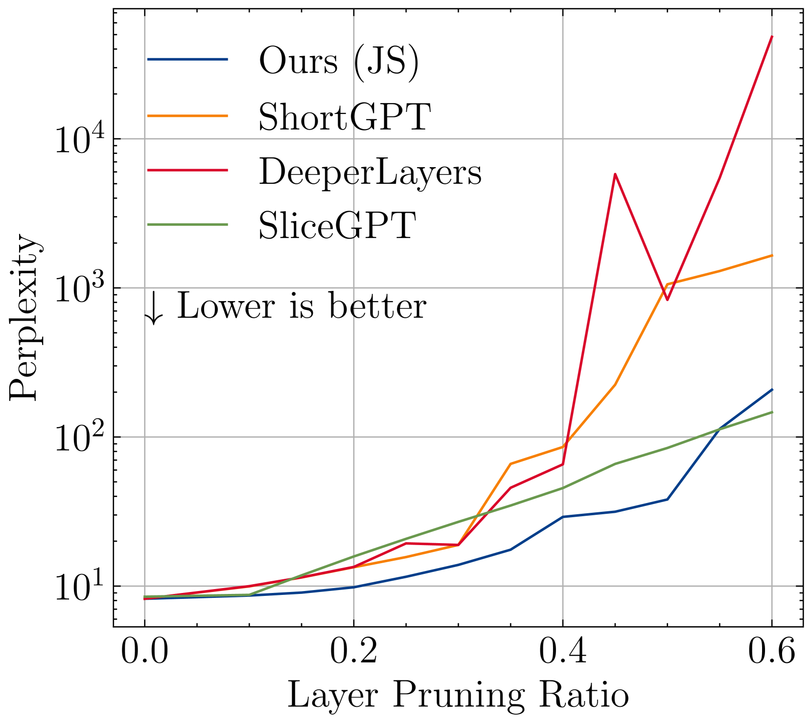

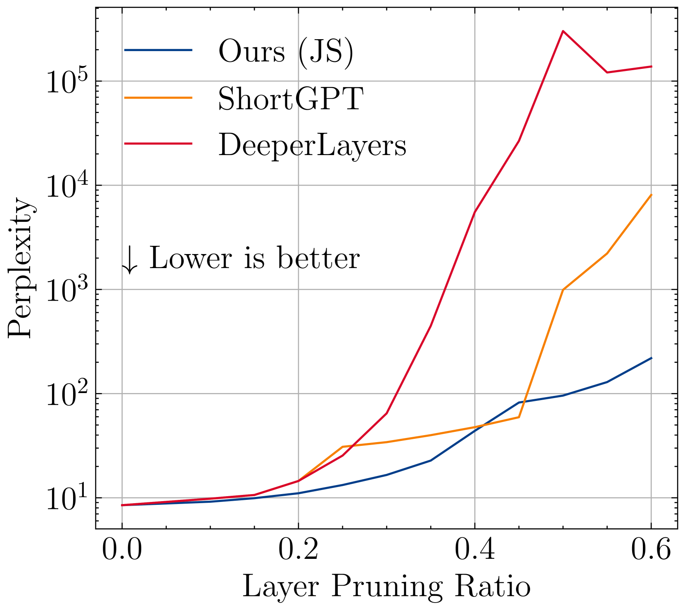

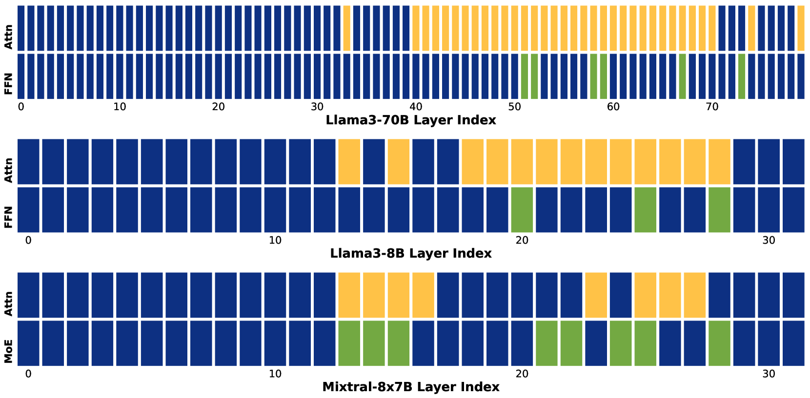

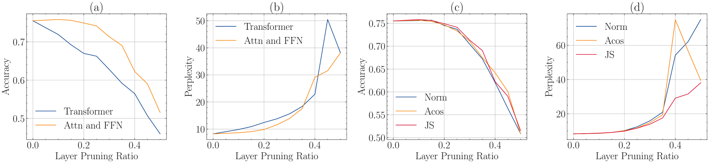

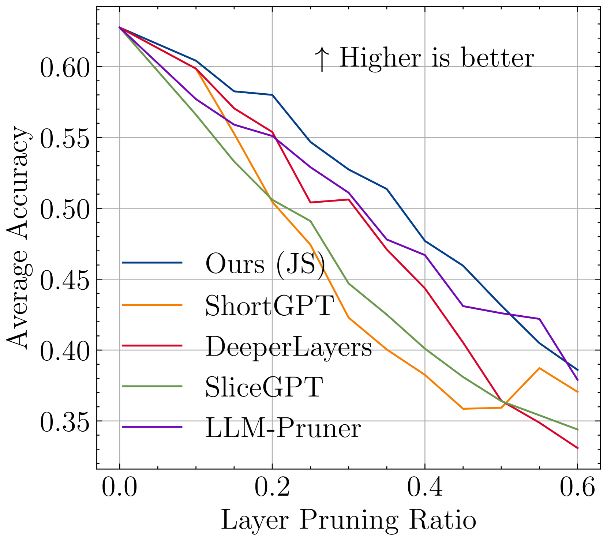

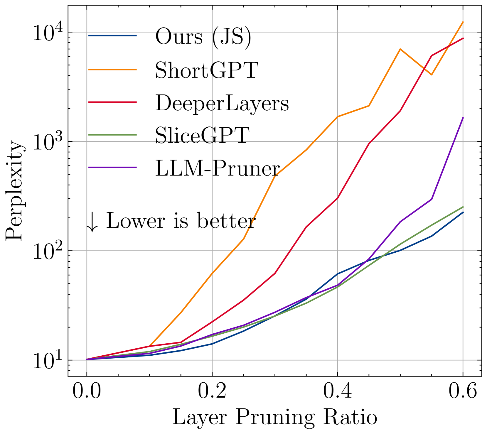

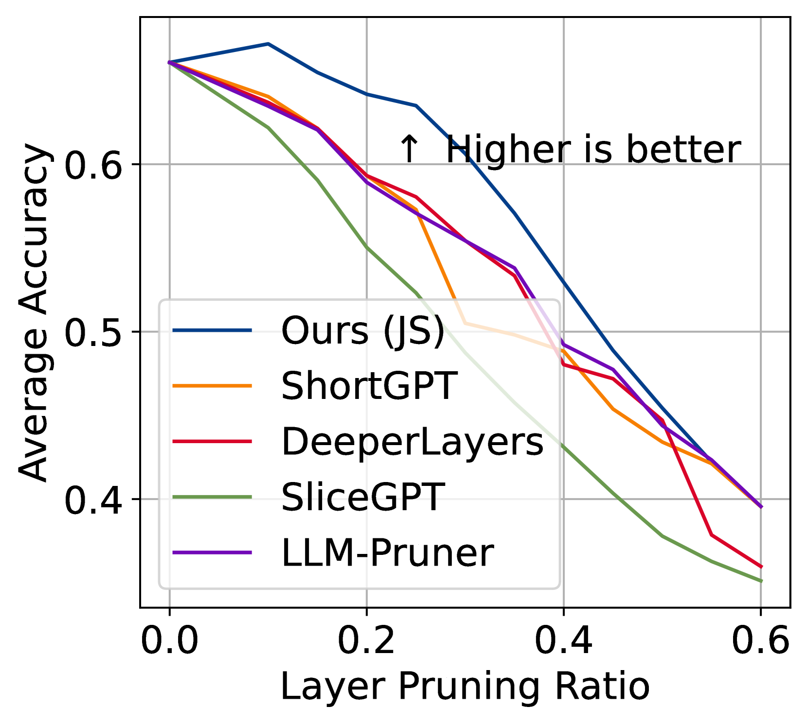

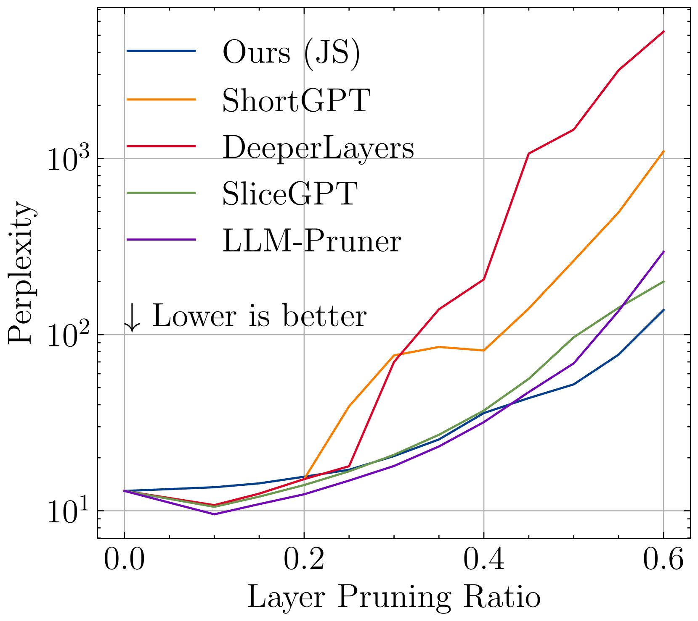

[Arxiv](https://arxiv.org/abs/2405.18218)