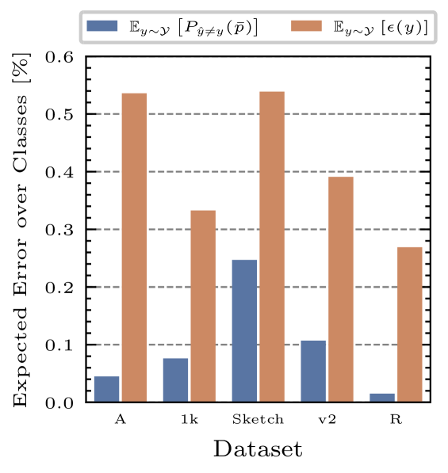
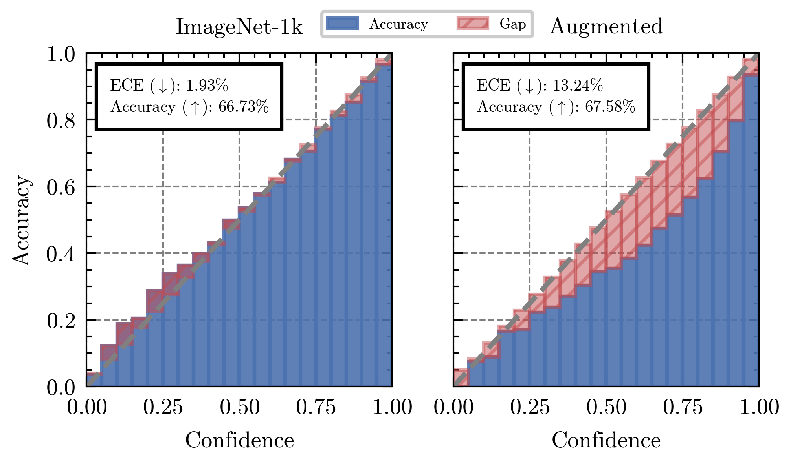

# 视觉-语言模型的测试时间适应性，简单到令人沮丧

发布时间：2024年05月28日

`Agent

理由：这篇论文主要介绍了一种新的测试时间适应（TTA）策略，称为ZERO，用于视觉-语言模型（VLMs）。这种策略允许模型在处理复杂样本时进行自我调整，提高泛化能力。ZERO方法的特点是高效、快速且内存消耗小，它通过多次增广和预测，保留最自信的预测，并将Softmax温度设为零后进行边际化。这种方法的实现不需要反向传播，仅需一次视觉编码器的前向批量传递。因此，这篇论文更偏向于介绍一个具体的Agent（即ZERO方法），用于改进和优化现有的视觉-语言模型，而不是理论研究或应用案例。` `计算机视觉`

> Frustratingly Easy Test-Time Adaptation of Vision-Language Models

# 摘要

> 视觉-语言模型虽能精准区分各类语义，但在处理复杂样本时泛化能力不足。为此，情节测试时间适应（TTA）策略应运而生，成为一种高效技术，使VLMs仅凭一张未标记图像即可自我调整。当前TTA研究多采用边际熵最小化进行提示调整，这种方法虽有效，但依赖在线反向传播，导致推理缓慢且内存消耗大。本研究深入分析了这一方法的内在机制，并发现了一种隐藏的强大TTA方法——我们称之为ZERO（零温度TTA）。ZERO方法简洁高效：多次增广，预测，保留最自信的预测，并将Softmax温度设为零后进行边际化。ZERO仅需一次视觉编码器的前向批量传递，无需反向传播。通过遵循文献中的实验标准，我们验证了ZERO的性能，结果显示其在速度上比传统测试时间提示调整快10倍，内存效率提高13倍，性能上与最新技术相比亦有显著优势。因其简便与计算量小，ZERO可作为该领域未来研究的坚实基线。相关代码已公开于https://github.com/FarinaMatteo/zero。

> Vision-Language Models seamlessly discriminate among arbitrary semantic categories, yet they still suffer from poor generalization when presented with challenging examples. For this reason, Episodic Test-Time Adaptation (TTA) strategies have recently emerged as powerful techniques to adapt VLMs in the presence of a single unlabeled image. The recent literature on TTA is dominated by the paradigm of prompt tuning by Marginal Entropy Minimization, which, relying on online backpropagation, inevitably slows down inference while increasing memory. In this work, we theoretically investigate the properties of this approach and unveil that a surprisingly strong TTA method lies dormant and hidden within it. We term this approach ZERO (TTA with "zero" temperature), whose design is both incredibly effective and frustratingly simple: augment N times, predict, retain the most confident predictions, and marginalize after setting the Softmax temperature to zero. Remarkably, ZERO requires a single batched forward pass through the vision encoder only and no backward passes. We thoroughly evaluate our approach following the experimental protocol established in the literature and show that ZERO largely surpasses or compares favorably w.r.t. the state-of-the-art while being almost 10x faster and 13x more memory-friendly than standard Test-Time Prompt Tuning. Thanks to its simplicity and comparatively negligible computation, ZERO can serve as a strong baseline for future work in this field. The code is available at https://github.com/FarinaMatteo/zero.

[Arxiv](https://arxiv.org/abs/2405.18330)