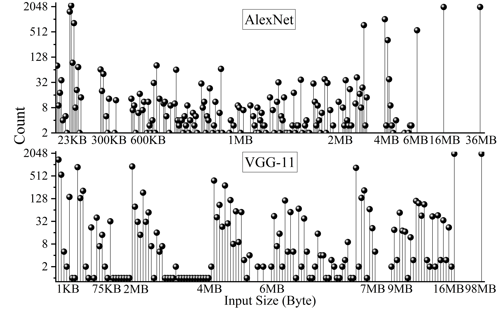

# 多轨网络上的全栈 Allreduce 技术

发布时间：2024年05月28日

`Agent

理由：这篇论文主要讨论了在分布式系统中解决高通信成本问题的全栈解决方案，特别是通过开发Nezha系统来提升数据传输效率。这个系统涉及网络协作、负载均衡和异常处理机制，这些都是典型的Agent行为，即在复杂环境中自主地执行任务和优化性能。因此，这篇论文更适合归类为Agent，因为它描述了一个系统如何像一个智能代理一样操作和优化网络通信。` `分布式系统` `网络通信`

> Full-Stack Allreduce on Multi-Rail Networks

# 摘要

> 高通信成本是分布式系统可扩展性的绊脚石，而Sora等多模态模型因其资源需求超出了现有网络的承载能力，使得问题雪上加霜。现有网络架构对此束手无策。本文提出了一种全栈解决方案，支持多轨网络上的allreduce，旨在通过跨网络协作数据传输打破大规模网络的可扩展性瓶颈。我们开发的Nezha系统，融合了TCP、网络内计算协议SHARP及基于RDMA的协议GLEX，以期提升数据传输效率。Nezha采用基于成本反馈的负载均衡数据分配策略，并辅以异常处理机制，确保数据传输的可靠性。实验结果显示，在同质双轨配置下，Nezha将allreduce性能提升了58%至87%，并在异质环境中根据网络性能差异实现了显著加速。

> The high communication costs impede scalability in distributed systems. Multimodal models like Sora exacerbate this issue by requiring more resources than current networks can support. However, existing network architectures fail to address this gap. In this paper, we provide full-stack support for allreduce on multi-rail networks, aiming to overcome the scalability limitations of large-scale networks by facilitating collaborative data transfer across various networks. To achieve this, we propose the Nezha system, which integrates TCP, in-network computing protocol SHARP, and RDMA-based protocol GLEX. To maximize data transfer rates, Nezha incorporates a load balancing data allocation scheme based on cost feedback and combines exception handling to achieve reliable data transmission. Our experiments on a six-node cluster demonstrate that Nezha significantly enhances allreduce performance by 58\% to 87\% in homogeneous dual-rail configurations and offers considerable acceleration in heterogeneous settings, contingent on the performance variance among networks.

[Arxiv](https://arxiv.org/abs/2405.17870)