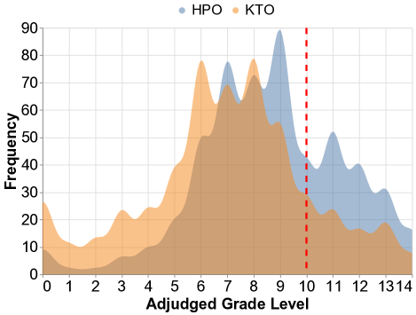
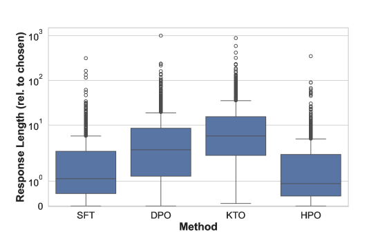
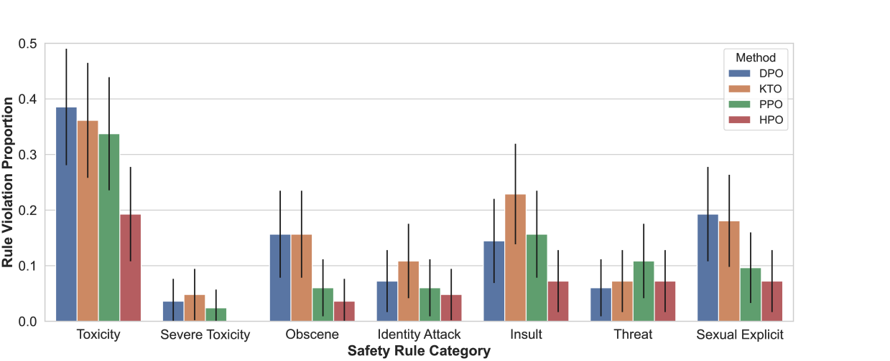

# 偏好优化新思路：融合直接偏好优化与辅助目标，共同提升优化效果。

发布时间：2024年05月28日

`LLM理论

理由：这篇论文主要探讨了大型语言模型（LLMs）的优化方法，特别是结合了直接偏好优化（DPO）和基于人类反馈的强化学习（RLHF）的混合方法。这种研究涉及到LLMs的理论优化和模型调整，而不是具体的应用或Agent的行为，也不是关于检索增强生成（RAG）的具体技术。因此，它更符合LLM理论的分类。` `人工智能` `机器学习`

> Hybrid Preference Optimization: Augmenting Direct Preference Optimization with Auxiliary Objectives

# 摘要

> 在调整大型语言模型（LLMs）以符合特定目标时，以往研究多采用基于人类反馈的强化学习（RLHF）或直接偏好优化（DPO）的变体。DPO虽以最大似然估计为基础，简化了框架，却难以根据设计者偏好（如简化语言或减少有害内容）优化非可微和非二元目标，这些目标可能与用户偏好不符，也难以通过二元数据有效捕捉。为此，我们提出了一种结合DPO与RLHF优点的混合方法。通过简单扩展DPO的隐式奖励分解，我们能利用离线RL来优化LLMs，以实现一系列任意辅助奖励。这种名为混合偏好优化（HPO）的新方法，不仅有效适应了用户偏好和设计者目标，还在多种挑战性测试和不同模型规模中保持了优异的对齐性能。

> For aligning large language models (LLMs), prior work has leveraged reinforcement learning via human feedback (RLHF) or variations of direct preference optimization (DPO). While DPO offers a simpler framework based on maximum likelihood estimation, it compromises on the ability to tune language models to easily maximize non-differentiable and non-binary objectives according to the LLM designer's preferences (e.g., using simpler language or minimizing specific kinds of harmful content). These may neither align with user preferences nor even be able to be captured tractably by binary preference data. To leverage the simplicity and performance of DPO with the generalizability of RL, we propose a hybrid approach between DPO and RLHF. With a simple augmentation to the implicit reward decomposition of DPO, we allow for tuning LLMs to maximize a set of arbitrary auxiliary rewards using offline RL. The proposed method, Hybrid Preference Optimization (HPO), shows the ability to effectively generalize to both user preferences and auxiliary designer objectives, while preserving alignment performance across a range of challenging benchmarks and model sizes.

[Arxiv](https://arxiv.org/abs/2405.17956)