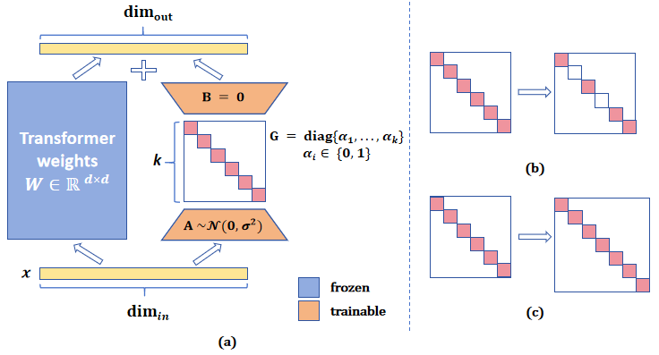

# IAPT：大型语言模型中的指令感知提示优化

发布时间：2024年05月28日

`LLM应用

这篇论文介绍了一种创新的提示调优方法——指令感知提示调优（IAPT），该方法在大型语言模型中使用，旨在提高参数效率和性能。论文中提到的技术细节和实验结果表明，IAPT在多个任务上表现出色，特别是在单一主干多租户场景中，其效率超过了低秩适应（LoRA）。这种方法的应用性质和对大型语言模型的优化使其适合归类为LLM应用。` `机器学习`

> IAPT: Instruction-Aware Prompt Tuning for Large Language Models

# 摘要

> 软提示调优虽为参数高效微调的热门方法，但其缺点明显：为确保下游任务性能，需在输入序列中大量插入软令牌，因此在大型语言模型时代，其关注度不及低秩适应（LoRA）。本研究提出一种创新提示调优法——指令感知提示调优（IAPT），仅需四个软令牌。首先，我们在Transformer各层植入参数高效的软提示生成器，为每条指令定制独特软提示，这些提示如同指令的语义概要，有效引导输出生成。其次，软提示生成器采用瓶颈结构，包含自注意力池化、两级线性投影及激活函数。初步实验揭示，不同层的生成器需不同激活函数，故我们借助有理函数自动学习其独特激活。实验涵盖多任务，结果显示：(a) IAPT在可比调参下超越近期基线；(b) 在单一主干多租户场景中，IAPT较LoRA更为高效。

> Soft prompt tuning is a widely studied parameter-efficient fine-tuning method. However, it has a clear drawback: many soft tokens must be inserted into the input sequences to guarantee downstream performance. As a result, soft prompt tuning is less considered than Low-rank adaptation (LoRA) in the large language modeling (LLM) era. In this work, we propose a novel prompt tuning method, Instruction-Aware Prompt Tuning (IAPT), that requires only four soft tokens. First, we install a parameter-efficient soft prompt generator at each Transformer layer to generate idiosyncratic soft prompts for each input instruction. The generated soft prompts can be seen as a semantic summary of the input instructions and can effectively guide the output generation. Second, the soft prompt generators are modules with a bottleneck architecture consisting of a self-attention pooling operation, two linear projections, and an activation function. Pilot experiments show that prompt generators at different Transformer layers require different activation functions. Thus, we propose to learn the idiosyncratic activation functions for prompt generators automatically with the help of rational functions. We have conducted experiments on various tasks, and the experimental results demonstrate that (a) our IAPT method can outperform the recent baselines with comparable tunable parameters. (b) Our IAPT method is more efficient than LoRA under the single-backbone multi-tenant setting.

[Arxiv](https://arxiv.org/abs/2405.18203)