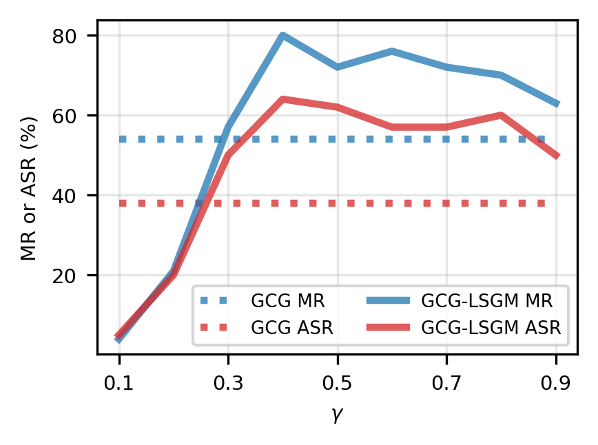

# 针对安全对齐的 LLMs，我们提升了对抗样本的生成技术。

发布时间：2024年05月28日

`LLM理论

理由：这篇论文主要探讨了大型语言模型（LLMs）的安全性问题，特别是对抗性提示的生成和攻击方法。它提出了一种新的方法来提高对抗性示例的生成效率，并通过实验验证了其有效性。这些内容更多地涉及LLMs的理论和内部机制，而不是直接的应用或Agent的行为，因此更适合归类为LLM理论。` `人工智能`

> Improved Generation of Adversarial Examples Against Safety-aligned LLMs

# 摘要

> 尽管在确保大型语言模型（LLMs）遵守安全标准并生成无害内容方面已有多项努力，但仍存在绕过这些限制的成功案例，即所谓的LLMs越狱攻击。基于梯度的方法生成的对抗性提示在自动执行此类攻击中表现卓越。然而，由于文本的离散特性，LLMs的输入梯度难以准确反映提示中令牌替换引起的损失变化，导致即使在白盒环境下，对安全对齐的LLMs的攻击成功率也有限。本文提出了一种新视角，建议通过借鉴针对黑盒图像分类模型的基于迁移的攻击中的创新来改善这一状况。我们首次将跳跃梯度方法和中间层攻击等有效方法的思想应用于提高针对白盒LLMs的自动生成对抗性示例的有效性。通过适当调整，我们将这些思想融入基于梯度的对抗性提示生成过程，实现了显著的性能提升，同时未增加显著的计算负担。此外，通过分析这些改进背后的机制，我们获得了新的见解，并开发了这些方法的优化组合。实证结果显示，这种组合在攻击Llama-2-7B-Chat模型在AdvBench上的攻击成功率比GCG提高了超过30%。

> Despite numerous efforts to ensure large language models (LLMs) adhere to safety standards and produce harmless content, some successes have been achieved in bypassing these restrictions, known as jailbreak attacks against LLMs. Adversarial prompts generated using gradient-based methods exhibit outstanding performance in performing jailbreak attacks automatically. Nevertheless, due to the discrete nature of texts, the input gradient of LLMs struggles to precisely reflect the magnitude of loss change that results from token replacements in the prompt, leading to limited attack success rates against safety-aligned LLMs, even in the white-box setting. In this paper, we explore a new perspective on this problem, suggesting that it can be alleviated by leveraging innovations inspired in transfer-based attacks that were originally proposed for attacking black-box image classification models. For the first time, we appropriate the ideologies of effective methods among these transfer-based attacks, i.e., Skip Gradient Method and Intermediate Level Attack, for improving the effectiveness of automatically generated adversarial examples against white-box LLMs. With appropriate adaptations, we inject these ideologies into gradient-based adversarial prompt generation processes and achieve significant performance gains without introducing obvious computational cost. Meanwhile, by discussing mechanisms behind the gains, new insights are drawn, and proper combinations of these methods are also developed. Our empirical results show that the developed combination achieves >30% absolute increase in attack success rates compared with GCG for attacking the Llama-2-7B-Chat model on AdvBench.

[Arxiv](https://arxiv.org/abs/2405.20778)