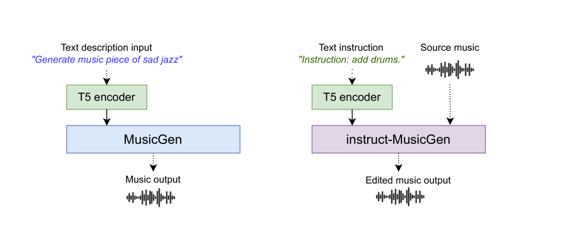

# Instruct-MusicGen：借助指令调谐，开启音乐语言模型的文本至音乐编辑新篇章

发布时间：2024年05月28日

`LLM应用

理由：这篇论文介绍了一种名为Instruct-MusicGen的新方法，该方法通过微调预训练的MusicGen模型来响应文本编辑指令，从而实现音乐的编辑和生成。这种方法利用了大型语言模型（LLM）的能力，但主要关注的是将LLM应用于音乐创作和编辑的实际场景，而不是探讨LLM的理论基础或Agent的设计。因此，它属于LLM应用类别。` `音乐制作` `人工智能`

> Instruct-MusicGen: Unlocking Text-to-Music Editing for Music Language Models via Instruction Tuning

# 摘要

> 近期，文本到音乐编辑技术的发展，通过文本查询改变音乐风格或乐器配置，为AI辅助音乐创作开辟了新天地。然而，传统方法需从头定制模型，既耗时又低效；而依赖大型语言模型的方法则导致音频重构不够精准。为此，我们推出了Instruct-MusicGen，这一创新方法通过微调预训练的MusicGen模型，灵活响应编辑指令，如增删音轨。通过在MusicGen架构中嵌入文本与音频融合模块，我们的模型能同步处理文本指令与音频输入，精准生成编辑后的音乐。令人瞩目的是，Instruct-MusicGen仅增加了8%的模型参数，且仅训练5000步，便在各项任务中超越了现有技术，性能堪比专为特定任务训练的模型。这一突破不仅提升了文本到音乐编辑的效率，也拓展了音乐语言模型在动态音乐制作领域的应用潜力。

> Recent advances in text-to-music editing, which employ text queries to modify music (e.g.\ by changing its style or adjusting instrumental components), present unique challenges and opportunities for AI-assisted music creation. Previous approaches in this domain have been constrained by the necessity to train specific editing models from scratch, which is both resource-intensive and inefficient; other research uses large language models to predict edited music, resulting in imprecise audio reconstruction. To Combine the strengths and address these limitations, we introduce Instruct-MusicGen, a novel approach that finetunes a pretrained MusicGen model to efficiently follow editing instructions such as adding, removing, or separating stems. Our approach involves a modification of the original MusicGen architecture by incorporating a text fusion module and an audio fusion module, which allow the model to process instruction texts and audio inputs concurrently and yield the desired edited music. Remarkably, Instruct-MusicGen only introduces 8% new parameters to the original MusicGen model and only trains for 5K steps, yet it achieves superior performance across all tasks compared to existing baselines, and demonstrates performance comparable to the models trained for specific tasks. This advancement not only enhances the efficiency of text-to-music editing but also broadens the applicability of music language models in dynamic music production environments.

[Arxiv](https://arxiv.org/abs/2405.18386)