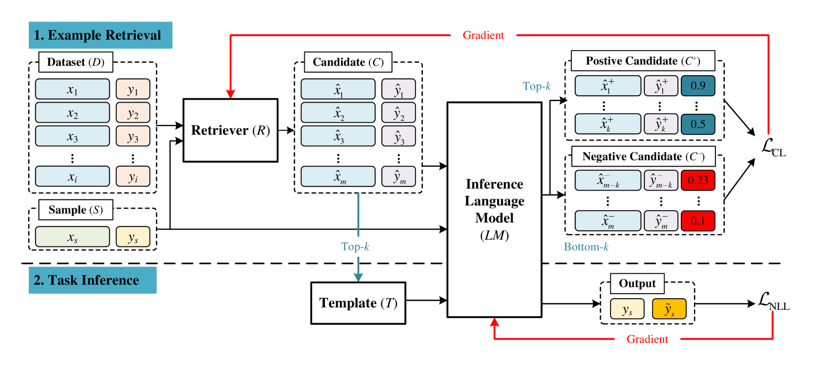
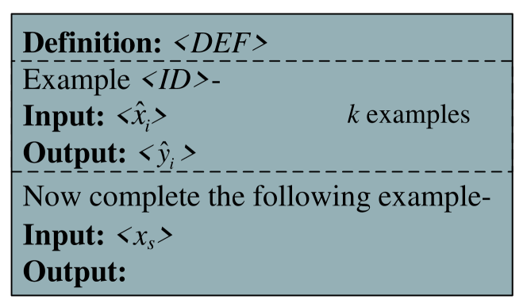
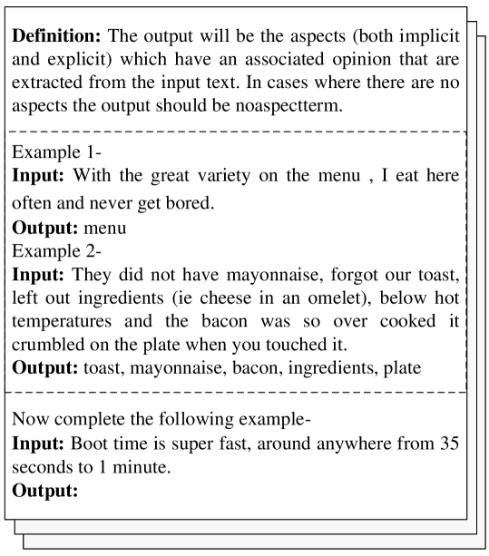
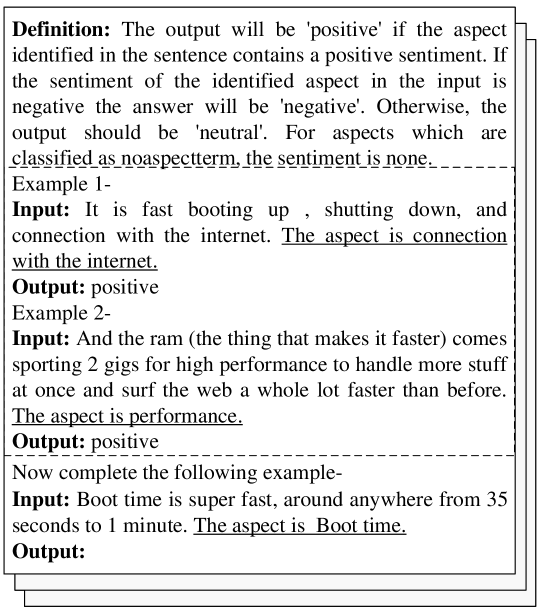
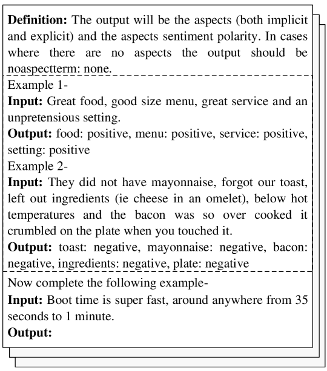
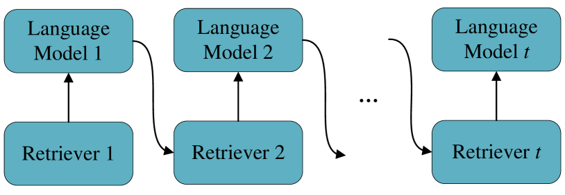
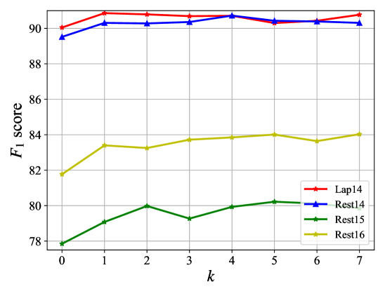
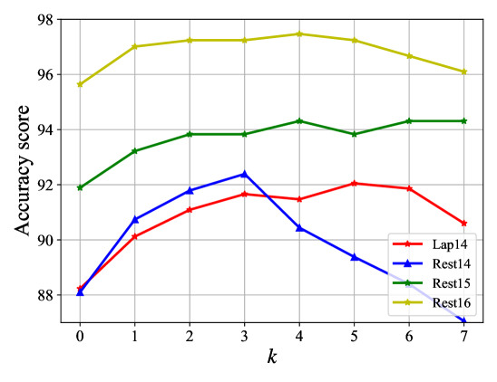
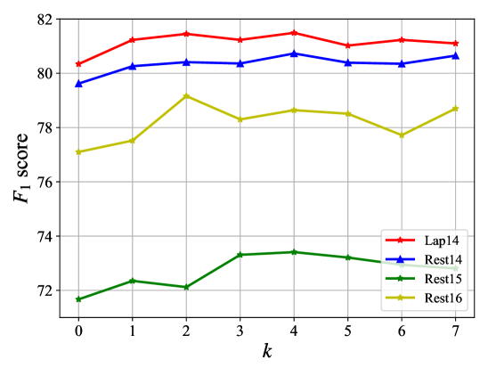

# 在基于方面的情感分析中，采用基于检索示例排名的指令调优方法。

发布时间：2024年05月28日

`RAG

理由：这篇论文主要关注的是基于方面的情感分析（ABSA）任务，并提出了一种结合检索示例排名的指令学习策略。这种方法涉及使用语言模型作为评分器来评估输出可能性，并优化检索器与语言模型。这与RAG（Retrieval-Augmented Generation）的概念相符，其中检索机制与生成模型相结合，以提高特定任务的性能。因此，这篇论文更适合归类于RAG，而不是Agent、LLM应用或LLM理论。` `情感分析`

> Instruction Tuning with Retrieval-based Examples Ranking for Aspect-based Sentiment Analysis

# 摘要

> 基于方面的情感分析（ABSA）通过识别特定方面的情感信息，为企业和组织揭示了更深层次的市场洞察。随着大型语言模型的兴起，研究者们开始利用固定示例进行指令调优，将ABSA转化为生成任务。但此方法的性能极易受上下文示例选择的影响，现有检索技术多依赖于表面相似性，与语言模型的生成目标脱节。为此，本研究创新性地提出了一种结合检索示例排名的指令学习策略，专为ABSA任务设计。我们采用语言模型作为评分器，对每个目标样本的输出可能性进行评估，并依据评分对训练示例进行正负分类。通过交替训练机制，同时优化检索器与语言模型。高质量示例被用于构建指令提示，语言模型在评分与推理过程中提升了生成效率，且无需额外计算资源或增加训练复杂度。经过在三个ABSA子任务上的广泛测试，该方法展现出超越众多强基线模型的优越性能。相关代码与数据已公开于https://anonymous.4open.science/r/IT-RER-ABSA-181F。

> Aspect-based sentiment analysis (ABSA) identifies sentiment information related to specific aspects and provides deeper market insights to businesses and organizations. With the emergence of large language models (LMs), recent studies have proposed using fixed examples for instruction tuning to reformulate ABSA as a generation task. However, the performance is sensitive to the selection of in-context examples; several retrieval methods are based on surface similarity and are independent of the LM generative objective. This study proposes an instruction learning method with retrieval-based example ranking for ABSA tasks. For each target sample, an LM was applied as a scorer to estimate the likelihood of the output given the input and a candidate example as the prompt, and training examples were labeled as positive or negative by ranking the scores. An alternating training schema is proposed to train both the retriever and LM. Instructional prompts can be constructed using high-quality examples. The LM is used for both scoring and inference, improving the generation efficiency without incurring additional computational costs or training difficulties. Extensive experiments on three ABSA subtasks verified the effectiveness of the proposed method, demonstrating its superiority over various strong baseline models. Code and data are released at https://anonymous.4open.science/r/IT-RER-ABSA-181F.

[Arxiv](https://arxiv.org/abs/2405.18035)