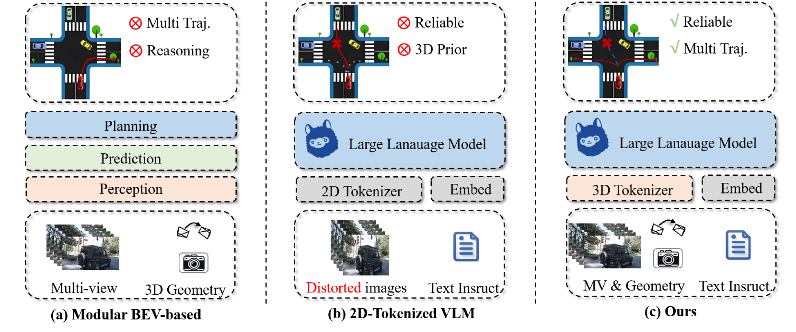
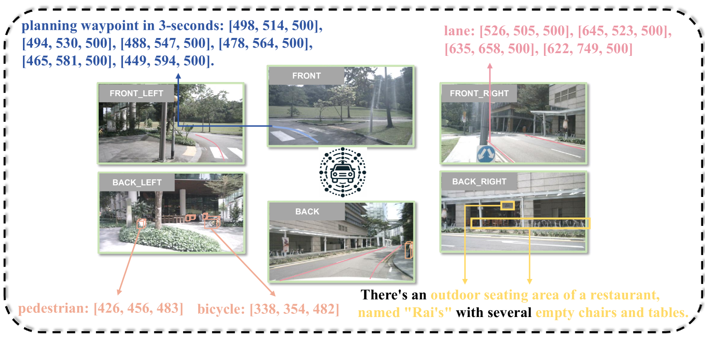
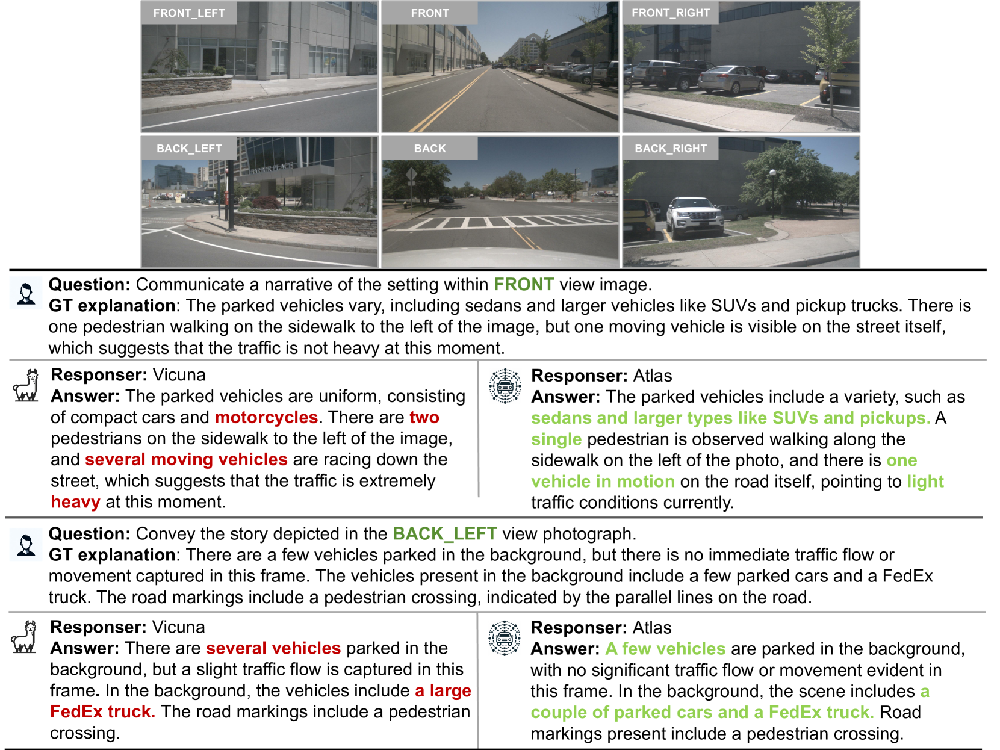
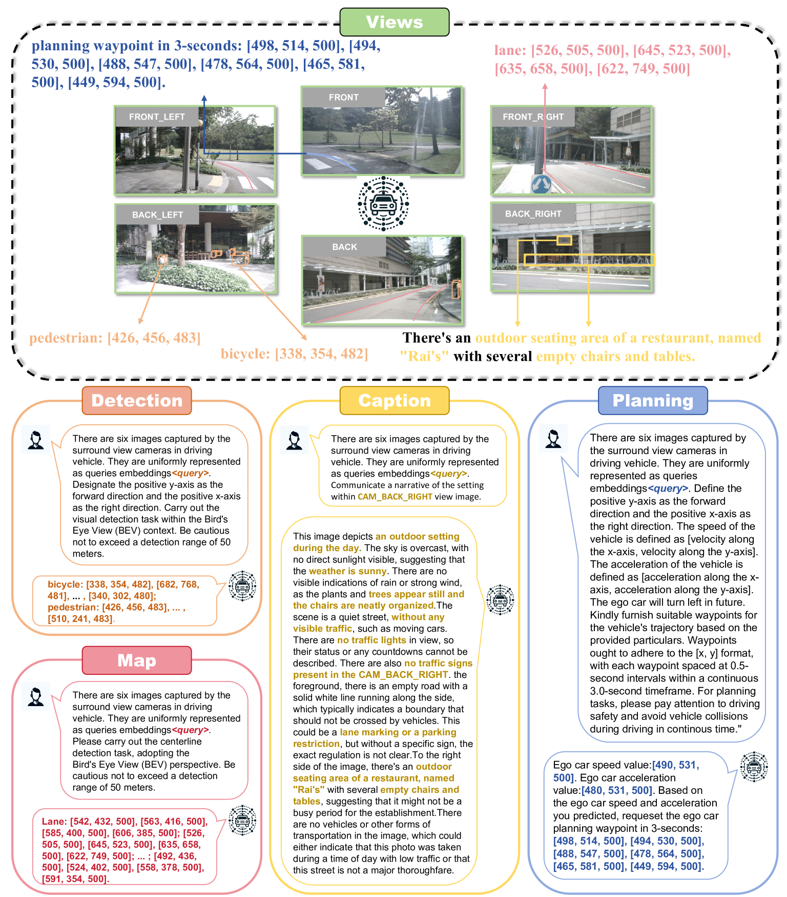
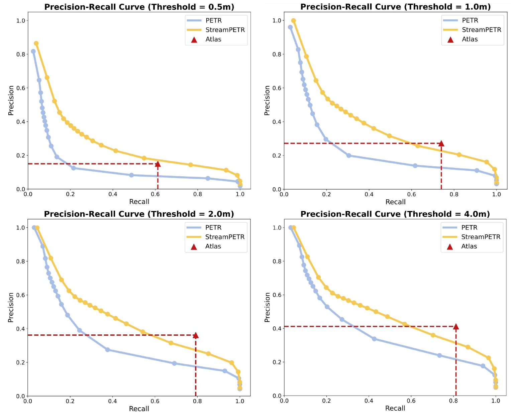
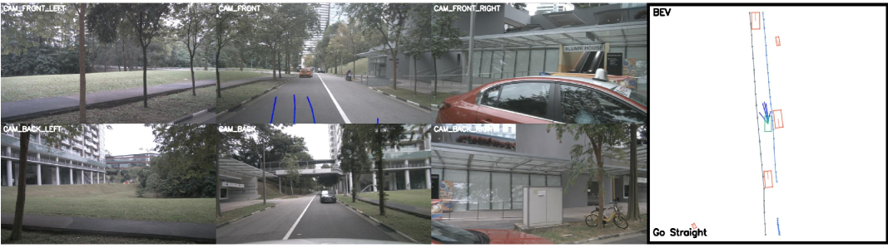
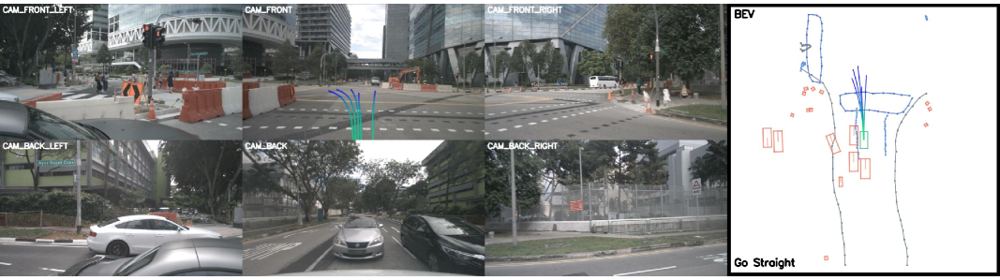

# 3D-Token化的大型语言模型是否是解锁可靠自动驾驶之门的钥匙？

发布时间：2024年05月28日

`Agent

这篇论文主要探讨了自动驾驶技术中视觉-语言模型（VLMs）的应用，特别是在三维环境感知方面的问题和解决方案。论文提出了一种新的策略Atlas，该策略通过结合三维感知器和大型语言模型（LLM）来改进自动驾驶系统对三维环境的感知能力。这种改进对于自动驾驶系统中的代理（Agent）来说至关重要，因为它直接关系到系统在复杂环境中的决策和行动能力。因此，这篇论文更符合Agent分类，因为它专注于提升自动驾驶系统中代理的性能和可靠性。` `自动驾驶` `计算机视觉`

> Is a 3D-Tokenized LLM the Key to Reliable Autonomous Driving?

# 摘要

> 自动驾驶技术的飞速进步，特别是结合了视觉-语言模型（VLMs）的端到端规划，已经显著提升了逻辑推理和认知能力。然而，现有的VLM方法多依赖于二维视觉标记器和大型语言模型（LLM），缺乏三维几何先验，这引发了关键问题：二维标记化的LLM能否准确感知三维环境？我们的评估显示，这种方法在三维物体检测、地图构建及环境描述上表现不佳，意味着它无法提供可靠的自动驾驶。为此，我们提出了名为Atlas的新策略，它采用DETR风格的3D感知器作为三维标记器，通过一层线性投影器与LLM结合，有效利用三维物理世界的先验知识，同时处理多视角高分辨率图像并进行时空建模。尽管设计简洁，Atlas在nuScenes数据集上的表现卓越，证明了三维标记化的LLM是实现可靠自动驾驶的关键。相关代码和数据集即将公开。

> Rapid advancements in Autonomous Driving (AD) tasks turned a significant shift toward end-to-end fashion, particularly in the utilization of vision-language models (VLMs) that integrate robust logical reasoning and cognitive abilities to enable comprehensive end-to-end planning. However, these VLM-based approaches tend to integrate 2D vision tokenizers and a large language model (LLM) for ego-car planning, which lack 3D geometric priors as a cornerstone of reliable planning. Naturally, this observation raises a critical concern: Can a 2D-tokenized LLM accurately perceive the 3D environment? Our evaluation of current VLM-based methods across 3D object detection, vectorized map construction, and environmental caption suggests that the answer is, unfortunately, NO. In other words, 2D-tokenized LLM fails to provide reliable autonomous driving. In response, we introduce DETR-style 3D perceptrons as 3D tokenizers, which connect LLM with a one-layer linear projector. This simple yet elegant strategy, termed Atlas, harnesses the inherent priors of the 3D physical world, enabling it to simultaneously process high-resolution multi-view images and employ spatiotemporal modeling. Despite its simplicity, Atlas demonstrates superior performance in both 3D detection and ego planning tasks on nuScenes dataset, proving that 3D-tokenized LLM is the key to reliable autonomous driving. The code and datasets will be released.

[Arxiv](https://arxiv.org/abs/2405.18361)