# 预训练变换器中的知识流通路径

发布时间：2024年05月28日

`LLM理论

这篇论文主要探讨了大型语言模型（LLM）内部的知识存储机制，特别是通过分析计算图来揭示关键的知识电路。研究内容涉及模型内部的知识编码方式、知识编辑技术的影响以及这些机制如何影响模型的行为。这些都是对LLM理论层面的深入分析，因此归类为LLM理论。` `知识表示`

> Knowledge Circuits in Pretrained Transformers

# 摘要

> 现代大型语言模型之所以强大，是因为它们庞大的知识库被编码在参数中，使它们能够感知世界并进行推理。这些模型内部的知识存储机制一直是研究的热点。本文深入分析了语言模型的计算图，揭示了关键的知识电路，这些电路有助于表达特定知识。通过GPT2和TinyLLAMA的实验，我们发现信息头、关系头和多层感知机如何协作在模型中编码知识。我们还评估了知识编辑技术对这些电路的影响，深入探讨了这些编辑方法的功能和限制。最后，我们利用知识电路来分析语言模型的行为，如幻觉和情境学习，并认为这有助于改进Transformer的设计。相关代码和数据可在https://github.com/zjunlp/KnowledgeCircuits获取。

> The remarkable capabilities of modern large language models are rooted in their vast repositories of knowledge encoded within their parameters, enabling them to perceive the world and engage in reasoning. The inner workings of how these models store knowledge have long been a subject of intense interest and investigation among researchers. To date, most studies have concentrated on isolated components within these models, such as the Multilayer Perceptrons and attention head. In this paper, we delve into the computation graph of the language model to uncover the knowledge circuits that are instrumental in articulating specific knowledge. The experiments, conducted with GPT2 and TinyLLAMA, has allowed us to observe how certain information heads, relation heads, and Multilayer Perceptrons collaboratively encode knowledge within the model. Moreover, we evaluate the impact of current knowledge editing techniques on these knowledge circuits, providing deeper insights into the functioning and constraints of these editing methodologies. Finally, we utilize knowledge circuits to analyze and interpret language model behaviors such as hallucinations and in-context learning. We believe the knowledge circuit holds potential for advancing our understanding of Transformers and guiding the improved design of knowledge editing. Code and data are available in https://github.com/zjunlp/KnowledgeCircuits.

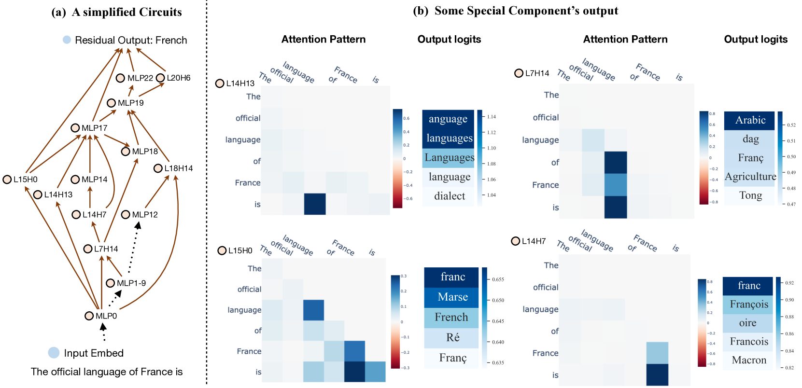

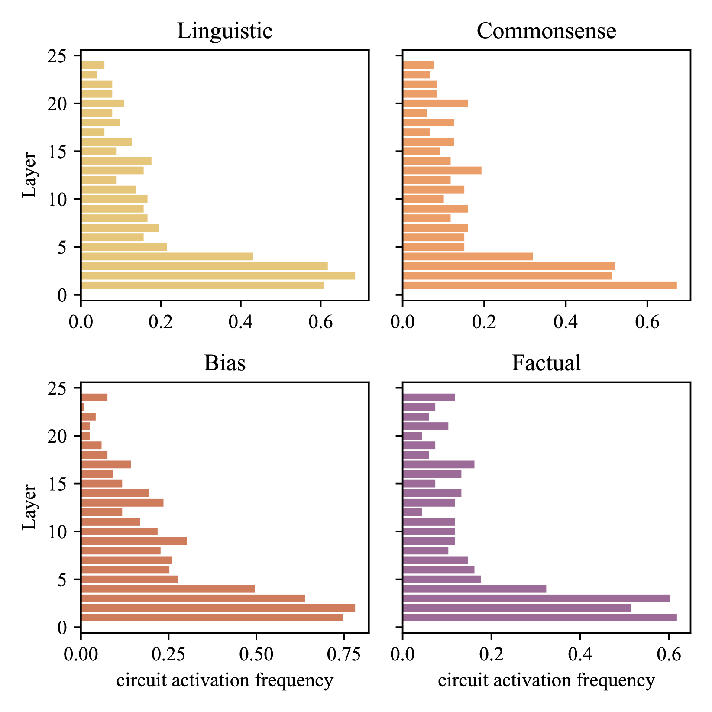

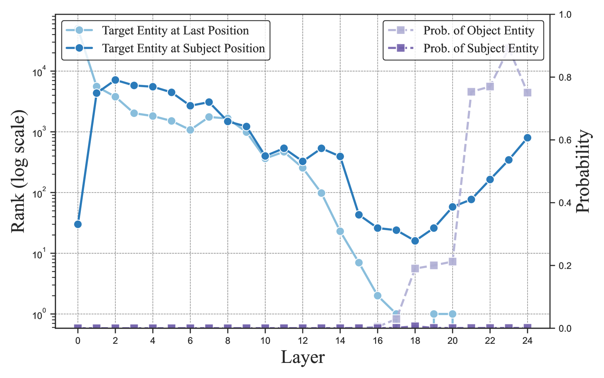

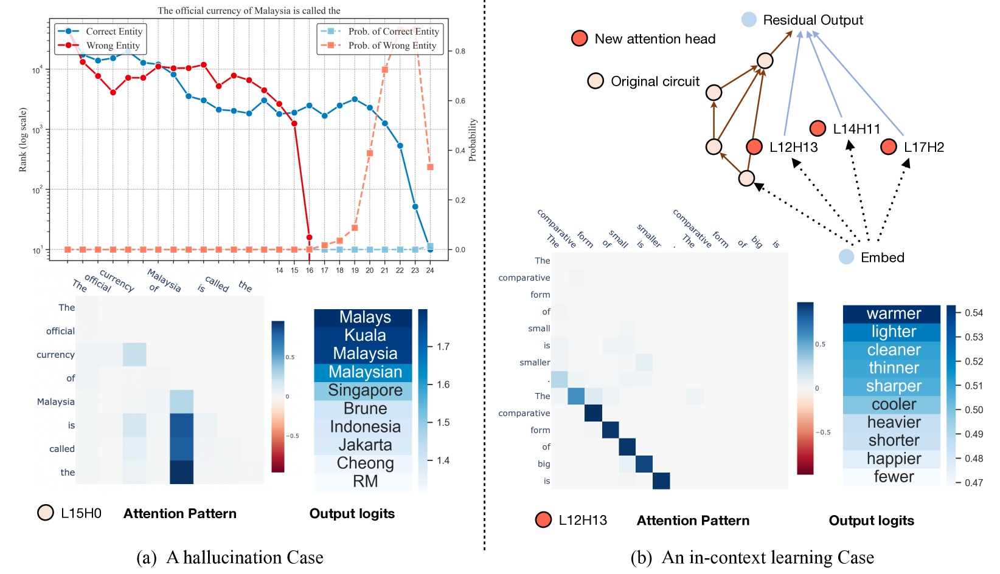

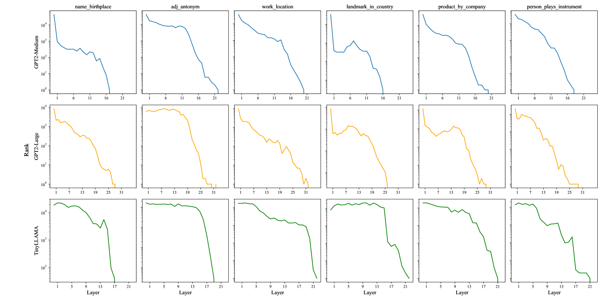

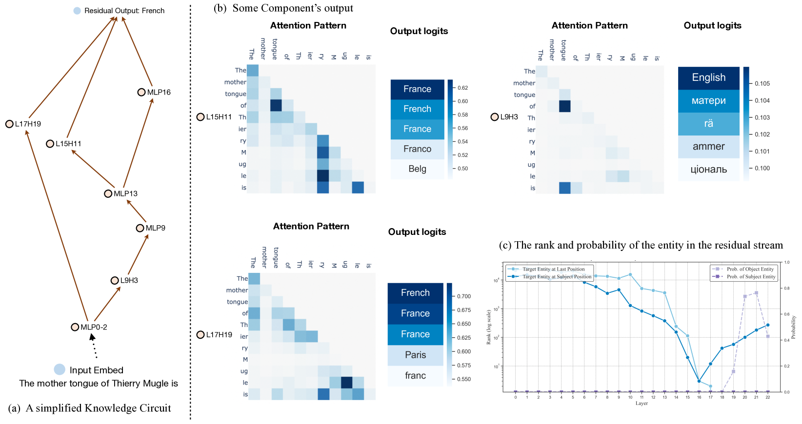

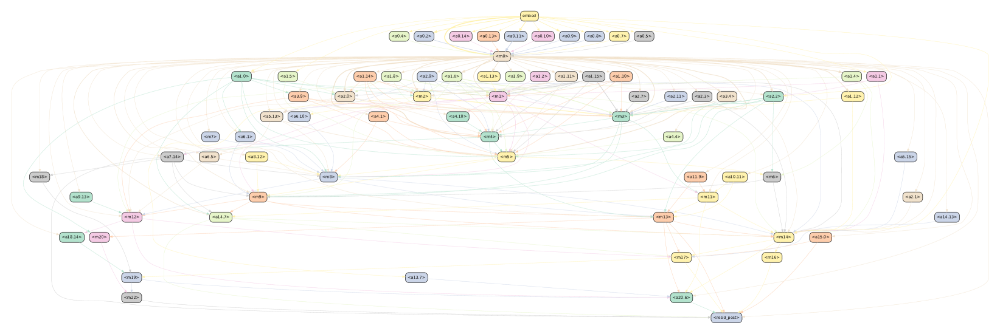

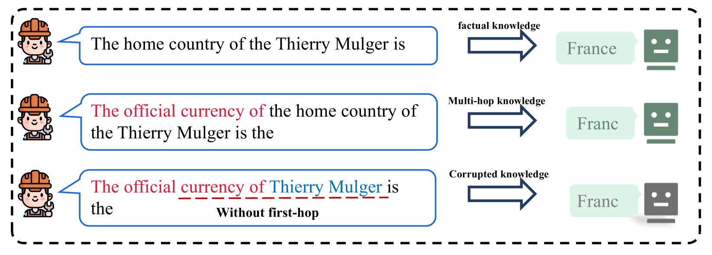

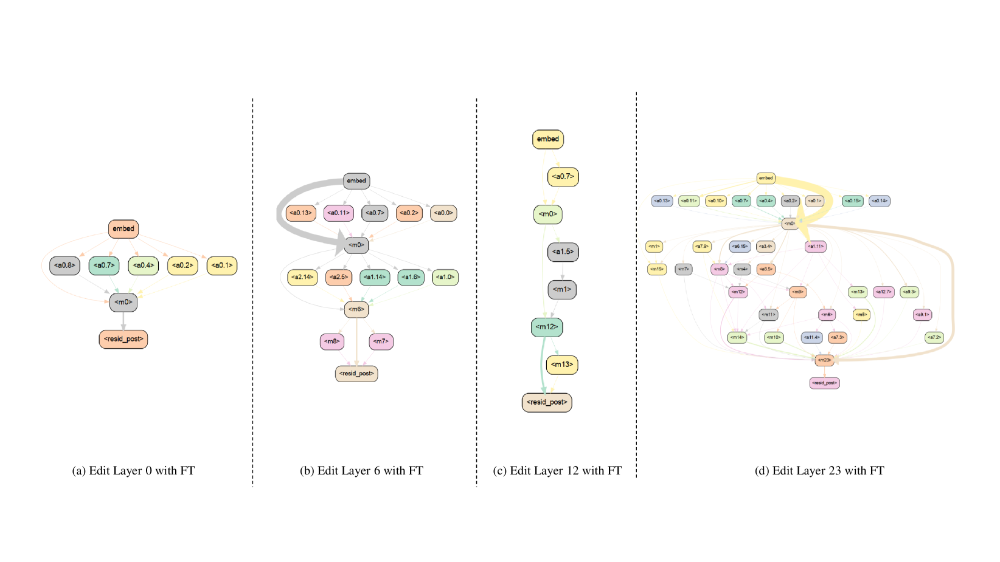

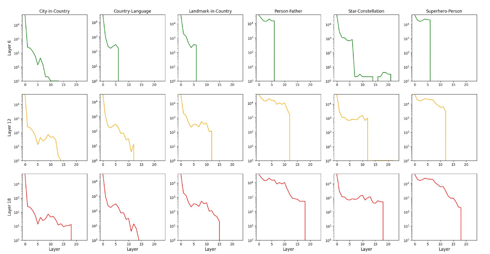

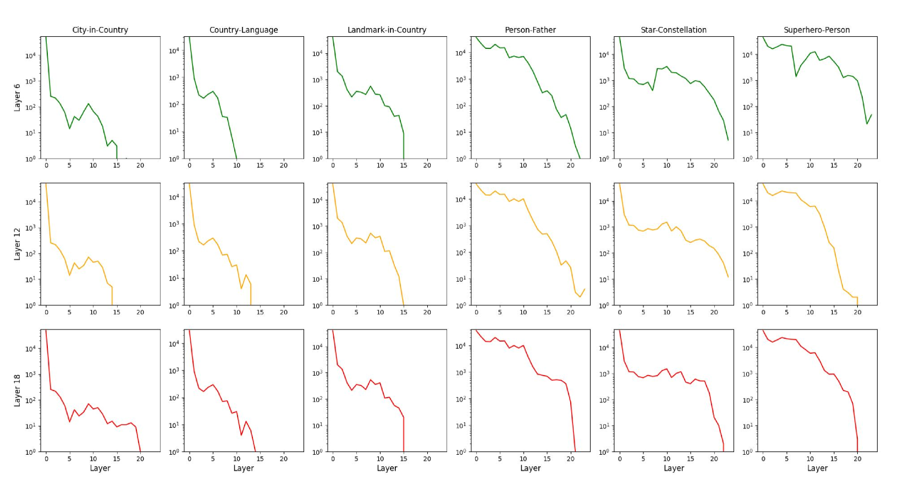

[Arxiv](https://arxiv.org/abs/2405.17969)