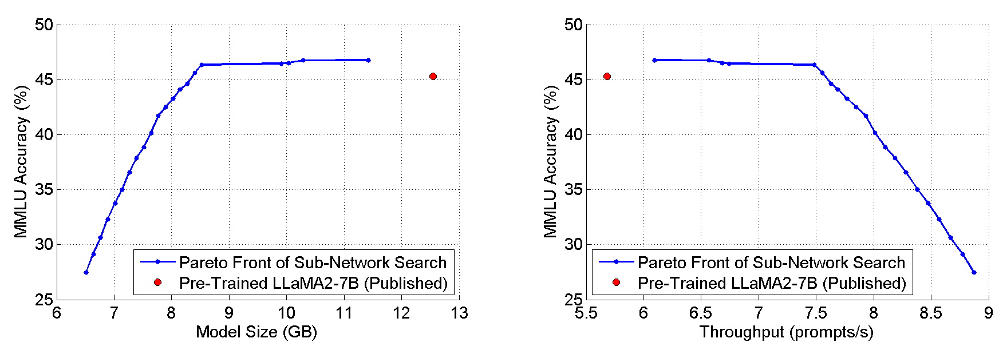

# LLaMA-NAS：大型语言模型的精妙神经架构探索

发布时间：2024年05月28日

`LLM应用

这篇论文主要探讨了如何通过一种新型的网络架构搜索方法来优化大型语言模型（LLMs）的性能和效率，特别是在减少内存和计算成本方面的应用。论文提出了一种基于LLaMA2-7B的一步式NAS方法，通过遗传算法搜索Pareto最优的网络架构，实现了模型大小的显著减少和吞吐量的提升，同时保持了模型的准确度。这种方法的应用性质明显，旨在解决实际应用中的硬件限制问题，因此归类为LLM应用。` `人工智能`

> LLaMA-NAS: Efficient Neural Architecture Search for Large Language Models

# 摘要

> 现代大型语言模型（LLMs）在自然语言处理、复杂推理、情感分析等任务上表现卓越，推动了其广泛应用。然而，这些卓越性能的背后是高昂的内存和计算成本，限制了LLMs在多数硬件上的应用。为此，我们提出了一种基于LLaMA2-7B的一步式NAS方法，旨在寻找Pareto最优的网络架构。通过仅对LLaMA2-7B进行一次微调，并运用遗传算法搜索，我们找到了更小、计算更简单的网络架构。对于某些标准任务，我们证明了预训练的LLaMA2-7B网络过于庞大，实际上可以大幅缩减——模型大小减少1.5倍，吞吐量提升1.3倍，而准确度几乎不受影响。我们的方法不仅高效地找到了高性能的小型网络，而且比传统的剪枝或稀疏化技术更为优越。此外，我们还展示了量化技术如何与我们的方法相辅相成，进一步降低网络的大小和复杂性。我们相信，这项工作为自动生成适用于更经济、更普及硬件的LLMs开辟了新途径。

> The abilities of modern large language models (LLMs) in solving natural language processing, complex reasoning, sentiment analysis and other tasks have been extraordinary which has prompted their extensive adoption. Unfortunately, these abilities come with very high memory and computational costs which precludes the use of LLMs on most hardware platforms. To mitigate this, we propose an effective method of finding Pareto-optimal network architectures based on LLaMA2-7B using one-shot NAS. In particular, we fine-tune LLaMA2-7B only once and then apply genetic algorithm-based search to find smaller, less computationally complex network architectures. We show that, for certain standard benchmark tasks, the pre-trained LLaMA2-7B network is unnecessarily large and complex. More specifically, we demonstrate a 1.5x reduction in model size and 1.3x speedup in throughput for certain tasks with negligible drop in accuracy. In addition to finding smaller, higher-performing network architectures, our method does so more effectively and efficiently than certain pruning or sparsification techniques. Finally, we demonstrate how quantization is complementary to our method and that the size and complexity of the networks we find can be further decreased using quantization. We believe that our work provides a way to automatically create LLMs which can be used on less expensive and more readily available hardware platforms.

[Arxiv](https://arxiv.org/abs/2405.18377)