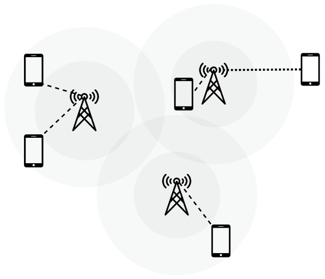
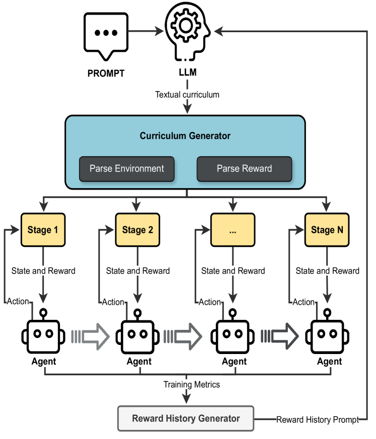
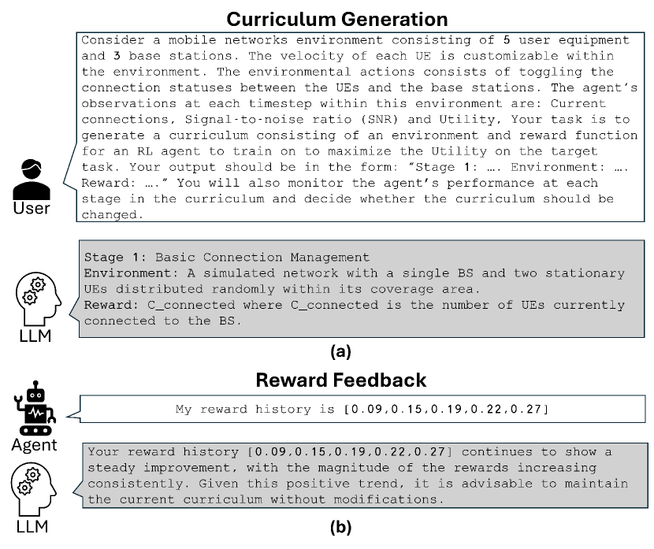
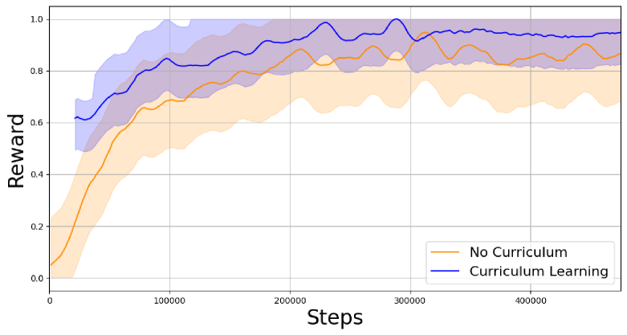
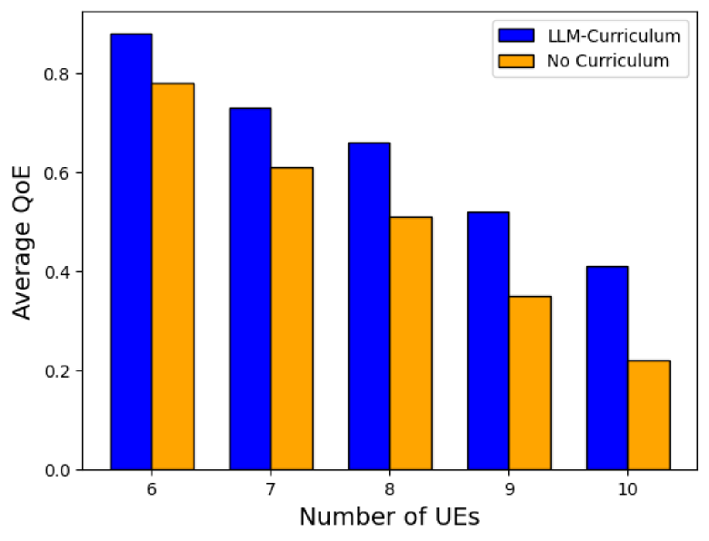
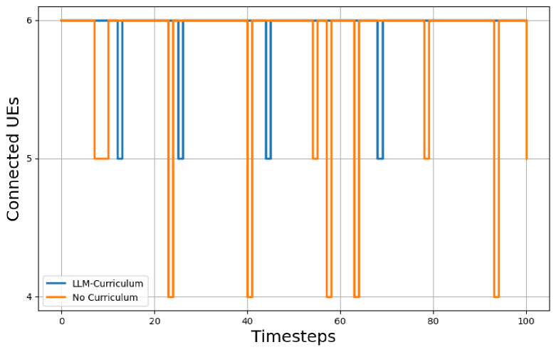

# 利用大型语言模型优化移动网络课程设计

发布时间：2024年05月28日

`Agent

理由：这篇论文主要探讨了如何利用大型语言模型（LLMs）来辅助强化学习（RL）代理的课程设计，以提高其在移动网络中的应用效果。这里的关键点在于使用LLMs来优化RL代理的性能，即通过自动化课程设计来提升RL代理的收敛速度和泛化能力。因此，这项工作更侧重于如何通过LLMs来增强Agent（即RL代理）的能力，而不是直接研究LLMs的理论或应用，也不是关于检索增强生成（RAG）的研究。` `移动网络`

> Large Language Model-Driven Curriculum Design for Mobile Networks

# 摘要

> 本文提出了一种创新框架，通过利用大型语言模型（LLMs）自动化课程设计，显著提升了强化学习（RL）在移动网络中的应用效果。随着移动网络迈向6G时代，其复杂性和动态性的增加带来了管理上的巨大挑战。传统RL方法因目标冲突及庞大的状态与动作空间而常遇收敛缓慢和泛化不佳的问题。为此，我们采用课程学习策略，系统性地提升RL代理面对的挑战，以优化其收敛与泛化能力。但课程设计往往依赖深厚的领域知识和大量人工投入。本框架借助LLMs的生成能力，自动完成课程设计，大幅减少人力需求，同时增强RL代理的收敛速度和性能。在模拟移动网络环境中实施此方法后，我们观察到RL收敛速度的提升、对未知场景的更好泛化以及整体性能的显著增强。以移动网络中的自主协调和用户关联为例，我们的研究展示了将LLM驱动的课程生成与RL结合，对于未来无线网络管理的巨大潜力，为实现完全自主网络操作奠定了坚实基础。

> This paper proposes a novel framework that leverages large language models (LLMs) to automate curriculum design, thereby enhancing the application of reinforcement learning (RL) in mobile networks. As mobile networks evolve towards the 6G era, managing their increasing complexity and dynamic nature poses significant challenges. Conventional RL approaches often suffer from slow convergence and poor generalization due to conflicting objectives and the large state and action spaces associated with mobile networks. To address these shortcomings, we introduce curriculum learning, a method that systematically exposes the RL agent to progressively challenging tasks, improving convergence and generalization. However, curriculum design typically requires extensive domain knowledge and manual human effort. Our framework mitigates this by utilizing the generative capabilities of LLMs to automate the curriculum design process, significantly reducing human effort while improving the RL agent's convergence and performance. We deploy our approach within a simulated mobile network environment and demonstrate improved RL convergence rates, generalization to unseen scenarios, and overall performance enhancements. As a case study, we consider autonomous coordination and user association in mobile networks. Our obtained results highlight the potential of combining LLM-based curriculum generation with RL for managing next-generation wireless networks, marking a significant step towards fully autonomous network operations.

[Arxiv](https://arxiv.org/abs/2405.18039)