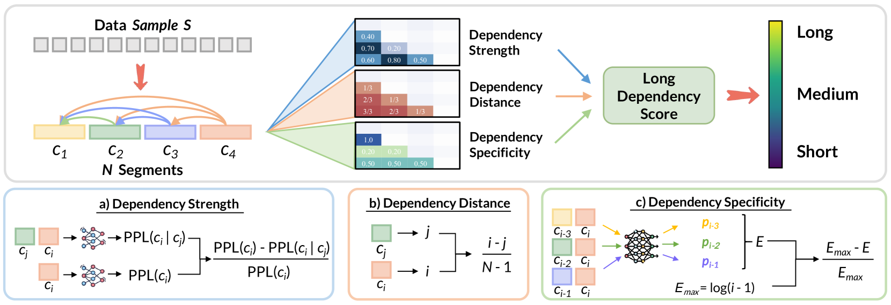
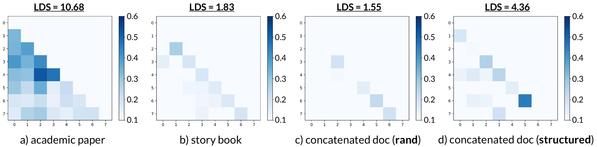
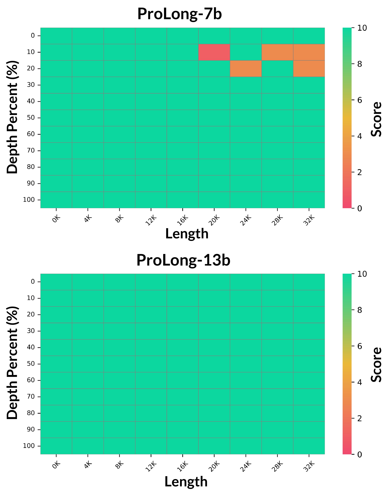
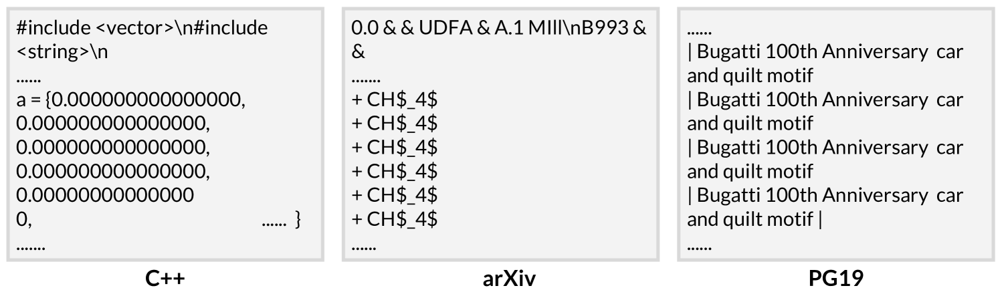

# 探索长依赖：大型语言模型的新视角

发布时间：2024年05月28日

`LLM理论

这篇论文主要探讨了大型语言模型（LLM）在长上下文建模方面的能力提升问题，并提出了一种名为ProLong的框架来评估和筛选训练样本，以增强模型的长依赖处理能力。这一研究专注于LLM的理论和方法改进，因此属于LLM理论分类。` `机器学习`

> Long Context is Not Long at All: A Prospector of Long-Dependency Data for Large Language Models

# 摘要

> 长上下文建模能力对LLMs至关重要，但仅通过长窗口训练不足以提升这一能力，因为并非所有训练样本都展现出长距离的强语义关联。为此，我们开发了ProLong框架，它能评估每个训练样本的长依赖性，并筛选出最有助于提升长上下文建模能力的样本。我们首先用delta困惑度衡量文本段间的依赖强度，再结合依赖距离调整指标，最后通过依赖特异性避免重复模式带来的无关依赖。我们还引入了随机抽样以提高计算效率。实验证明，ProLong能精准识别出具有长依赖的文档，从而显著提升LLMs的长上下文处理能力。

> Long-context modeling capabilities are important for large language models (LLMs) in various applications. However, directly training LLMs with long context windows is insufficient to enhance this capability since some training samples do not exhibit strong semantic dependencies across long contexts. In this study, we propose a data mining framework \textbf{ProLong} that can assign each training sample with a long dependency score, which can be used to rank and filter samples that are more advantageous for enhancing long-context modeling abilities in LLM training. Specifically, we first use delta perplexity scores to measure the \textit{Dependency Strength} between text segments in a given document. Then we refine this metric based on the \textit{Dependency Distance} of these segments to incorporate spatial relationships across long-contexts. Final results are calibrated with a \textit{Dependency Specificity} metric to prevent trivial dependencies introduced by repetitive patterns. Moreover, a random sampling approach is proposed to optimize the computational efficiency of ProLong. Comprehensive experiments on multiple benchmarks indicate that ProLong effectively identifies documents that carry long dependencies and LLMs trained on these documents exhibit significantly enhanced long-context modeling capabilities.

[Arxiv](https://arxiv.org/abs/2405.17915)