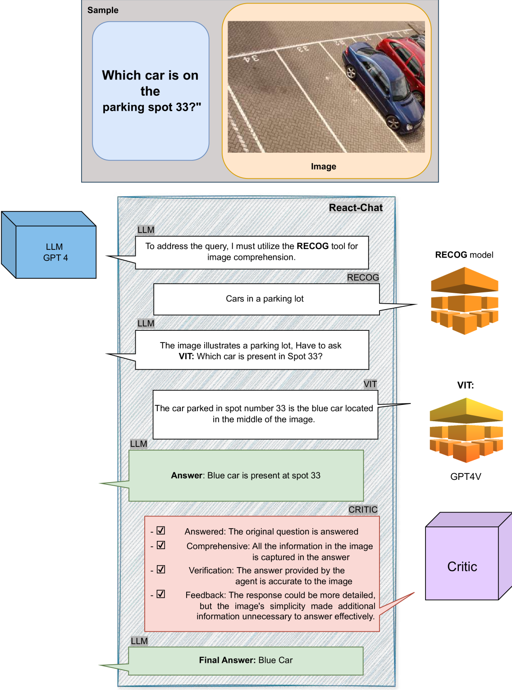

# MMCTAgent：复杂视觉推理的多模态批判性思维框架，专为提升代理的深度思考能力而设计。

发布时间：2024年05月28日

`Agent

理由：这篇论文介绍了一个名为 MMCTAgent 的创新框架，它是一个多模态批判性思维代理，专门设计来增强多模态大型语言模型（MLLMs）在复杂视觉推理任务中的能力。该代理通过迭代分析、问题分解、策略规划及推理动态演化来处理多模态信息，并引入了批判性思维元素，如答案验证和基于视觉的自我反思。这些特性表明，MMCTAgent 是一个专门用于处理和增强多模态任务的智能代理，因此归类为Agent。` `人工智能` `视觉分析`

> MMCTAgent: Multi-modal Critical Thinking Agent Framework for Complex Visual Reasoning

# 摘要

> 多模态大型语言模型（MLLMs）在视觉与语言结合的任务中取得了显著进步，但仍面临多模态理解的细节挑战、复杂任务的解析及多模态信息的推理难题。为此，我们推出了MMCTAgent，一个创新的多模态批判性思维代理框架，旨在突破MLLMs在复杂视觉推理中的局限。借鉴人类认知与批判性思维，MMCTAgent通过迭代分析、问题分解、策略规划及推理动态演化，强化了多模态信息的处理能力。同时，它引入了批判性思维元素，如答案验证和基于视觉的自我反思，以及任务特异性评估标准，显著提升了决策质量。在多个图像和视频理解基准测试中，MMCTAgent（含或不含批评者机制）均超越了基础MLLMs及其他增强工具的流程，展现了卓越性能。

> Recent advancements in Multi-modal Large Language Models (MLLMs) have significantly improved their performance in tasks combining vision and language. However, challenges persist in detailed multi-modal understanding, comprehension of complex tasks, and reasoning over multi-modal information. This paper introduces MMCTAgent, a novel multi-modal critical thinking agent framework designed to address the inherent limitations of current MLLMs in complex visual reasoning tasks. Inspired by human cognitive processes and critical thinking, MMCTAgent iteratively analyzes multi-modal information, decomposes queries, plans strategies, and dynamically evolves its reasoning. Additionally, MMCTAgent incorporates critical thinking elements such as verification of final answers and self-reflection through a novel approach that defines a vision-based critic and identifies task-specific evaluation criteria, thereby enhancing its decision-making abilities. Through rigorous evaluations across various image and video understanding benchmarks, we demonstrate that MMCTAgent (with and without the critic) outperforms both foundational MLLMs and other tool-augmented pipelines.

[Arxiv](https://arxiv.org/abs/2405.18358)