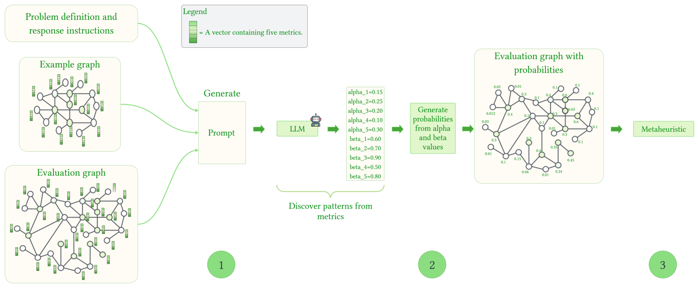
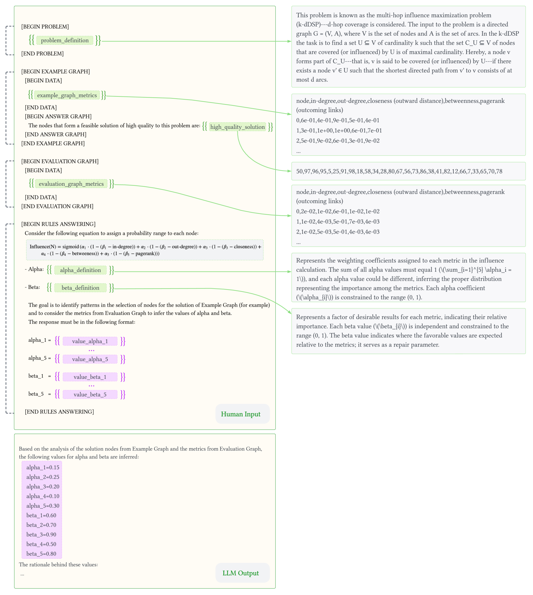
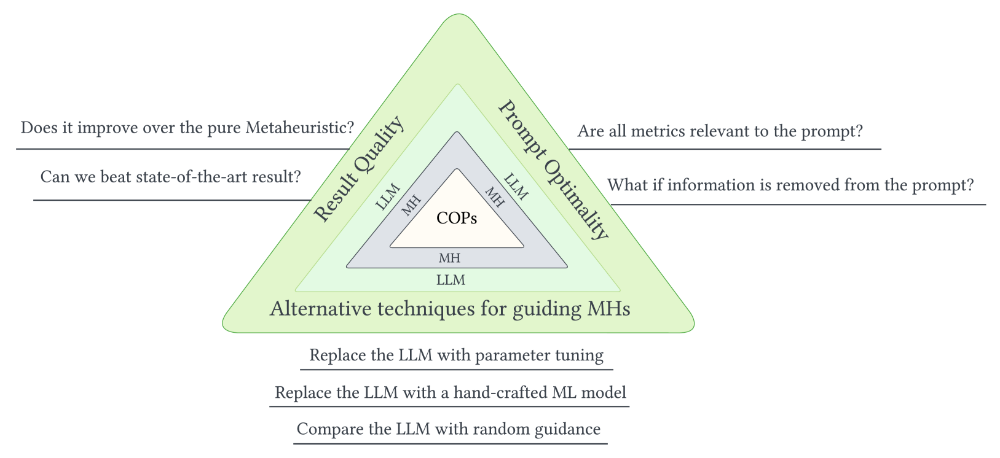
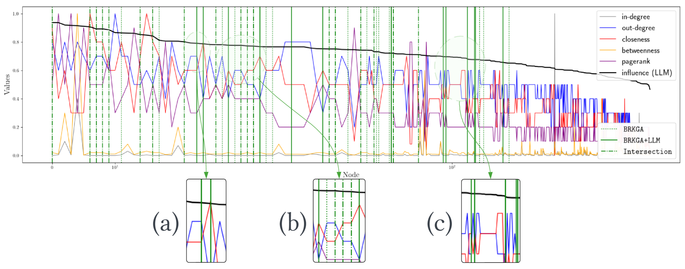
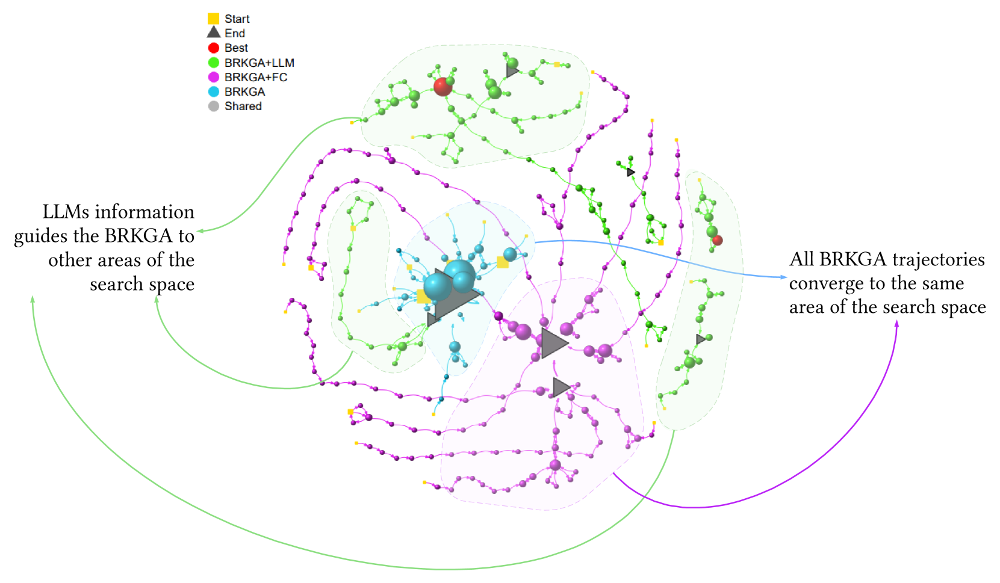

# 元启发式算法与大型语言模型携手合作，共同探索一体化优化的新途径。

发布时间：2024年05月28日

`LLM应用

这篇论文探讨了将大型语言模型（LLMs）与元启发式（MHs）结合的方法，以提升在社交网络组合优化问题中的性能。这种方法利用LLMs作为模式识别工具，并通过设计提示来优化输出，从而在实际应用中提高了结果质量。虽然论文也提到了LLMs的潜在局限性，但其主要关注点在于应用LLMs来改进现有的技术，因此属于LLM应用分类。` `社交网络` `组合优化`

> Metaheuristics and Large Language Models Join Forces: Towards an Integrated Optimization Approach

# 摘要

> 自大型语言模型（LLMs）兴起以来，元启发式（MHs）研究者一直在探索如何有效利用其力量。本文提出了一种创新方法，将LLMs作为模式识别工具融入MHs，以提升性能。在社交网络组合优化问题中测试的这一混合方法，不仅超越了现有结合机器学习与MHs的顶尖技术，还通过巧妙设计提示，展示了LLMs输出作为问题知识的潜力，显著提升了结果质量。尽管如此，我们也意识到LLMs的潜在局限，并强调对其进行深入研究的重要性，以推动这一领域的发展。

> Since the rise of Large Language Models (LLMs) a couple of years ago, researchers in metaheuristics (MHs) have wondered how to use their power in a beneficial way within their algorithms. This paper introduces a novel approach that leverages LLMs as pattern recognition tools to improve MHs. The resulting hybrid method, tested in the context of a social network-based combinatorial optimization problem, outperforms existing state-of-the-art approaches that combine machine learning with MHs regarding the obtained solution quality. By carefully designing prompts, we demonstrate that the output obtained from LLMs can be used as problem knowledge, leading to improved results. Lastly, we acknowledge LLMs' potential drawbacks and limitations and consider it essential to examine them to advance this type of research further.

[Arxiv](https://arxiv.org/abs/2405.18272)