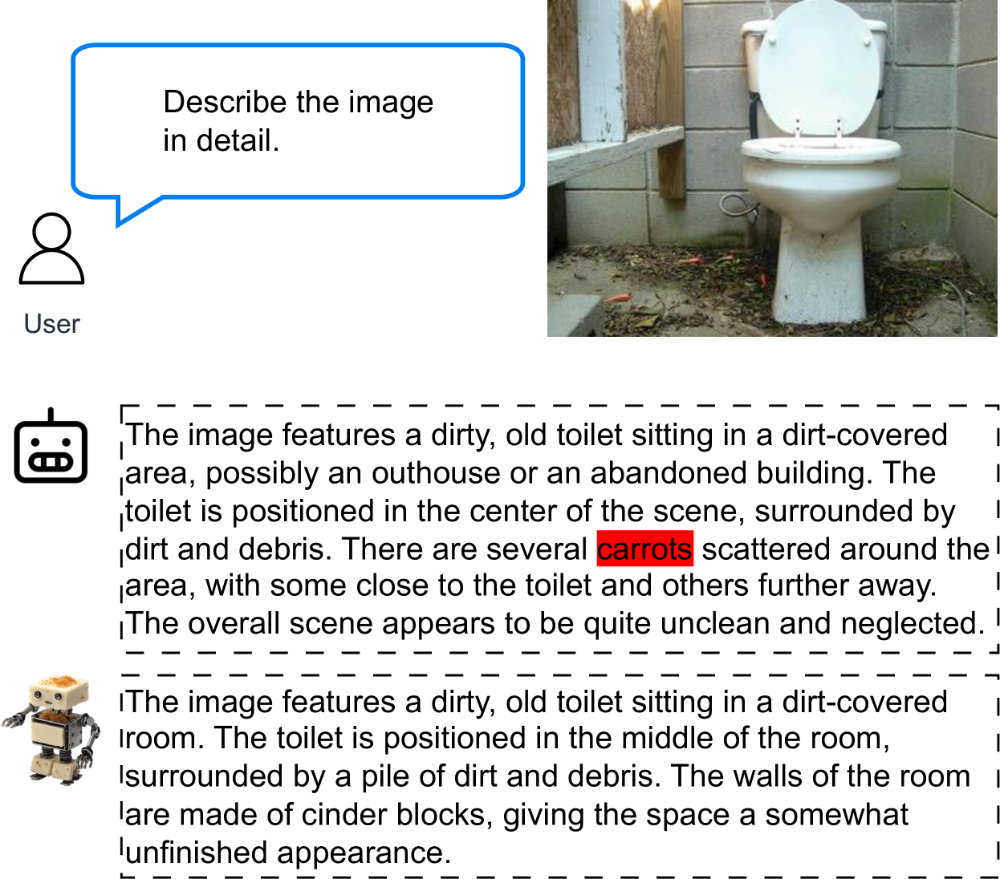

# 利用数据增强对比调谐策略，有效缓解物体幻觉现象

发布时间：2024年05月28日

`LLM理论

理由：这篇论文关注的是多模态大型语言模型（MLLMs）中的一个具体问题——对象幻觉，并提出了一种对比调优策略来解决这一问题。这种研究更多地涉及模型的内部机制和理论改进，而不是直接的应用或Agent的行为，也不是关于检索增强生成（RAG）的具体应用。因此，它更适合归类为“LLM理论”。` `人工智能` `机器学习`

> Mitigating Object Hallucination via Data Augmented Contrastive Tuning

# 摘要

> 多模态大型语言模型（MLLMs）虽有显著进步，却常产生事实错误信息。本研究聚焦于MLLMs中的对象幻觉问题，即模型输出关于不存在对象的信息。为此，我们提出了一种对比调优策略，适用于预训练的MLLM，旨在减少幻觉同时保持其视觉-语言通用能力。具体而言，对于每个事实标记，我们通过有选择地修改真实信息，生成一个幻觉标记。通过在标记级别实施对比调优，我们提升了事实标记相对于幻觉标记的相对概率。详尽的评估表明，此方法能有效减少幻觉，且操作简便、高效，训练需求极低，推理时无需额外资源。

> Despite their remarkable progress, Multimodal Large Language Models (MLLMs) tend to hallucinate factually inaccurate information. In this work, we address object hallucinations in MLLMs, where information is offered about an object that is not present in the model input. We introduce a contrastive tuning method that can be applied to a pretrained off-the-shelf MLLM for mitigating hallucinations while preserving its general vision-language capabilities. For a given factual token, we create a hallucinated token through generative data augmentation by selectively altering the ground-truth information. The proposed contrastive tuning is applied at the token level to improve the relative likelihood of the factual token compared to the hallucinated one. Our thorough evaluation confirms the effectiveness of contrastive tuning in mitigating hallucination. Moreover, the proposed contrastive tuning is simple, fast, and requires minimal training with no additional overhead at inference.

[Arxiv](https://arxiv.org/abs/2405.18654)