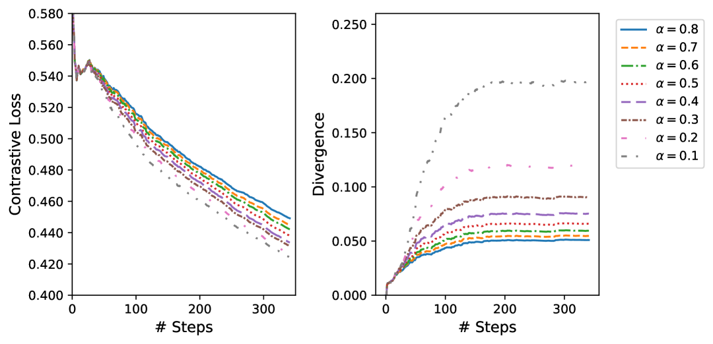

# 利用数据增强对比调优缓解对象幻觉现象

发布时间：2024年05月28日

`LLM应用

这篇论文关注的是多模态大型语言模型（MLLMs）中的对象幻觉问题，并提出了一种对比调优策略来减少这种幻觉。这种方法是在预训练的MLLM上进行的，目的是在减少错误信息的同时保留模型的视觉-语言通用能力。因此，这项研究属于LLM应用类别，因为它专注于改进现有模型的实际应用性能，而不是探讨LLM的理论基础或Agent的行为。` `人工智能` `机器学习`

> Mitigating Object Hallucination via Data Augmented Contrastive Tuning

# 摘要

> 多模态大型语言模型（MLLMs）虽有显著进步，却常产生事实错误信息。本研究聚焦于MLLMs中的对象幻觉问题，即模型输出关于不存在对象的信息。我们提出了一种对比调优策略，适用于预训练的MLLM，旨在减少幻觉同时保留其视觉-语言通用能力。通过生成数据增强，我们为事实标记创造幻觉标记，有选择地修改真实信息。对比调优在标记层面实施，旨在提升事实标记相对于幻觉标记的相对概率。全面评估显示，此方法有效减少幻觉，且操作简便、迅速，训练需求极低，推理时无需额外负担。

> Despite their remarkable progress, Multimodal Large Language Models (MLLMs) tend to hallucinate factually inaccurate information. In this work, we address object hallucinations in MLLMs, where information is offered about an object that is not present in the model input. We introduce a contrastive tuning method that can be applied to a pretrained off-the-shelf MLLM for mitigating hallucinations while preserving its general vision-language capabilities. For a given factual token, we create a hallucinated token through generative data augmentation by selectively altering the ground-truth information. The proposed contrastive tuning is applied at the token level to improve the relative likelihood of the factual token compared to the hallucinated one. Our thorough evaluation confirms the effectiveness of contrastive tuning in mitigating hallucination. Moreover, the proposed contrastive tuning is simple, fast, and requires minimal training with no additional overhead at inference.

[Arxiv](https://arxiv.org/abs/2405.18654)