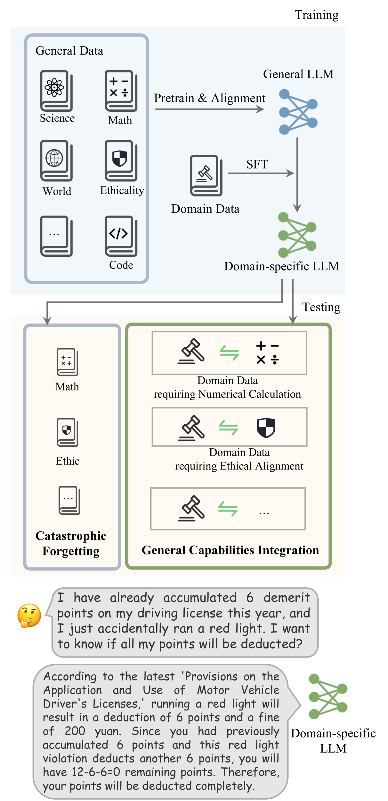
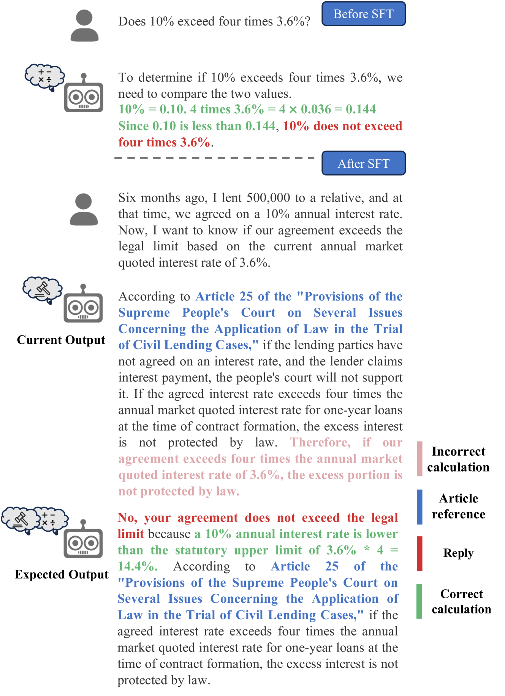
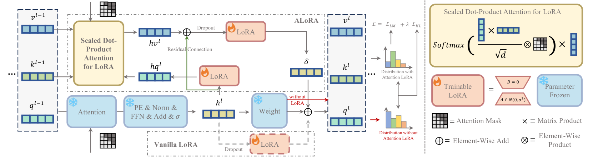
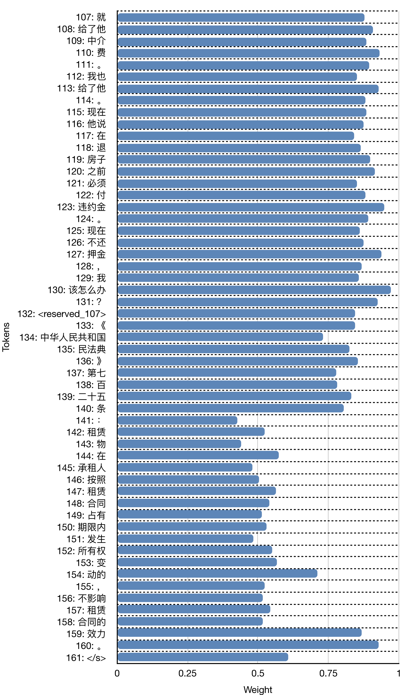

# 超越灾难性遗忘：为特定领域LLMs融合通用能力

发布时间：2024年05月28日

`LLM应用

这篇论文主要探讨了大型语言模型（LLMs）在特定领域微调后出现的灾难性遗忘（CF）问题，并提出了通用能力整合（GCI）的概念，旨在在单一模型中融合通用能力与领域知识，以提升特定领域任务的性能。论文通过设计法律领域的训练与测试任务，并构建相应数据集，开发了ALoRA方法来实现这一目标。这种方法通过多头注意力机制，使模型能够根据任务需求灵活切换知识与能力。因此，这篇论文属于LLM应用类别，因为它关注的是LLM在特定领域的应用和改进。` `人工智能`

> More Than Catastrophic Forgetting: Integrating General Capabilities For Domain-Specific LLMs

# 摘要

> 大型语言模型（LLMs）在特定领域微调后，通用任务表现会下降，这一现象称为灾难性遗忘（CF）。本文进一步提出了一个实际挑战——通用能力整合（GCI），要求在单一模型中融合通用能力与领域知识，旨在协调并有效利用这两者，以提升特定领域任务的性能。以法律领域为例，我们设计了实用性的训练与测试任务，并构建了相应数据集。为在特定领域中融入通用能力，我们开发了ALoRA，通过多头注意力机制，实现从先前令牌到当前令牌的信息直接传递，使模型能根据任务需求灵活切换知识与能力。实验结果验证了我们方法的有效性及其在特定领域中的重要性。

> The performance on general tasks decreases after Large Language Models (LLMs) are fine-tuned on domain-specific tasks, the phenomenon is known as Catastrophic Forgetting (CF). However, this paper presents a further challenge for real application of domain-specific LLMs beyond CF, called General Capabilities Integration (GCI), which necessitates the integration of both the general capabilities and domain knowledge within a single instance. The objective of GCI is not merely to retain previously acquired general capabilities alongside new domain knowledge, but to harmonize and utilize both sets of skills in a cohesive manner to enhance performance on domain-specific tasks. Taking legal domain as an example, we carefully design three groups of training and testing tasks without lacking practicability, and construct the corresponding datasets. To better incorporate general capabilities across domain-specific scenarios, we introduce ALoRA, which utilizes a multi-head attention module upon LoRA, facilitating direct information transfer from preceding tokens to the current one. This enhancement permits the representation to dynamically switch between domain-specific knowledge and general competencies according to the attention. Extensive experiments are conducted on the proposed tasks. The results exhibit the significance of our setting, and the effectiveness of our method.

[Arxiv](https://arxiv.org/abs/2405.17830)