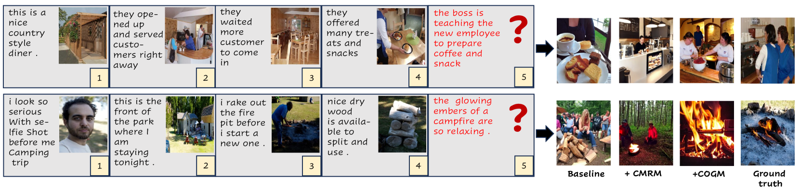
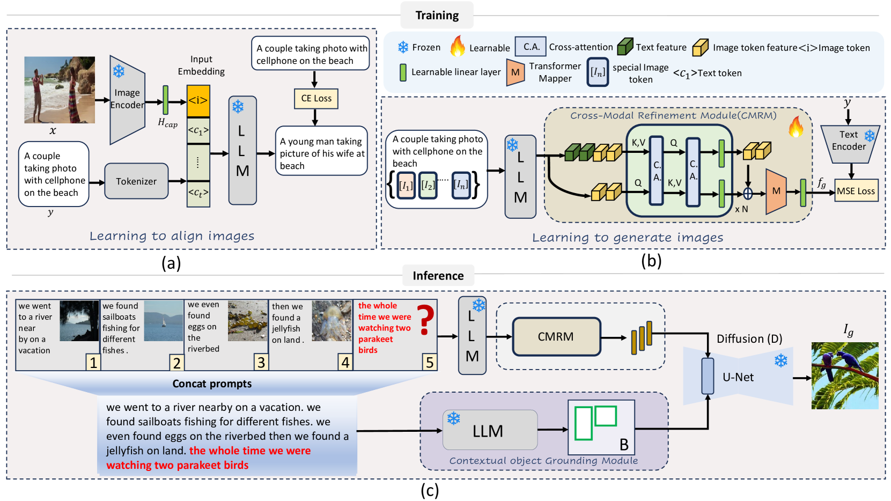
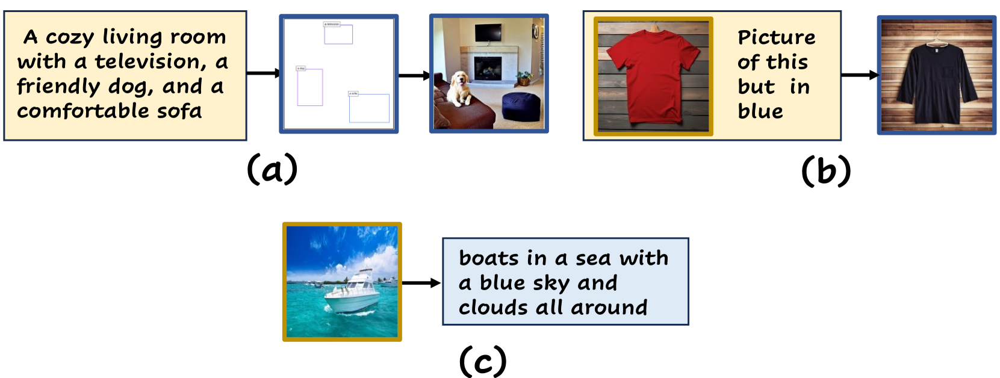
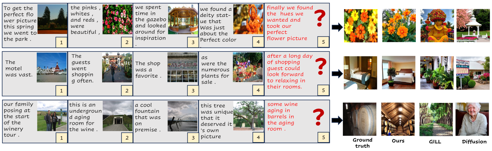
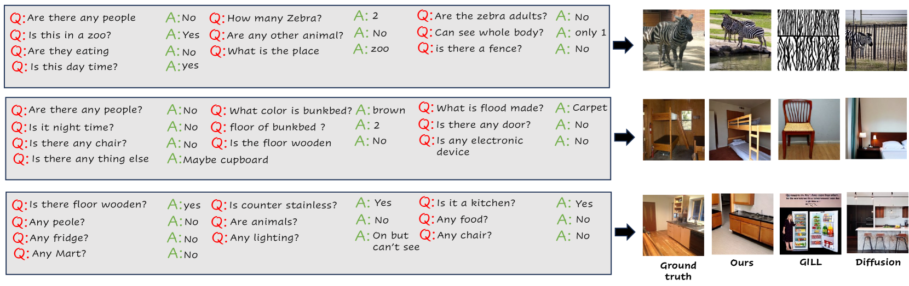

# 跨模态上下文学习驱动多模态内容生成

发布时间：2024年05月28日

`LLM应用

理由：这篇论文介绍了一种新的方法“跨模态上下文学习的多模态生成（MGCC）”，该方法结合了大型语言模型和扩散模型来从复杂的多模态提示序列中生成图像。这种方法特别关注于提高多模态提示处理的连贯性和准确性，尤其是在涉及多个对象的场景中。论文中提到的实验结果表明，MGCC在图像生成和多模态对话方面表现出色，并在权威数据集上超越了现有技术。因此，这项工作属于LLM的应用领域，因为它展示了如何利用大型语言模型来解决实际的多模态生成问题。` `图像生成` `多模态交互`

> Multi-modal Generation via Cross-Modal In-Context Learning

# 摘要

> 本研究聚焦于从复杂的多模态提示序列中创造新颖图像的挑战。现有技术虽在文本至图像转换上有所成就，却常在处理长篇提示时丢失细节，且难以维持多提示间的连贯性，尤其在涉及多对象的场景中，图像与提示常出现错位。为此，我们创新性地提出了“跨模态上下文学习的多模态生成（MGCC）”方法，它巧妙结合了大型语言模型与扩散模型的力量，精准地从复杂提示中提取图像。MGCC的核心在于其跨模态精炼模块，它能在语言模型的嵌入空间内捕捉文本与图像间的深层联系，并辅以对象定位模块，确保多对象场景中的图像生成准确无误。实验结果显示，MGCC不仅在图像生成上表现出色，还能促进多模态对话和文本创作，其性能在两个权威数据集上均超越了现有技术。在视觉故事生成（VIST）数据集上，MGCC的CLIP相似度达到了0.652，优于SOTA GILL的0.641；在视觉对话上下文（VisDial）数据集上，更是以0.660的CLIP分数，显著领先于现有最佳方法的0.645。更多详情及代码，请访问：https://github.com/VIROBO-15/MGCC。

> In this work, we study the problem of generating novel images from complex multimodal prompt sequences. While existing methods achieve promising results for text-to-image generation, they often struggle to capture fine-grained details from lengthy prompts and maintain contextual coherence within prompt sequences. Moreover, they often result in misaligned image generation for prompt sequences featuring multiple objects. To address this, we propose a Multi-modal Generation via Cross-Modal In-Context Learning (MGCC) method that generates novel images from complex multimodal prompt sequences by leveraging the combined capabilities of large language models (LLMs) and diffusion models. Our MGCC comprises a novel Cross-Modal Refinement module to explicitly learn cross-modal dependencies between the text and image in the LLM embedding space, and a contextual object grounding module to generate object bounding boxes specifically targeting scenes with multiple objects. Our MGCC demonstrates a diverse range of multimodal capabilities, like novel image generation, the facilitation of multimodal dialogue, and generation of texts. Experimental evaluations on two benchmark datasets, demonstrate the effectiveness of our method. On Visual Story Generation (VIST) dataset with multimodal inputs, our MGCC achieves a CLIP Similarity score of $0.652$ compared to SOTA GILL $0.641$. Similarly, on Visual Dialogue Context (VisDial) having lengthy dialogue sequences, our MGCC achieves an impressive CLIP score of $0.660$, largely outperforming existing SOTA method scoring $0.645$. Code: https://github.com/VIROBO-15/MGCC

[Arxiv](https://arxiv.org/abs/2405.18304)