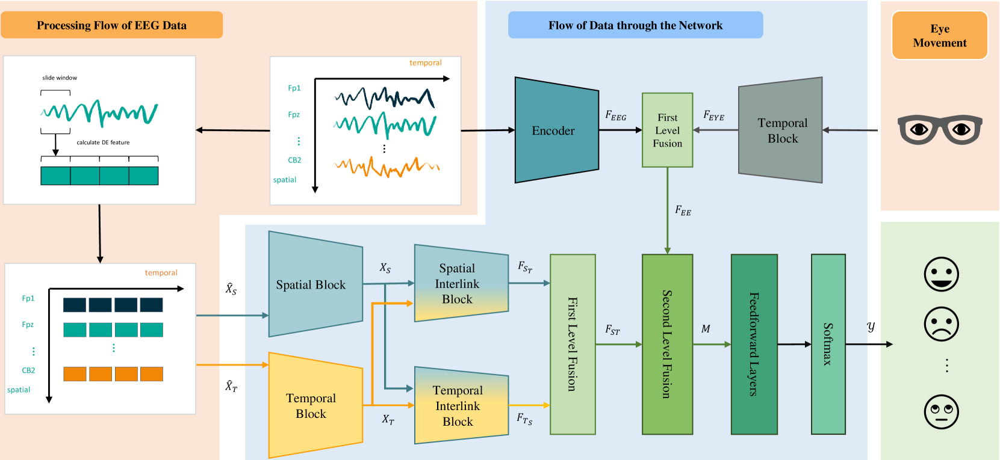
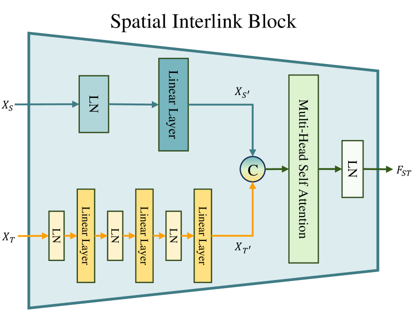
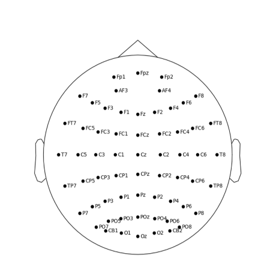
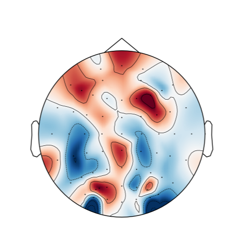
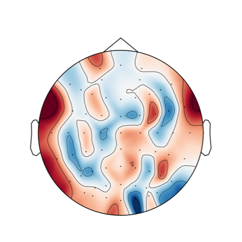
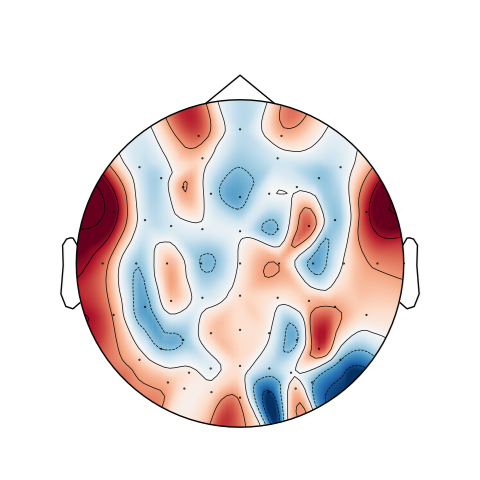
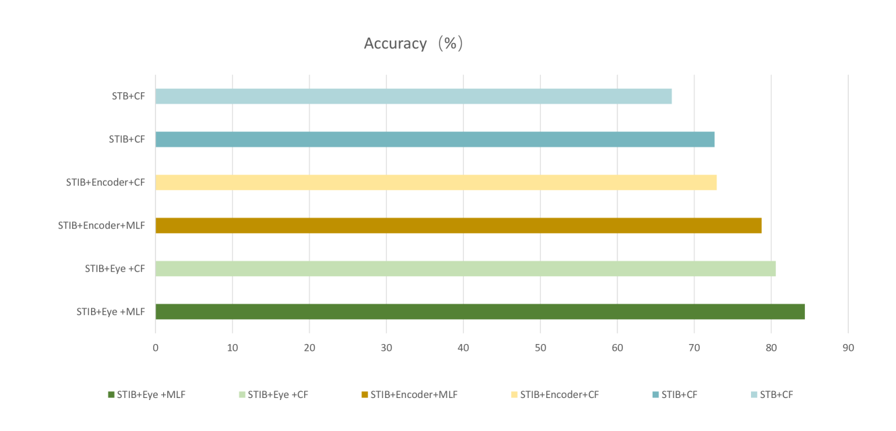

# 多模态情绪解读器：预训练模型助力跨主题情感识别

发布时间：2024年05月28日

`Agent

理由：这篇论文介绍了一种基于预训练的多模态情绪阅读器，该阅读器通过特定的算法和机制处理EEG信号，以识别情感。这种阅读器可以被视为一个智能Agent，因为它能够处理输入数据（EEG信号）并产生有意义的输出（情感识别）。此外，论文强调了该阅读器在跨受试者情感识别上的优越性能，这表明它具有一定的自主性和适应性，符合Agent的特性。虽然该阅读器可能涉及到一些大型语言模型（LLM）的应用，但论文的主要焦点是情感识别Agent的设计和性能，而不是LLM的理论或应用。因此，将其归类为Agent更为合适。` `情感计算` `神经信号处理`

> Multi-modal Mood Reader: Pre-trained Model Empowers Cross-Subject Emotion Recognition

# 摘要

> 基于EEG的情感识别在神经信号处理和情感计算等领域蓬勃发展，但个体脑结构的差异使得跨受试者情感识别充满挑战。现有方法虽尝试改进，但在实际应用和模型统一性上仍有不足，难以捕捉EEG信号的复杂时空特性，且未能充分利用多模态信息。为此，我们推出了基于预训练的多模态情绪阅读器，通过掩蔽脑信号建模和互联时空注意力机制，从大规模数据集中学习EEG的通用特征，并巧妙处理DE特征。多级融合层进一步整合了这些特征，充分发挥了多维多模态信息的优势。实验证明，该阅读器在跨受试者情感识别上超越了现有技术，且从注意力角度深入分析，揭示了情感相关脑区的奥秘，为神经信号处理中的情感研究开辟了新视角。

> Emotion recognition based on Electroencephalography (EEG) has gained significant attention and diversified development in fields such as neural signal processing and affective computing. However, the unique brain anatomy of individuals leads to non-negligible natural differences in EEG signals across subjects, posing challenges for cross-subject emotion recognition. While recent studies have attempted to address these issues, they still face limitations in practical effectiveness and model framework unity. Current methods often struggle to capture the complex spatial-temporal dynamics of EEG signals and fail to effectively integrate multimodal information, resulting in suboptimal performance and limited generalizability across subjects. To overcome these limitations, we develop a Pre-trained model based Multimodal Mood Reader for cross-subject emotion recognition that utilizes masked brain signal modeling and interlinked spatial-temporal attention mechanism. The model learns universal latent representations of EEG signals through pre-training on large scale dataset, and employs Interlinked spatial-temporal attention mechanism to process Differential Entropy(DE) features extracted from EEG data. Subsequently, a multi-level fusion layer is proposed to integrate the discriminative features, maximizing the advantages of features across different dimensions and modalities. Extensive experiments on public datasets demonstrate Mood Reader's superior performance in cross-subject emotion recognition tasks, outperforming state-of-the-art methods. Additionally, the model is dissected from attention perspective, providing qualitative analysis of emotion-related brain areas, offering valuable insights for affective research in neural signal processing.

[Arxiv](https://arxiv.org/abs/2405.19373)