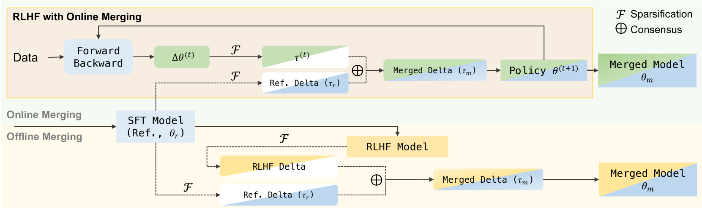

# 在线合并优化器：提升奖励，减轻对齐中的税收负担

发布时间：2024年05月28日

`LLM理论

理由：这篇论文主要探讨了如何调整RLHF（Reinforcement Learning with Human Feedback）与SFT（Supervised Fine-Tuning）模型参数的插值，以降低对齐成本并保持模型性能。这是一种针对大型语言模型（LLM）的理论性研究，旨在优化模型的训练过程和性能，而不是直接应用于特定的Agent或RAG系统，也不是关于LLM的具体应用案例。因此，它更符合LLM理论的分类。` `机器学习`

> Online Merging Optimizers for Boosting Rewards and Mitigating Tax in Alignment

# 摘要

> 在RLHF中，如何让大型语言模型既符合人类价值观又不损失预训练和监督微调带来的能力，是一个关键挑战。本文发现，通过调整RLHF与SFT模型参数的插值，可以在牺牲部分对齐奖励的前提下，降低对齐成本。基于此，我们提出了一种在线合并优化器，它在RLHF的每一步优化中融合RL策略与SFT模型，持续引导训练方向。具体做法是，通过SFT与预训练模型参数差异来合并梯度，确保梯度优化方向与SFT一致，最大化奖励。实验证明，该优化器适用于Qwen和LLaMA等不同规模的LLM（从1.8B到8B），以及DPO和KTO等多种RLHF算法，并能与现有模型合并技术协同工作。它不仅提升了对齐奖励，还减少了相应的成本，使得在14个基准测试中整体性能得到显著提升。

> Effectively aligning Large Language Models (LLMs) with human-centric values while preventing the degradation of abilities acquired through Pre-training and Supervised Fine-tuning (SFT) poses a central challenge in Reinforcement Learning from Human Feedback (RLHF). In this paper, we first discover that interpolating RLHF and SFT model parameters can adjust the trade-off between human preference and basic capabilities, thereby reducing the alignment tax at the cost of alignment reward. Inspired by this, we propose integrating the RL policy and SFT models at each optimization step in RLHF to continuously regulate the training direction, introducing the Online Merging Optimizer. Specifically, we merge gradients with the parameter differences between SFT and pretrained models, effectively steering the gradient towards maximizing rewards in the direction of SFT optimization. We demonstrate that our optimizer works well with different LLM families, such as Qwen and LLaMA, across various model sizes ranging from 1.8B to 8B, various RLHF algorithms like DPO and KTO, and existing model merging methods. It significantly enhances alignment reward while mitigating alignment tax, achieving higher overall performance across 14 benchmarks.

[Arxiv](https://arxiv.org/abs/2405.17931)