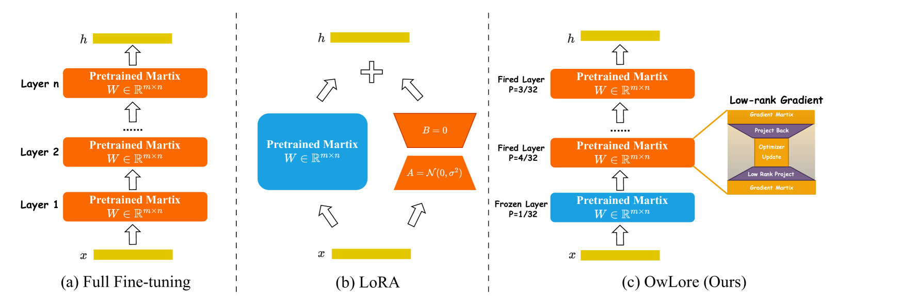
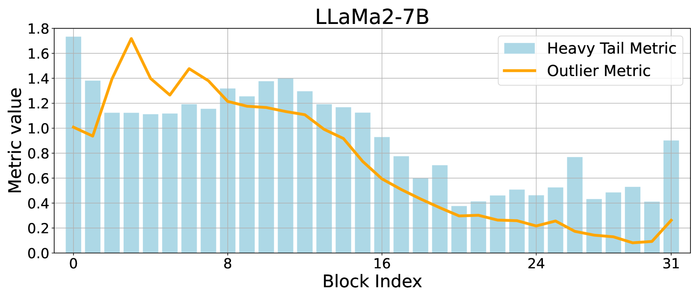
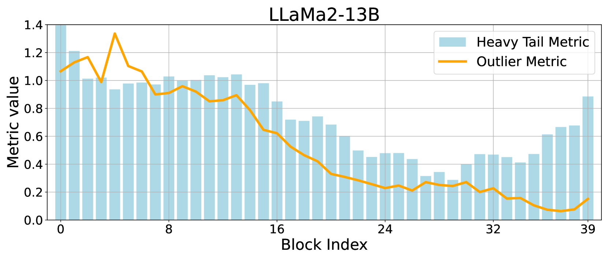
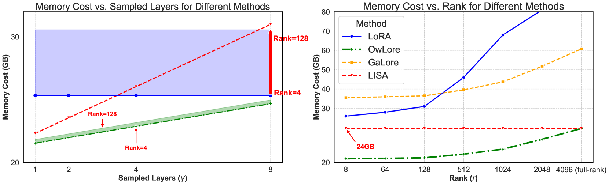
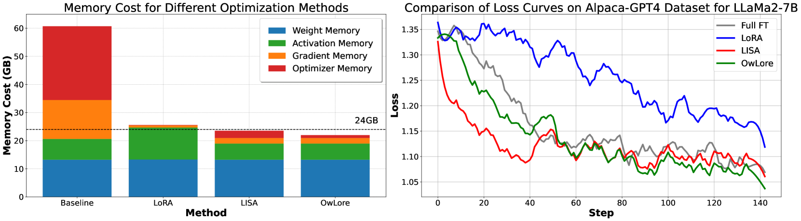
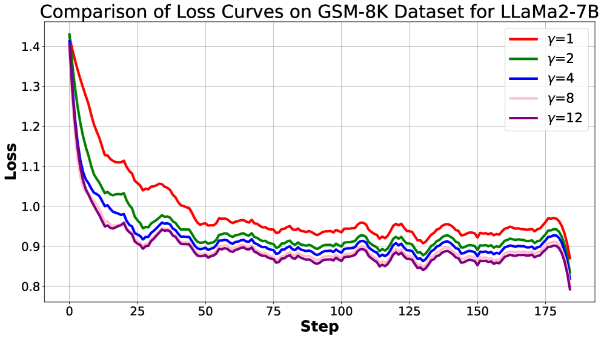

# OwLore：一种针对 LLM 微调的内存高效方法，通过异常值加权层级采样实现低秩投影。

发布时间：2024年05月28日

`LLM理论

这篇论文主要探讨了大型语言模型（LLMs）的微调策略，特别是提出了一种名为Outlier-weighed Layerwise Sampled Low-Rank Projection（OwLore）的新型内存高效微调方法。该方法通过分析LLMs层级异常分布来动态选择预训练层进行微调，并结合梯度低秩投影技术以优化内存使用和性能。这一研究深入分析了LLMs的内部结构和训练机制，属于对LLM理论的深入探讨和创新。因此，将其归类为LLM理论。` `机器学习`

> OwLore: Outlier-weighed Layerwise Sampled Low-Rank Projection for Memory-Efficient LLM Fine-tuning

# 摘要

> 大型语言模型（LLMs）的迅猛发展已经彻底革新了自然语言处理领域。然而，这些模型的庞大体积在训练和微调过程中带来了巨大挑战。尽管低秩适应（LoRA）等参数高效方法日益流行，但它们在性能上往往不及全秩微调。本文中，我们提出了一种名为Outlier-weighed Layerwise Sampled Low-Rank Projection（OwLore）的新型内存高效微调策略，它根据LLMs层级异常分布动态选择预训练层进行微调，而非添加额外适配器。我们通过重尾自正则化理论（HT-SR）揭示了异常现象，发现异常值多的层训练效果更佳。基于此，OwLore为异常值多的层赋予更高采样概率，以充分利用预训练LLMs的知识。此外，我们将梯度低秩投影融入方法中，以低秩方式高效训练每一层，大幅优化了内存与性能的平衡。实验证明，OwLore在多种架构上均优于基线方法，包括全秩微调，实现了在常识推理、MMLU和MT-Bench上的显著性能提升，同时更加节省内存。OwLore让我们仅用21GB内存即可微调LLaMa2-7B。

> The rapid advancements in Large Language Models (LLMs) have revolutionized various natural language processing tasks. However, the substantial size of LLMs presents significant challenges in training or fine-tuning. While parameter-efficient approaches such as low-rank adaptation (LoRA) have gained popularity, they often compromise performance compared to full-rank fine-tuning. In this paper, we propose Outlier-weighed Layerwise Sampled Low-Rank Projection (OwLore), a new memory-efficient fine-tuning approach, inspired by the layerwise outlier distribution of LLMs, which dynamically samples pre-trained layers to fine-tune instead of adding additional adaptors. We first interpret the outlier phenomenon through the lens of Heavy-Tailed Self-Regularization theory (HT-SR), discovering that layers with more outliers tend to be more heavy-tailed and consequently better trained. Inspired by this finding, OwLore strategically assigns higher sampling probabilities to layers with more outliers to better leverage the knowledge stored in pre-trained LLMs. To further mitigate the memory demands of fine-tuning, we integrate gradient low-rank projection into our approach, which facilitates each layer to be efficiently trained in a low-rank manner. By incorporating the efficient characteristics of low-rank and optimal layerwise sampling, OwLore significantly improves the memory-performance trade-off in LLM pruning. Our extensive experiments across various architectures, including LLaMa2, LLaMa3, and Mistral, demonstrate that OwLore consistently outperforms baseline approaches, including full fine-tuning. Specifically, it achieves up to a 1.1% average accuracy gain on the Commonsense Reasoning benchmark, a 3.0% improvement on MMLU, and a notable 10% boost on MT-Bench, while being more memory efficient. OwLore allows us to fine-tune LLaMa2-7B with only 21GB of memory.

[Arxiv](https://arxiv.org/abs/2405.18380)