# 探索语言模型的思维：一种上下文问答中归因的新途径

发布时间：2024年05月28日

`RAG

理由：这篇论文主要关注的是大型语言模型（LLMs）在上下文问答中的应用，特别是如何确保模型输出的可追溯性和可信度。论文提出了一种新的上下文问答归因技术，利用LLMs的隐藏状态进行精准归因，这与RAG（Retrieval-Augmented Generation）模型的目标相符，即通过检索增强生成过程的可解释性和可信度。此外，论文还推出了一个数据集，用于支持细粒度的归因注释，这也是RAG研究领域的一个重要方面。因此，这篇论文更适合归类于RAG。` `问答系统` `人工智能`

> Peering into the Mind of Language Models: An Approach for Attribution in Contextual Question Answering

# 摘要

> 生成式AI的进步，使得上下文问答变得尤为关键。确保模型输出可追溯至原始文档，是维护其可信度的关键。我们发现，大型语言模型（LLMs）在处理此类问答时，答案常由直接复制的输入文本与模型自创的“粘合剂”文本组成。鉴于此，我们认为LLMs具备识别文本来源的内在能力，这或许体现在其隐藏状态中。为此，我们开发了一种新的上下文问答归因技术，利用LLMs的隐藏状态进行精准归因，无需繁复的模型再训练或增加检索负担，同时保持答案质量。实验证明，该方法在识别和归因LLM生成中的直接复制文本方面，与GPT-4相比毫不逊色，甚至更胜一筹。此方法在多种LLM架构中均表现出色，展现了其广泛的应用潜力。此外，我们还推出了Verifiability-granular数据集，为上下文问答中的LLM生成提供细粒度的归因注释。

> With the enhancement in the field of generative artificial intelligence (AI), contextual question answering has become extremely relevant. Attributing model generations to the input source document is essential to ensure trustworthiness and reliability. We observe that when large language models (LLMs) are used for contextual question answering, the output answer often consists of text copied verbatim from the input prompt which is linked together with "glue text" generated by the LLM. Motivated by this, we propose that LLMs have an inherent awareness from where the text was copied, likely captured in the hidden states of the LLM. We introduce a novel method for attribution in contextual question answering, leveraging the hidden state representations of LLMs. Our approach bypasses the need for extensive model retraining and retrieval model overhead, offering granular attributions and preserving the quality of generated answers. Our experimental results demonstrate that our method performs on par or better than GPT-4 at identifying verbatim copied segments in LLM generations and in attributing these segments to their source. Importantly, our method shows robust performance across various LLM architectures, highlighting its broad applicability. Additionally, we present Verifiability-granular, an attribution dataset which has token level annotations for LLM generations in the contextual question answering setup.

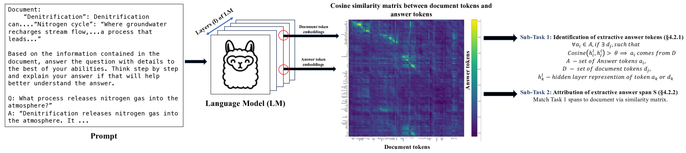

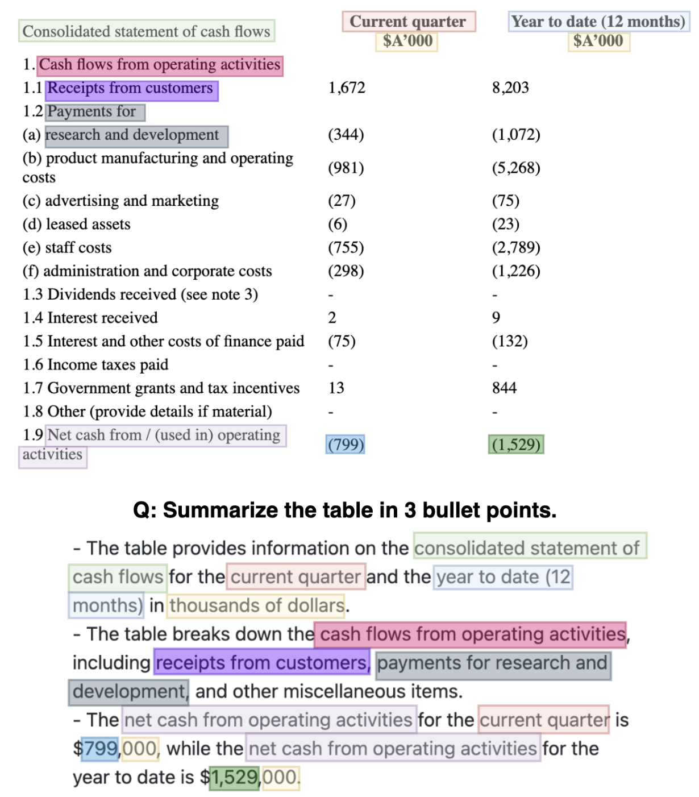

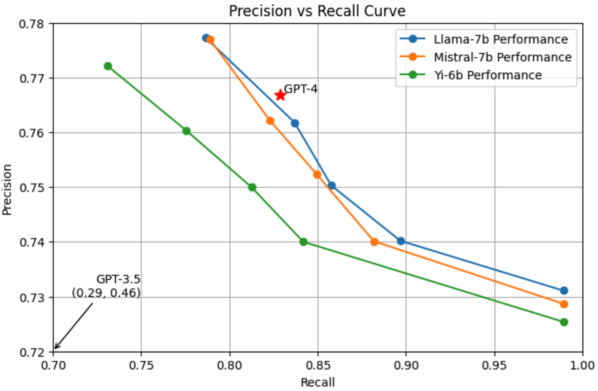

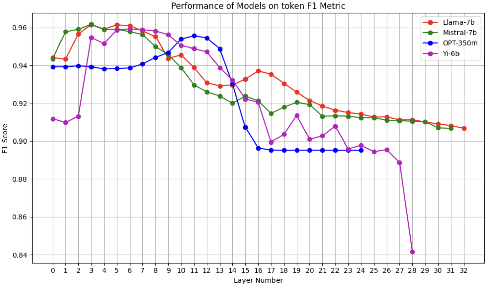

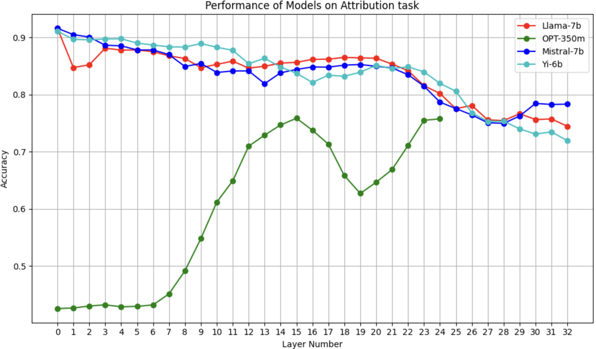

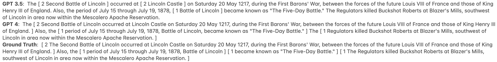

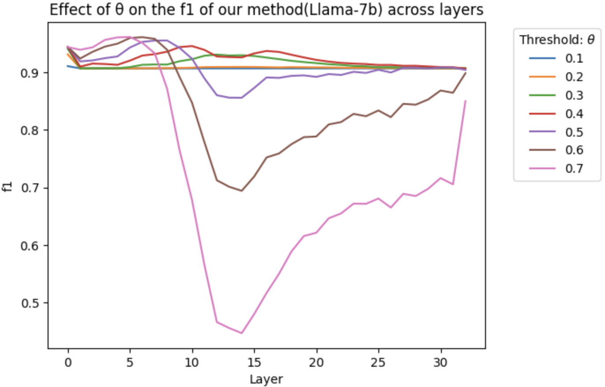

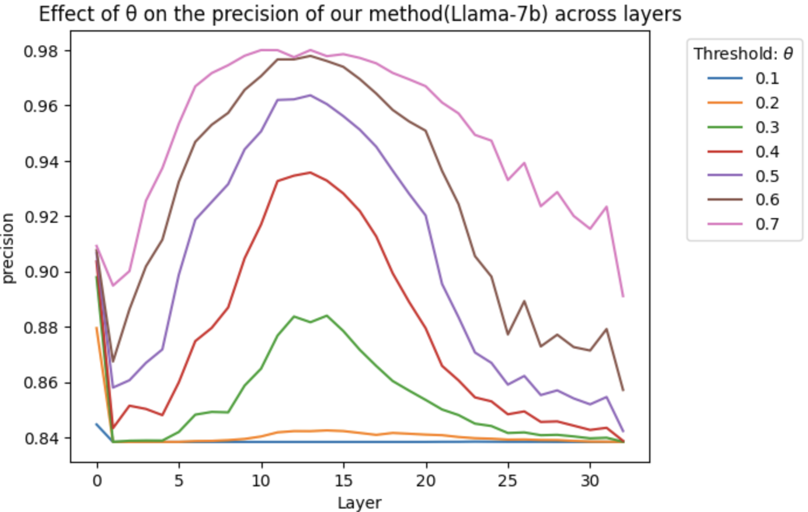

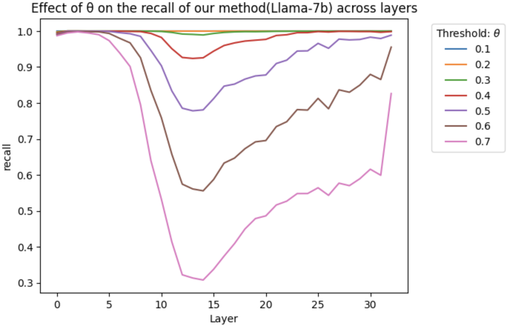

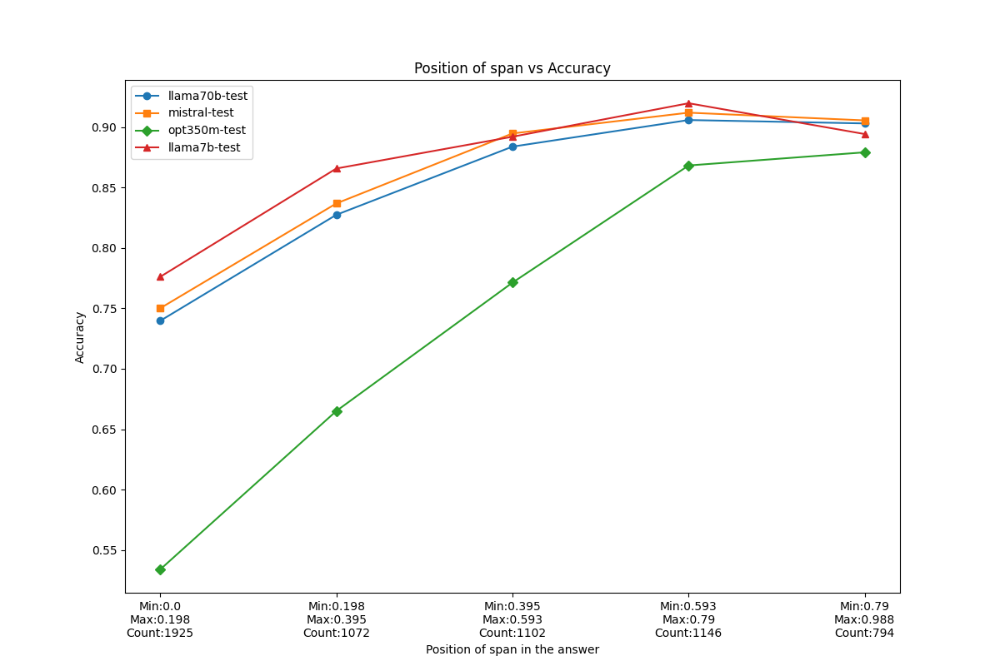

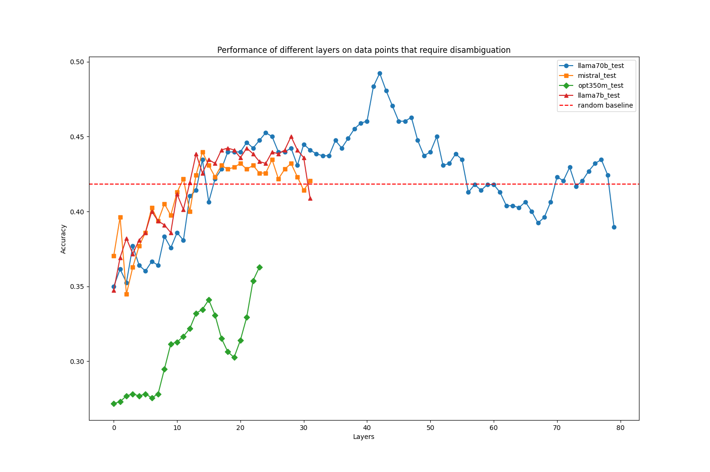

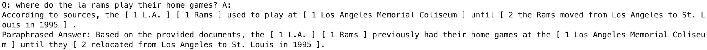

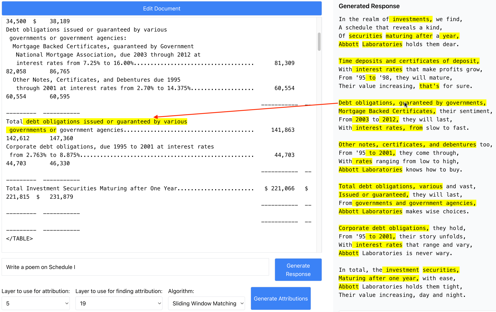

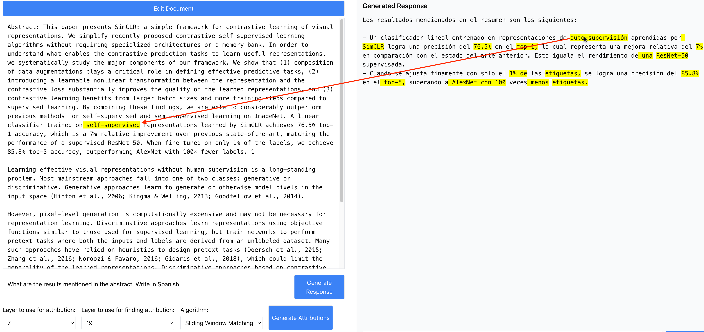

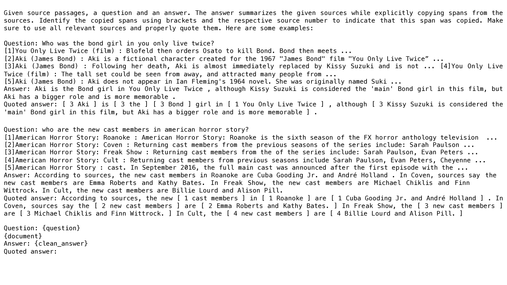

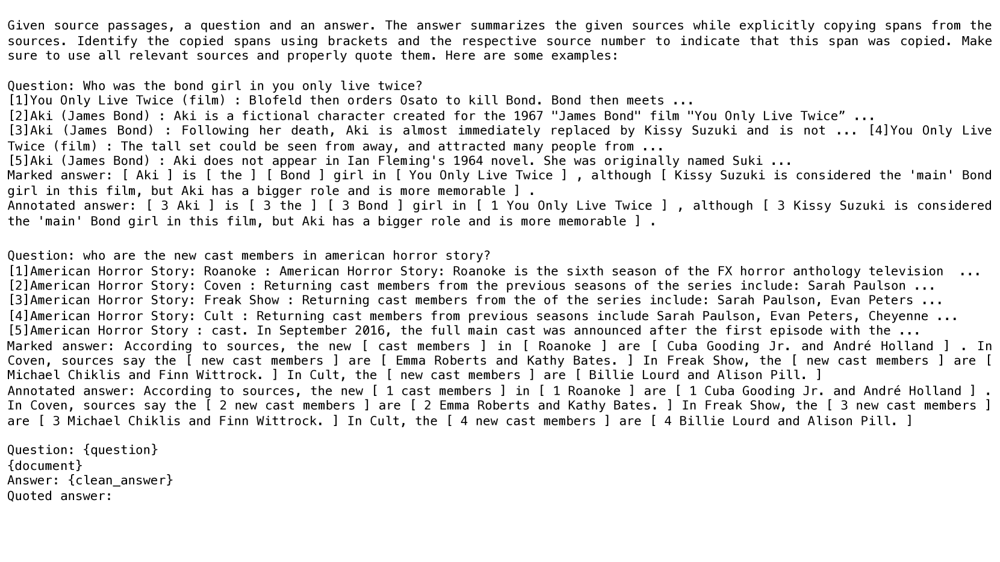

[Arxiv](https://arxiv.org/abs/2405.17980)