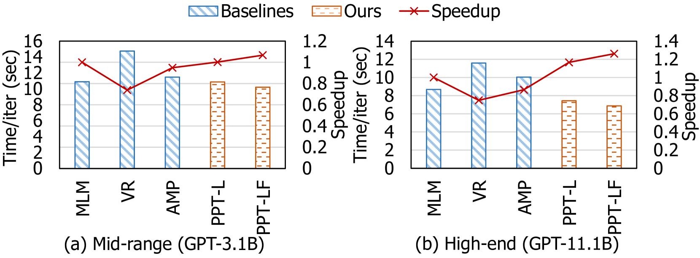

# Pipette：现实世界集群中大型语言模型训练参数的自动细粒度配置器

发布时间：2024年05月28日

`LLM应用

这篇论文主要讨论了大型语言模型（LLMs）训练过程中的技术挑战，特别是关于如何在3D并行GPU集群中高效地分割和映射模型。论文提出了一种名为Pipette的自动配置器，旨在优化模型在实际集群中的训练配置，确保在内存限制下的快速配置。这一研究直接应用于LLM的实际训练过程中，因此属于LLM应用分类。` `高性能计算` `机器学习`

> Pipette: Automatic Fine-grained Large Language Model Training Configurator for Real-World Clusters

# 摘要

> 训练大型语言模型（LLMs）因其庞大的计算和内存需求而颇具挑战。为此，业界常采用3D并行GPU集群，通过数据批次、流水线阶段及层内张量维度来分割模型。但3D并行也带来了新难题：如何在各维度上找到最佳分割点，并将模型高效映射至GPU。以往研究虽尝试自动化配置，却常忽视互连速度的异质性，以及实际带宽在不同链接间的差异。此外，关键路径建模未充分考虑通信，导致配置次优。而且，它们往往低估了单个GPU的内存需求，提出的方案难以实施。为此，我们开发了Pipette，一款专为实际集群设计的自动细粒度LLM训练配置器。借助优化的性能模型、内存估算及精细的GPU分配策略，Pipette确保了在内存限制下的快速配置。我们在大型集群上验证了Pipette，其性能显著超越了现有技术。Pipette的代码已公开于https://github.com/yimjinkyu1/date2024_pipette。

> Training large language models (LLMs) is known to be challenging because of the huge computational and memory capacity requirements. To address these issues, it is common to use a cluster of GPUs with 3D parallelism, which splits a model along the data batch, pipeline stage, and intra-layer tensor dimensions. However, the use of 3D parallelism produces the additional challenge of finding the optimal number of ways on each dimension and mapping the split models onto the GPUs. Several previous studies have attempted to automatically find the optimal configuration, but many of these lacked several important aspects. For instance, the heterogeneous nature of the interconnect speeds is often ignored. While the peak bandwidths for the interconnects are usually made equal, the actual attained bandwidth varies per link in real-world clusters. Combined with the critical path modeling that does not properly consider the communication, they easily fall into sub-optimal configurations. In addition, they often fail to consider the memory requirement per GPU, often recommending solutions that could not be executed. To address these challenges, we propose Pipette, which is an automatic fine-grained LLM training configurator for real-world clusters. By devising better performance models along with the memory estimator and fine-grained individual GPU assignment, Pipette achieves faster configurations that satisfy the memory constraints. We evaluated Pipette on large clusters to show that it provides a significant speedup over the prior art. The implementation of Pipette is available at https://github.com/yimjinkyu1/date2024_pipette.

[Arxiv](https://arxiv.org/abs/2405.18093)