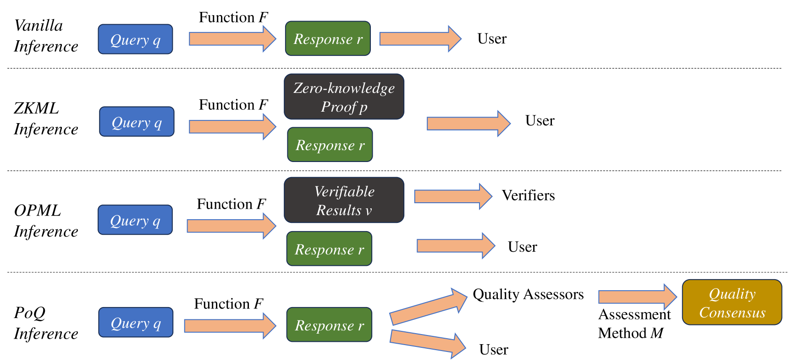
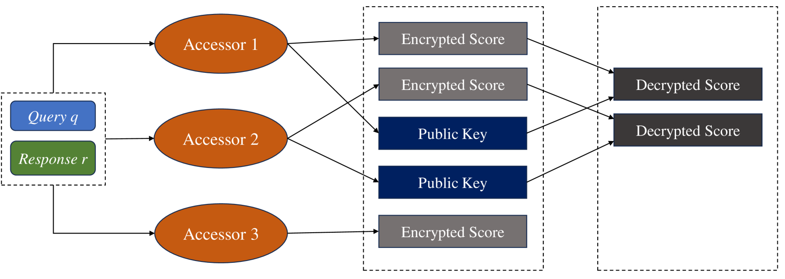
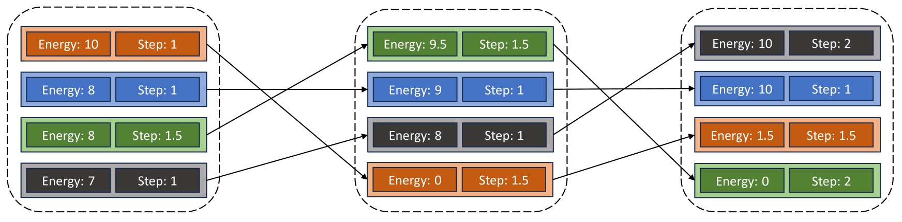
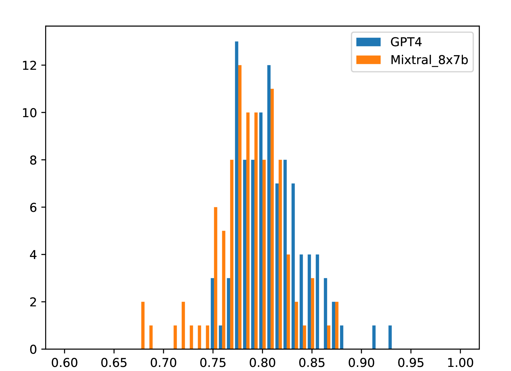
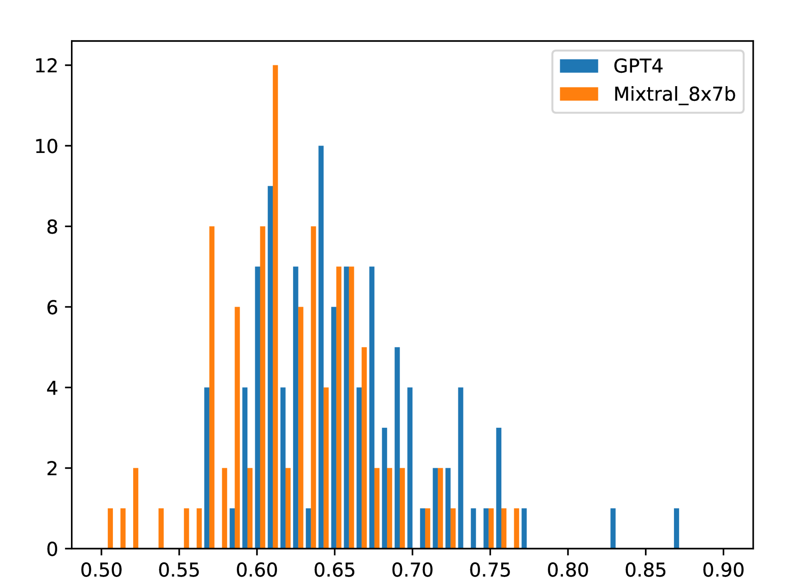
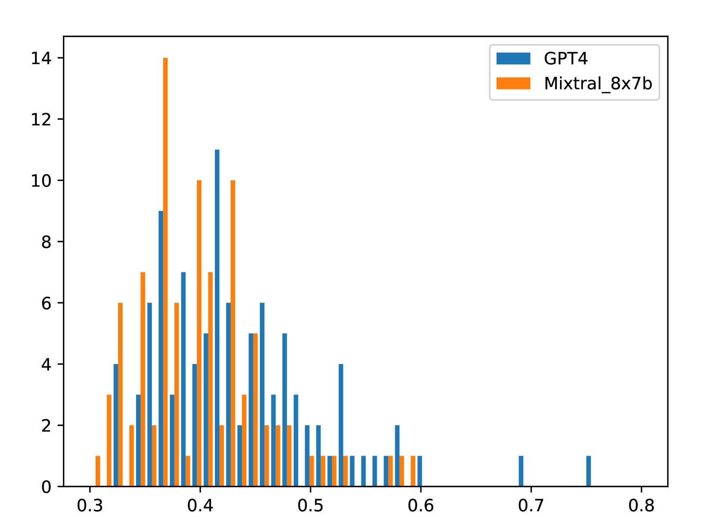
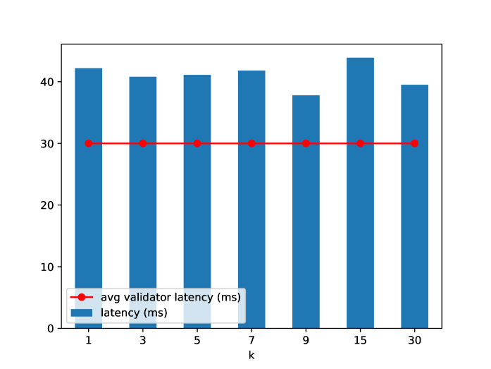

# 质量验证：区块链上无需信任的生成式AI模型推理的无成本新范式

发布时间：2024年05月28日

`Agent

理由：这篇论文主要介绍了一种名为“质量证明”（PoQ）的新推理范式，它是在区块链上部署大型生成模型的方法。这种范式特别关注推理结果的质量，并通过轻量级BERT交叉编码器进行质量评估。此外，论文还开发了PQML协议，专为开源模型如Llama 3和Mixtral设计，用于在区块链上的NLP生成模型推理。这些内容涉及到在去中心化环境中部署和验证模型的策略，更偏向于Agent的范畴，即如何在特定环境中有效部署和操作模型。因此，将其归类为Agent。` `区块链`

> Proof of Quality: A Costless Paradigm for Trustless Generative AI Model Inference on Blockchains

# 摘要

> 生成式AI模型如GPT-4和Stable Diffusion在自然语言和图像处理领域展现了强大的能力，但在去中心化环境中部署这些模型仍面临挑战。本文提出了一种名为“质量证明”（PoQ）的新推理范式，旨在区块链上部署大型生成模型。与传统验证推理过程的方法不同，PoQ关注推理结果的质量。我们采用轻量级BERT交叉编码器进行质量评估，并开发了PQML协议，专为如Llama 3和Mixtral等开源模型设计，用于区块链上的NLP生成模型推理。该协议能有效应对生态系统中的对抗性参与者，且质量验证的计算负担极轻，验证过程仅需一秒。初步模拟显示，PoQ共识生成速度比现有方案快1000倍。

> Generative AI models, such as GPT-4 and Stable Diffusion, have demonstrated powerful and disruptive capabilities in natural language and image tasks. However, deploying these models in decentralized environments remains challenging. Unlike traditional centralized deployment, systematically guaranteeing the integrity of AI model services in fully decentralized environments, particularly on trustless blockchains, is both crucial and difficult. In this paper, we present a new inference paradigm called \emph{proof of quality} (PoQ) to enable the deployment of arbitrarily large generative models on blockchain architecture. Unlike traditional approaches based on validating inference procedures, such as ZKML or OPML, our PoQ paradigm focuses on the outcome quality of model inference. Using lightweight BERT-based cross-encoders as our underlying quality evaluation model, we design and implement PQML, the first practical protocol for real-world NLP generative model inference on blockchains, tailored for popular open-source models such as Llama 3 and Mixtral. Our analysis demonstrates that our protocol is robust against adversarial but rational participants in ecosystems, where lazy or dishonest behavior results in fewer benefits compared to well-behaving participants. The computational overhead of validating the quality evaluation is minimal, allowing quality validators to complete the quality check within a second, even using only a CPU. Preliminary simulation results show that PoQ consensus is generated in milliseconds, 1,000 times faster than any existing scheme.

[Arxiv](https://arxiv.org/abs/2405.17934)