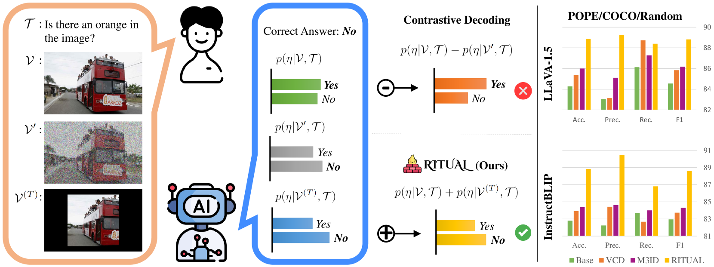
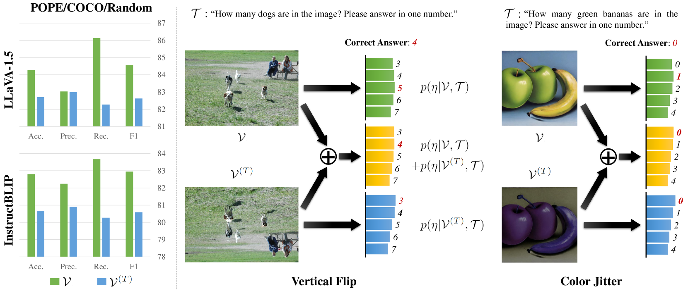
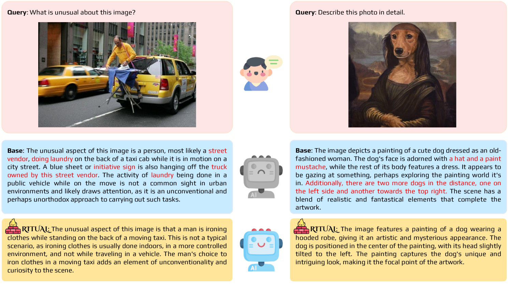
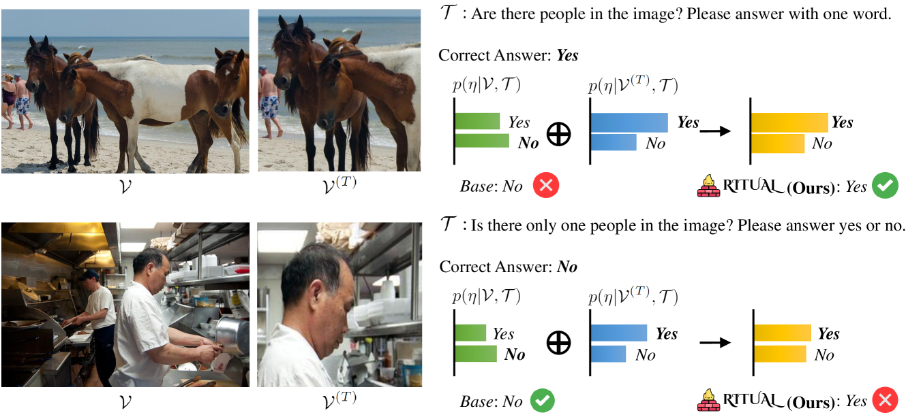
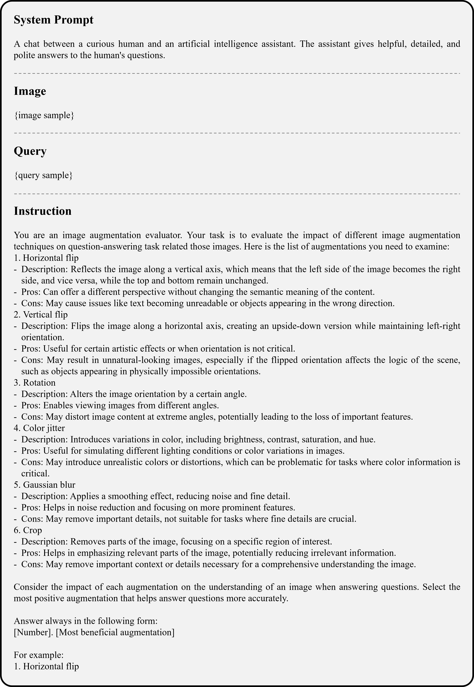
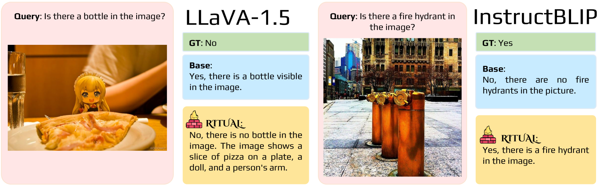
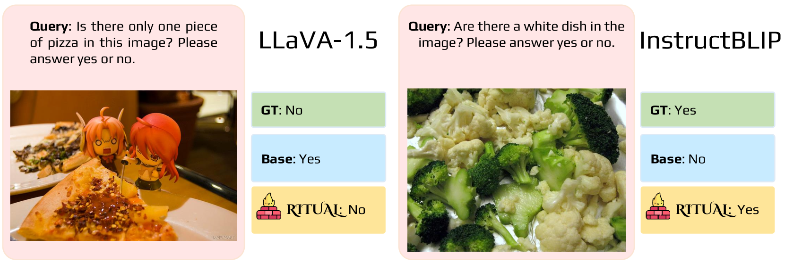
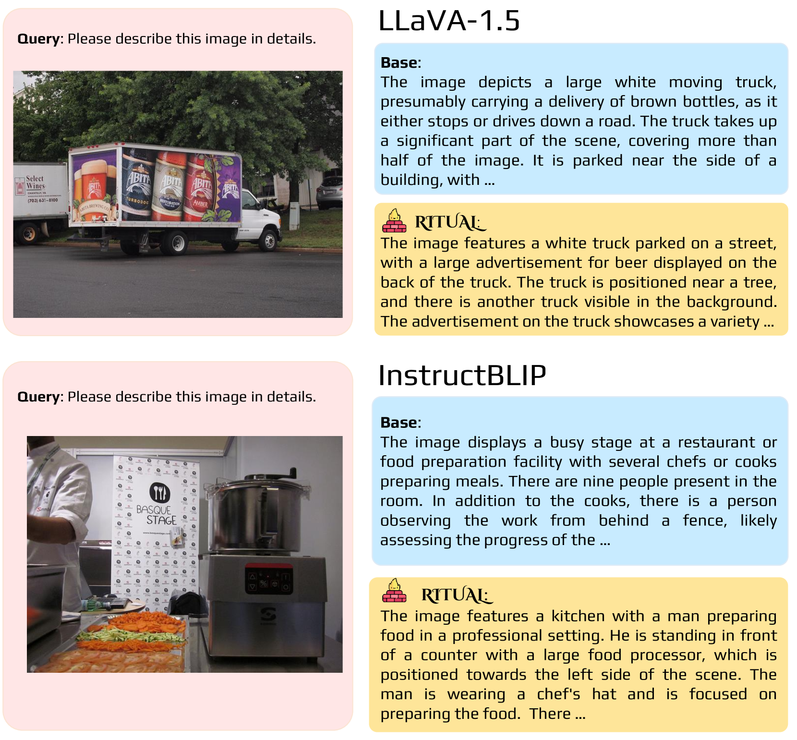
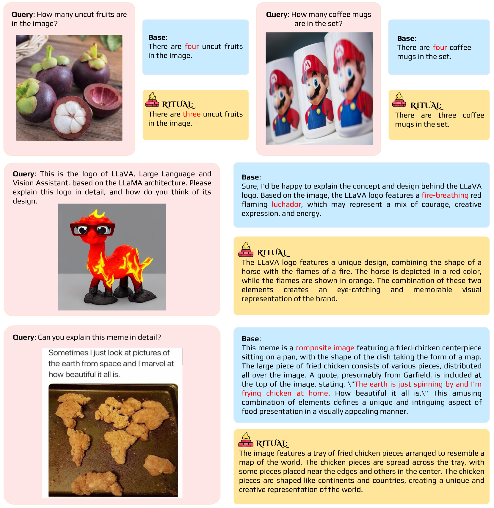

# RITUAL：大型视觉语言模型中的随机图像变换——一种通用的抗幻觉策略

发布时间：2024年05月28日

`LLM应用

这篇论文探讨了大型视觉语言模型（LVLMs）在处理视觉输入时产生“幻觉”输出的问题，并提出了一种名为RITUAL的新方法来减少这种输出。该方法通过随机图像变换来增强模型对多样视觉场景的理解，从而提高模型的可靠性和可信度。这种方法不需要额外的训练，且与现有的对比解码方法兼容，显示出了在实际应用中的潜力。因此，这篇论文属于LLM应用类别，因为它关注的是如何改进和应用现有的LLM技术以解决实际问题。` `计算机视觉`

> RITUAL: Random Image Transformations as a Universal Anti-hallucination Lever in LVLMs

# 摘要

> 大型视觉语言模型（LVLMs）的最新进展彻底改变了机器基于视觉输入理解和生成文本响应的方式。尽管这些模型表现出色，但它们常常产生与视觉信息不符的“幻觉”输出，这对模型的可靠性和可信度构成了挑战。现有的对比解码等方法虽有进步，但仍难以生成忠实于视觉的输出。本研究另辟蹊径，探索如何增强原始概率分布，提出了一种名为RITUAL的简单且无需额外训练的方法。该方法通过随机图像变换丰富模型对多样视觉场景的接触，从而减少幻觉输出的可能性。实验表明，尽管单独使用变换图像初期会降低性能，但策略性应用这些变换能有效提升模型表现。RITUAL与现有对比解码方法兼容，无需外部模型或昂贵的自我反馈机制，实用性高。在POPE、CHAIR和MME等多个幻觉基准测试中，RITUAL的表现均超越了现有方法。

> Recent advancements in Large Vision Language Models (LVLMs) have revolutionized how machines understand and generate textual responses based on visual inputs. Despite their impressive capabilities, they often produce "hallucinatory" outputs that do not accurately reflect the visual information, posing challenges in reliability and trustworthiness. Current methods such as contrastive decoding have made strides in addressing these issues by contrasting the original probability distribution of generated tokens with distorted counterparts; yet, generating visually-faithful outputs remains a challenge. In this work, we shift our focus to the opposite: What could serve as a complementary enhancement to the original probability distribution? We propose a simple, training-free method termed RITUAL to enhance robustness against hallucinations in LVLMs. Our approach employs random image transformations as complements to the original probability distribution, aiming to mitigate the likelihood of hallucinatory visual explanations by enriching the model's exposure to varied visual scenarios. Our empirical results show that while the isolated use of transformed images initially degrades performance, strategic implementation of these transformations can indeed serve as effective complements. Notably, our method is compatible with current contrastive decoding methods and does not require external models or costly self-feedback mechanisms, making it a practical addition. In experiments, RITUAL significantly outperforms existing contrastive decoding methods across several object hallucination benchmarks, including POPE, CHAIR, and MME.

[Arxiv](https://arxiv.org/abs/2405.17821)