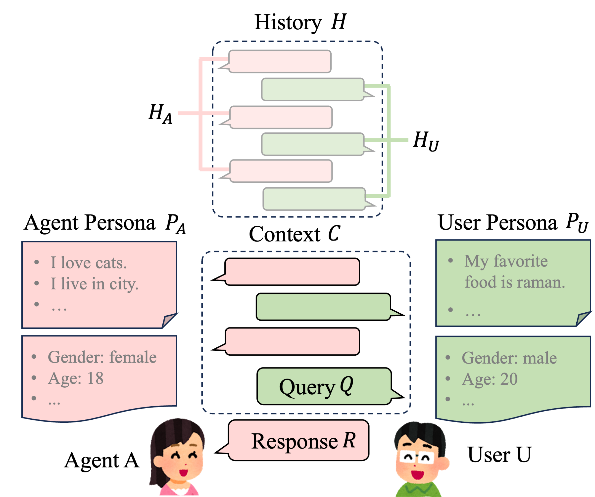

# 个性化对话生成：探索最新趋势与方法论，涵盖数据集与评估的全面综述

发布时间：2024年05月28日

`Agent

这篇论文主要关注的是个性化对话生成在提升对话代理（Agent）用户参与度方面的应用。它系统地审视了个性化对话生成的最新进展，分析了相关数据集和论文，并讨论了大型语言模型在对话代理领域的进步和挑战。因此，它属于Agent分类。` `对话系统` `人工智能`

> Recent Trends in Personalized Dialogue Generation: A Review of Datasets, Methodologies, and Evaluations

# 摘要

> 随着大型语言模型能够流畅生成响应，通过个性化提升对话代理的用户参与度变得日益重要。个性化对话生成涉及多方面，定义从赋予代理特定角色到捕捉用户明示与暗示的线索不等。本文系统地审视了个性化对话生成的最新进展，涵盖了22个数据集，强调了基准数据集及新增特征的新数据集。我们深入分析了2021至2023年间顶级会议上的17篇重要论文，识别出五类问题，并探讨了大型语言模型在此领域的进步。评估部分全面总结了这些研究所采用的评估方面和指标。最后，我们讨论了当前挑战，并展望了个性化对话生成未来研究的方向。

> Enhancing user engagement through personalization in conversational agents has gained significance, especially with the advent of large language models that generate fluent responses. Personalized dialogue generation, however, is multifaceted and varies in its definition -- ranging from instilling a persona in the agent to capturing users' explicit and implicit cues. This paper seeks to systemically survey the recent landscape of personalized dialogue generation, including the datasets employed, methodologies developed, and evaluation metrics applied. Covering 22 datasets, we highlight benchmark datasets and newer ones enriched with additional features. We further analyze 17 seminal works from top conferences between 2021-2023 and identify five distinct types of problems. We also shed light on recent progress by LLMs in personalized dialogue generation. Our evaluation section offers a comprehensive summary of assessment facets and metrics utilized in these works. In conclusion, we discuss prevailing challenges and envision prospect directions for future research in personalized dialogue generation.

[Arxiv](https://arxiv.org/abs/2405.17974)